# Amber CAPEX Portal — Full Walkthrough

**A slide-by-slide tour of the whole product, captured from a real end-to-end run.**

Every screenshot in this deck was taken from the running application on **30 July 2026**, driving
the real UI: the FY 2026-27 budget was authored from a blank sheet, pushed through all three
approval gates, spent against by two live requests, sourced from two vendors, split-awarded, and
settled down to the last rupee. Nothing is a mock-up.

| | |
|---|---|
| **Product** | Amber CAPEX Portal — capital-expenditure procurement for Amber Enterprises India Ltd |
| **Scope of this run** | 1 plant (Jhajjar Plant 1), 1 fiscal year (2026-27), 2 requests, 2 vendors, 2 awards |
| **Screens captured** | 87 |
| **Reference docs** | [`CLAUDE.md`](../CLAUDE.md) (architecture) · [`USER_STORY.md`](USER_STORY.md) (backlog) · [`SCOPE.md`](SCOPE.md) (scope) |

---

# Part 0 — The one-minute version

## Slide 0.1 · What problem this solves

Amber spends capital across nine plants. Before this portal that money moved through spreadsheets,
email threads and WhatsApp: a plant asks for a machine, someone chases quotations, someone else
argues the price down, a third person raises the PO, and Accounts finds out last. Nobody could
answer *"where is this request and who is sitting on it?"* without ringing four people.

The portal turns that into **one tracked pipeline with named gates**:

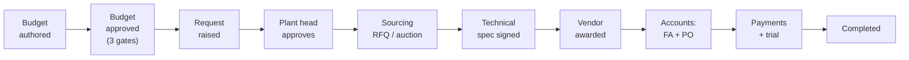
```mermaid
flowchart LR
  A["Budget<br/>authored"] --> B["Budget<br/>approved<br/>(3 gates)"]
  B --> C["Request<br/>raised"]
  C --> D["Plant head<br/>approves"]
  D --> E["Sourcing<br/>RFQ / auction"]
  E --> F["Technical<br/>spec signed"]
  F --> G["Vendor<br/>awarded"]
  G --> H["Accounts:<br/>FA + PO"]
  H --> I["Payments<br/>+ trial"]
  I --> J["Completed"]
```

Two ideas make it work:

1. **Money is pre-allocated.** Every request must point at a *sub-particular* inside an approved
   budget head. You cannot spend what was never approved, and every screen shows allocated vs used.
2. **Outsiders act on emailed links, not logins.** Plant heads, the Technical team, both Accounts
   teams and every vendor work through single-purpose tokenised URLs. Only the buying/sourcing
   organisation gets a portal seat.

## Slide 0.2 · The cast

| Actor | How they get in | What they own |
|---|---|---|
| **Buyer / requester** (plant-scoped) | Portal login | Raises requests against their plant's budget |
| **Maintenance** | Portal login | Authors next-FY budget proposals |
| **Sourcing team** | Portal login | Vendors, RFQ, negotiation, auctions, award, trial review |
| **Super admin** | Portal login | Budget approval (admin stage), configuration, everything |
| **Plant head** | 📧 emailed link | Approves budgets and requests |
| **Technical team** | 📧 emailed link | Signs off the machine specification, per vendor |
| **Plant Accounts** | 📧 emailed link | FA codes, then milestone payments |
| **Global Accounts ("Satish")** | 📧 emailed link | Final budget sign-off; issues the PO |
| **Vendors** | 📧 emailed link | Terms, quotations, bids, PI, PO download, trial |

## Slide 0.3 · The two halves

The product is really **two connected systems**:

- **Budget** — *how much may be spent, per plant, per head, per line item, per year.*
  Authored → plant head → admin → Global Accounts → published as the live FY master.
- **Procurement** — *spending it.* Request → approval → sourcing (RFQ or reverse auction) →
  technical sign-off → award → PI → FA codes → PO → payments → done.

Everything else (dashboards, adhoc transfers, TAT penalties, the accounts queue) hangs off those two.

---

# Part 1 — Getting in

## Slide 1.1 · Login

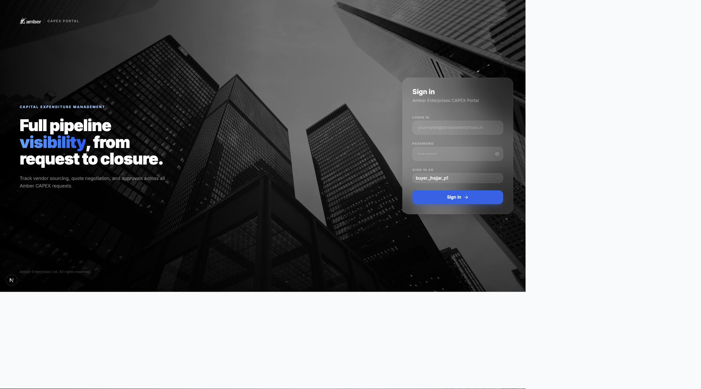

A single sign-in screen. In this build authentication is **mock**: the "Sign in as" dropdown *is*
the identity — it writes the chosen role to the browser and the portal renders for that persona.
There is no server, no password check, no session token.

## Slide 1.2 · The five portal roles

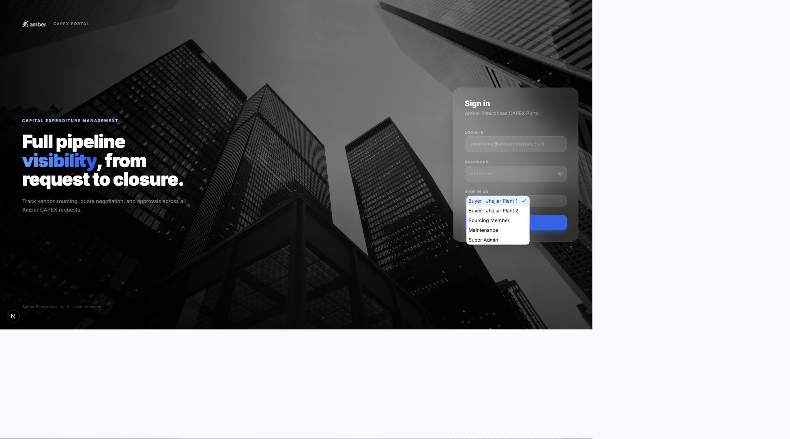

Only five personas have portal seats:

- **Buyer · Jhajjar Plant 1** and **Buyer · Jhajjar Plant 2** — plant-scoped; they see only their
  own plant's data.
- **Sourcing Member** — runs quotations, auctions, awards.
- **Maintenance** — writes next year's budget.
- **Super Admin** — full access; the only role that can approve the admin budget stage or open
  Configurations.

Roles that used to exist — `plant_head`, `sourcing_head`, `accounts`, `plant_accounts` — were
deliberately **removed**. Those people now work through emailed links (Parts 4, 6 and 9). If an old
role is still stored in a browser the app clears it and bounces back to this screen, so nobody lands
in a portal with no navigation.

## Slide 1.3 · A clean slate

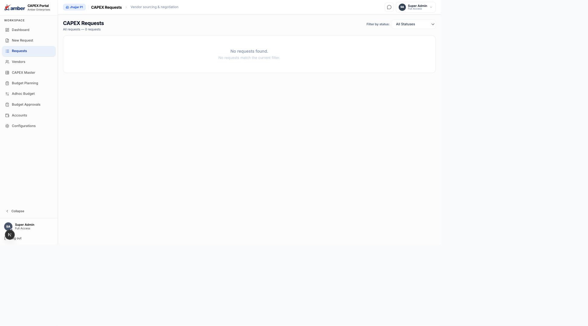
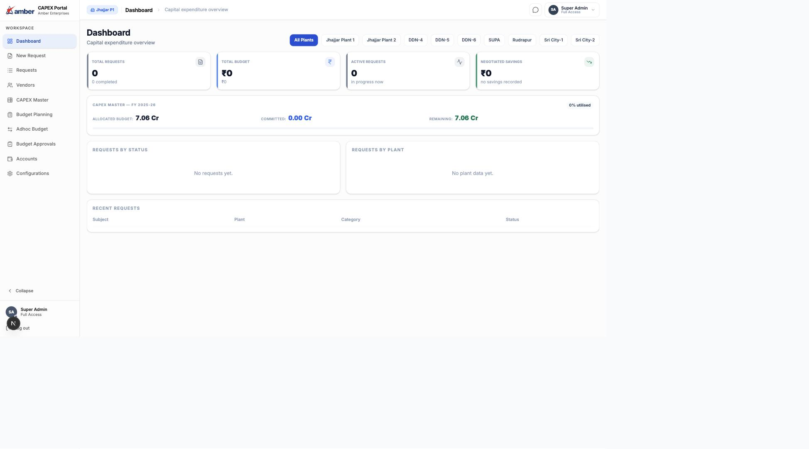

This run starts genuinely empty — zero requests, zero committed spend. The workspace navigation on
the left is the whole internal product: Dashboard · New Request · Requests · Vendors · CAPEX Master ·
Budget Planning · Adhoc Budget · Budget Approvals · Accounts · Configurations. Each entry is
role-filtered; a plant buyer sees fewer items than the super admin shown here.

---

# Part 2 — The budget year

> This is where the portal starts. Until a budget exists, no request can be raised, because every
> line item must point at an approved sub-particular.

## Slide 2.1 · The live master starts blank

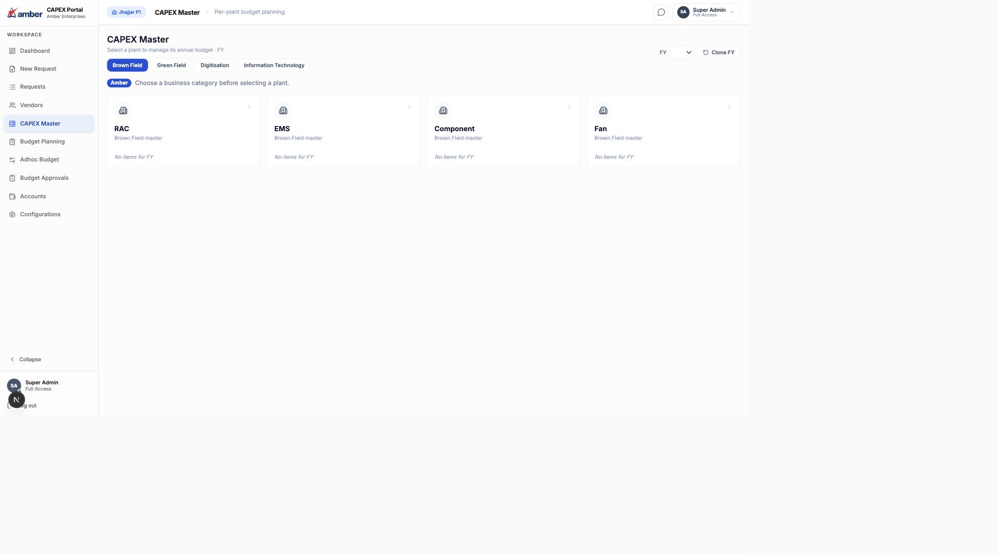

**CAPEX Master** is the register of approved money. It is organised in four tabs — **Brown Field**
(existing plants), **Green Field** (new plants), **Digitisation**, **Information Technology** — and
Brown/Green Field add a business-category step (**RAC · EMS · Component · Fan**) so a plant can run
four independent budgets.

Right now every category reads *"No items for FY"*. That is intentional: FY 2026-27 is about to be
authored from scratch.

## Slide 2.2 · Budget Planning — a blank draft

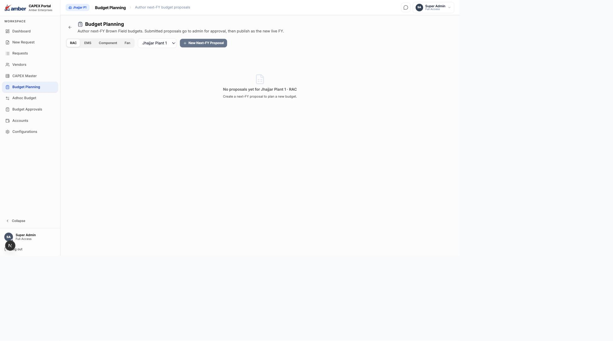
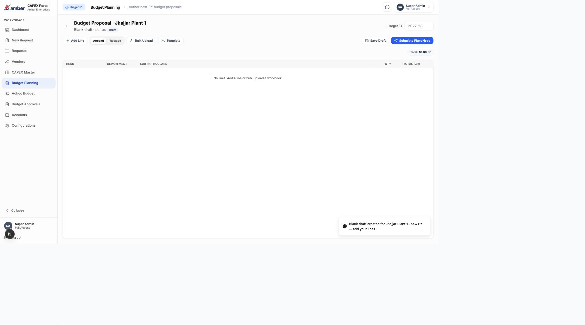

**Budget Planning** is where next year is written. Pick a category and plant, click
**New Next-FY Proposal**, and you get a **deliberately blank draft** — the portal never pre-fills
last year's lines, so each year is argued on its own merits. Set the **Target FY** (here `2026-27`)
and start filling.

Three ways to fill it:

- **Add Line** — type rows by hand.
- **Template** — download an Excel template.
- **Bulk Upload** — upload the filled workbook, in **Append** or **Replace** mode.

## Slide 2.3 · The Excel template ships with worked examples

The downloaded template is not an empty grid. Its columns are exactly the ones the parser accepts —
`S.No · Head · Department · Sub Particulars · Qty · Total Cost (Cr) · Reason for Requirement ·
Benefits · ROI` — and it arrives **pre-filled with real Jhajjar Plant 1 examples** spanning five
heads, so the expected shape is never ambiguous:

| Head | Department | Sub Particulars | Qty | Total (Cr) |
|---|---|---|---|---|
| Automation | HEX | HEX Black Copper Detection | 3 | 0.33 |
| Machinery | HEX | Shrink less Vertical M/C | 1 | 2.10 |
| General | IMM | Centralised Material Feeding for Molding Machines (24 Machine, 450T to 1300Ton) | 1 | 1.50 |
| Digitization | Innovation / Data Analyst | Plant ESG/EMS | 1 | 0.40 |
| New Business | Hex | Mezzanine, Goods Lift & Utilities | 1 | 2.10 |
| … | | *(10 rows total, 5 heads)* | | |

Note there is **no Rate column** — you enter **Total Cost (Cr)** directly. A downloaded template can
be edited and re-uploaded unchanged.

## Slide 2.4 · Bulk upload lands 10 lines across 5 heads

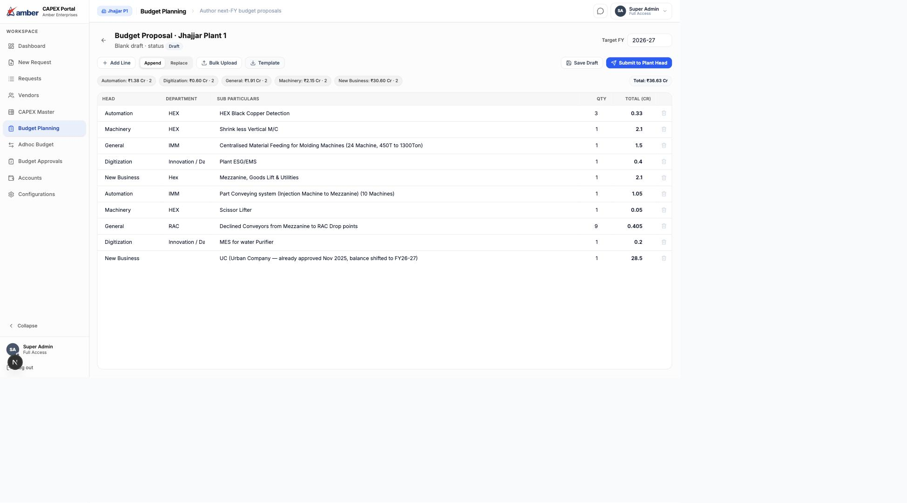

The same file, uploaded straight back: **₹36.63 Cr across 10 lines**, with per-head chips
(Automation ₹1.38 Cr · Digitization ₹0.60 Cr · General ₹1.91 Cr · Machinery ₹2.15 Cr ·
New Business ₹30.60 Cr). Every cell stays editable inline afterwards.

## Slide 2.5 · Submit → the plant head, by email

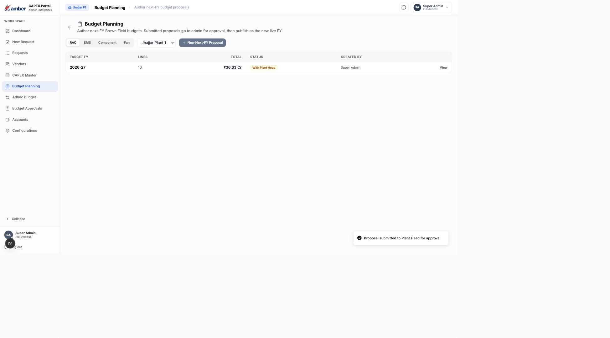
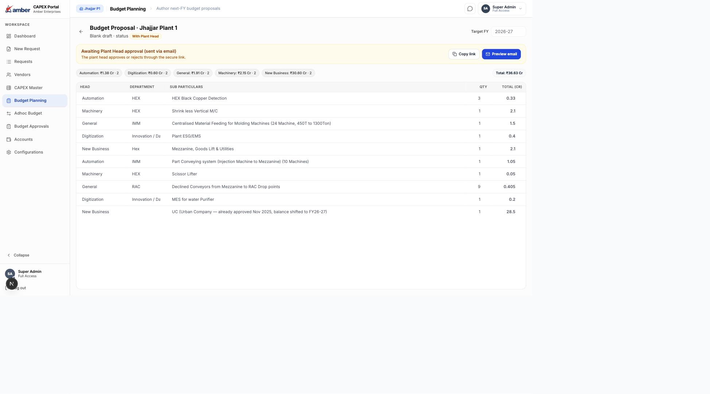

**Submit to Plant Head** moves the proposal to *With Plant Head* and mints a fresh single-use
approval token. The author now sees an amber banner with two affordances — **Copy link** and
**Preview email** — because *the portal does not send mail*; it composes it and hands you the link.

## Slide 2.6 · The email

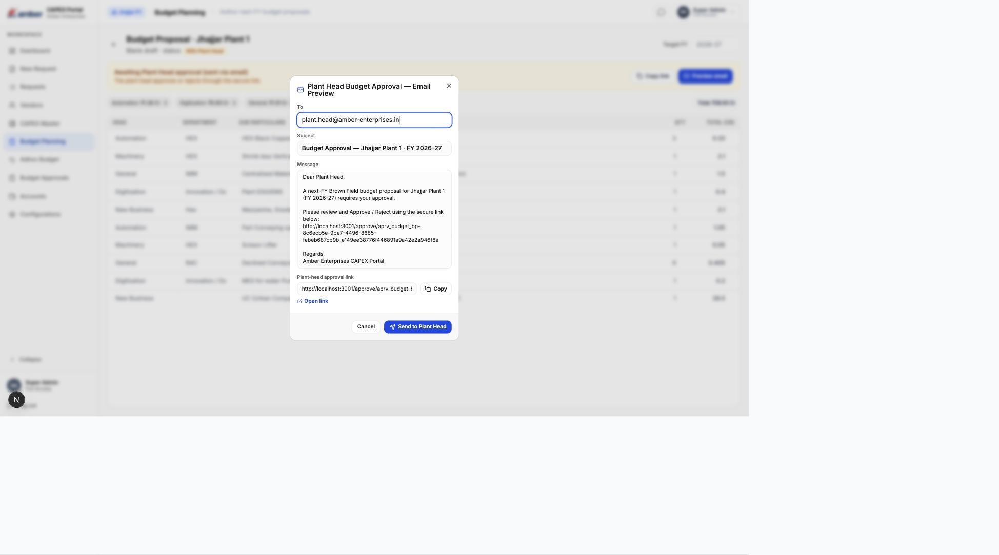

Recipient, subject and body are pre-written and editable; the secure link is spelled out in the body
*and* offered as a copyable field with **Open link**. This same modal (`EmailPreviewModal`) is reused
for every handoff in the product — five different emails, one component.

## Slide 2.7 · What the plant head sees

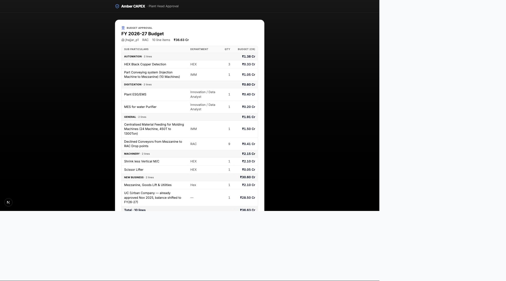

No login. A dark public page titled **Plant Head Approval**, showing the proposal **grouped by head
with every sub-particular** — department, quantity, budget — a subtotal per head, and a grand total.
This is the same breakdown component every approver sees, so no two gates review different numbers.

## Slide 2.8 · Approve, edit-and-send-back, or reject

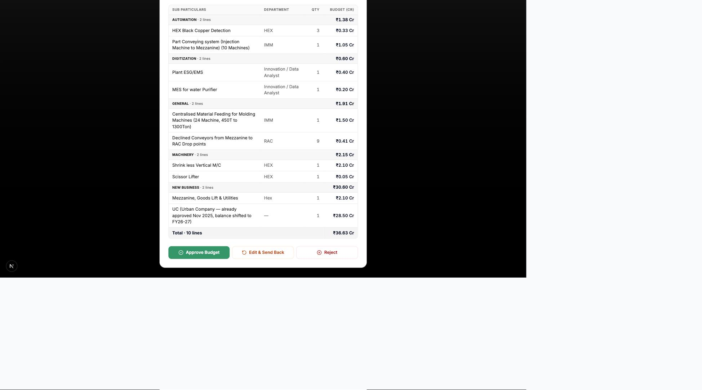

Three outcomes. **Edit & Send Back** is the interesting one:

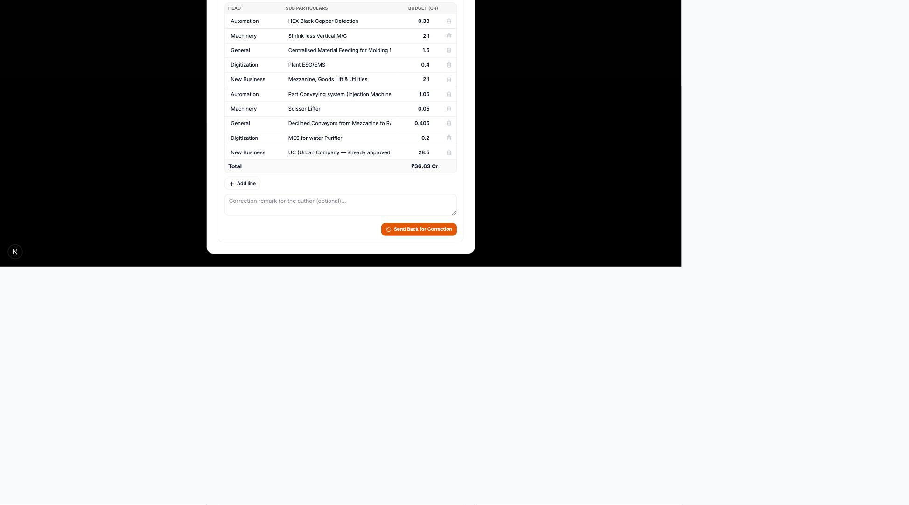

The plant head can **change the numbers themselves**, delete lines, add lines, and attach a
correction remark — all applied atomically when they send it back. The author sees the edited lines
*plus* the remark and resubmits, which restarts the cycle from the plant head with a rotated token.

## Slide 2.9 · Approved

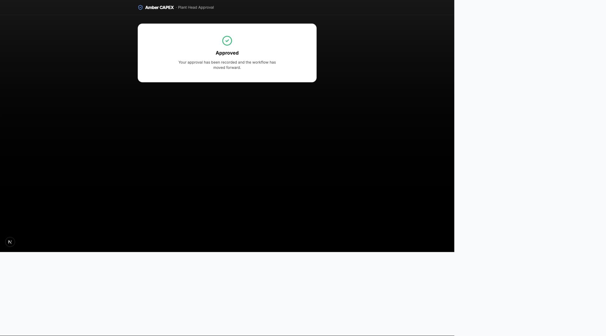

The token is burned on decision, so the link cannot be replayed.

## Slide 2.10 · Stage 2 — the super admin

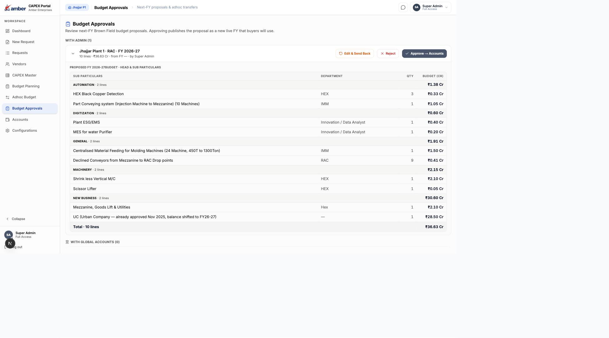

**Budget Approvals** is super-admin only. The proposal is now *With Admin*, expandable to the same
full head → sub-particular breakdown. The admin can also **Edit & Send Back** or **Reject**.
Approving does **not** publish — it moves to the third gate.

## Slide 2.11 · Stage 3 — Global Accounts sign-off

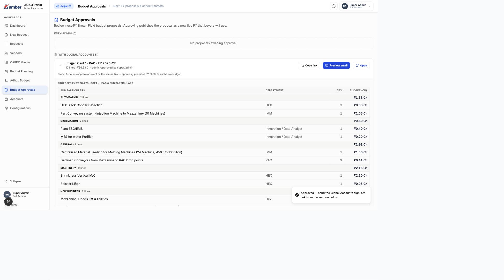
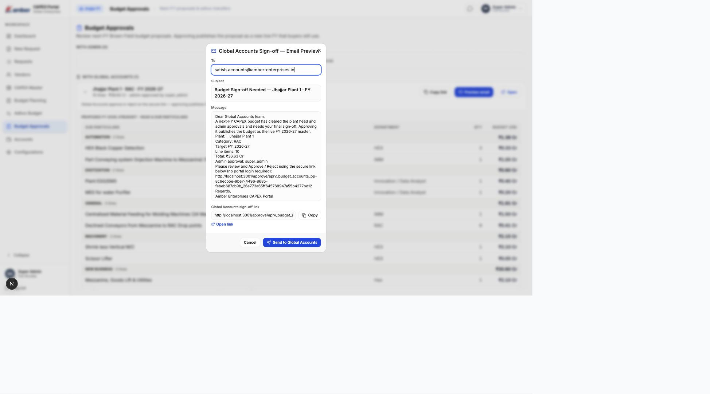

Approving at the admin stage mints **Satish's** sign-off token and moves the row into
*With Global Accounts*, where the admin can copy the link, preview the email, or open it directly.

## Slide 2.12 · The final gate publishes the year

The page tells him plainly what his click does: *"Already approved by the plant head and the admin.
Your approval is the final gate — it publishes this proposal as the live FY 2026-27 budget."*

## Slide 2.13 · FY 2026-27 is now live money

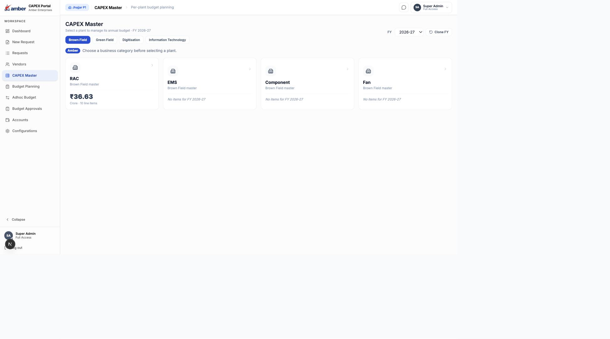
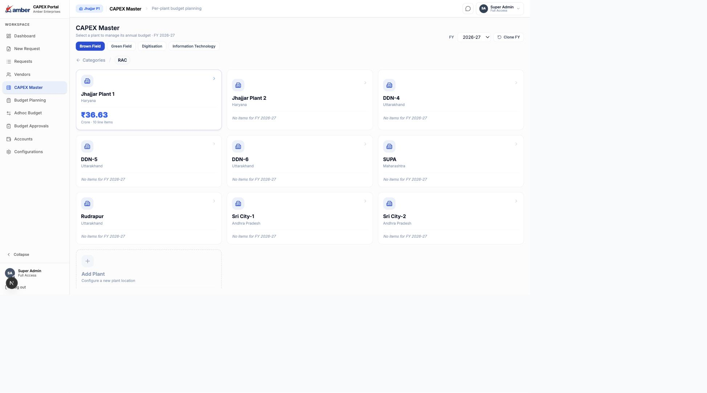
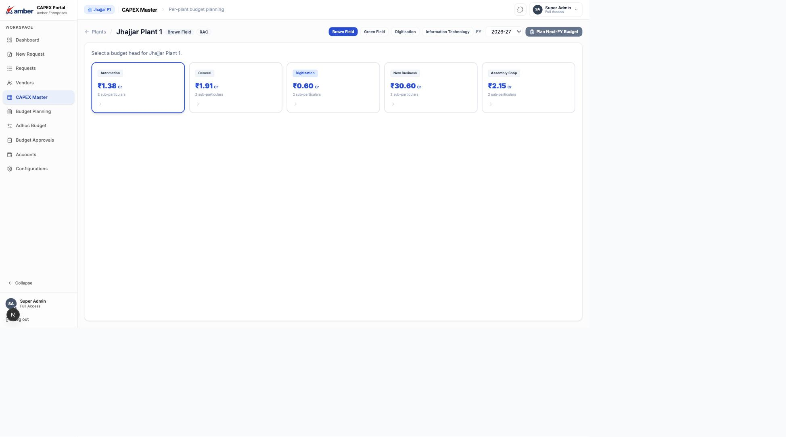
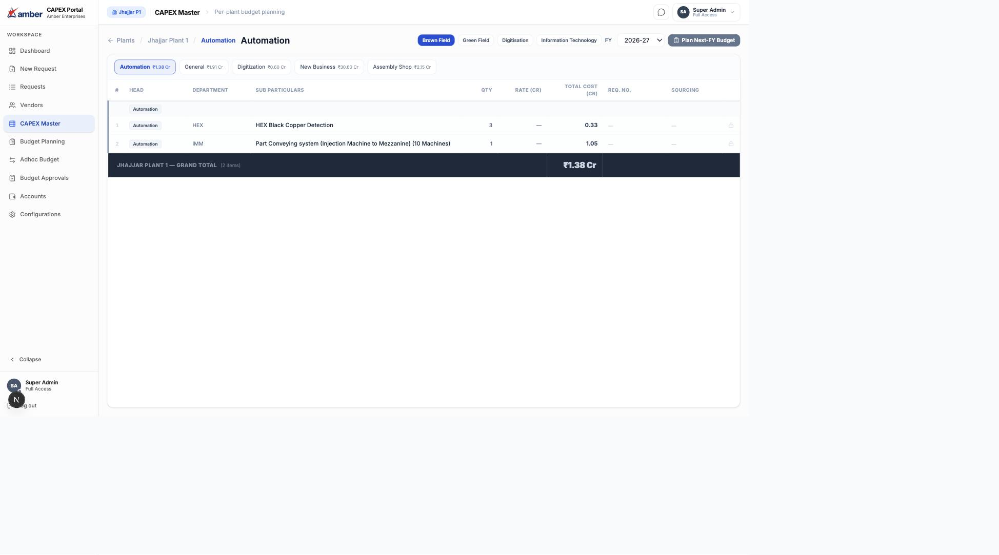

The proposal's ten lines are now `CapexMasterItem` rows on the live FY. Drill down
**category → plant → budget head → line items**: RAC ₹36.63 Cr → Jhajjar Plant 1 ₹36.63 Cr →
five head cards → the sub-particulars inside a head.

Two things to notice:

- The **padlock** on each row: a live Brown Field FY is **read-only**. You cannot quietly edit
  approved money. The only mid-year change is an *Adhoc transfer* (Slide 10.2), which itself needs
  admin approval.
- The **Sourcing** and **Req. No.** columns — once a request consumes a line, it shows here, so a
  budget row and its spend live side by side.

### Budget flow, in one diagram

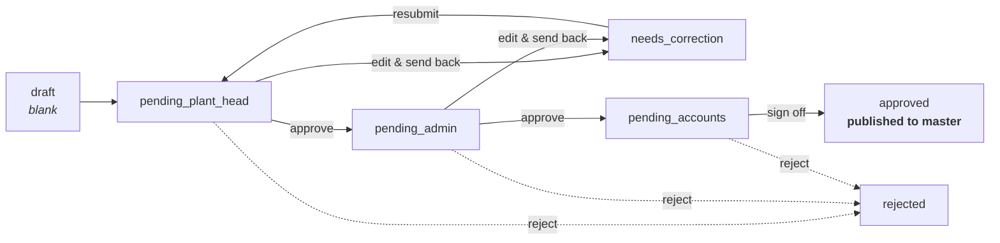
```mermaid
flowchart LR
  D["draft<br/><i>blank</i>"] --> P["pending_plant_head"]
  P -->|approve| A["pending_admin"]
  P -->|edit & send back| N["needs_correction"]
  A -->|approve| G["pending_accounts"]
  A -->|edit & send back| N
  N -->|resubmit| P
  G -->|sign off| L["approved<br/><b>published to master</b>"]
  P -.reject.-> R["rejected"]
  A -.reject.-> R
  G -.reject.-> R
```

---

# Part 3 — Raising a request

## Slide 3.1 · Vendors first

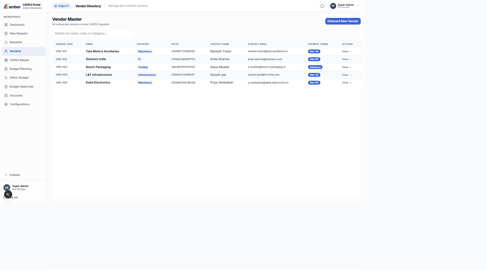

**Vendor Master** holds the onboarded supply base — code, category, GSTIN, contact, payment terms.
Payment terms matter later: they generate the payment-milestone split (30/60/10 in this run).
Sourcing can also add a **one-time vendor** on the fly during an RFQ, and flag them **foreign**,
which switches on the Incoterms questionnaire.

## Slide 3.2 · Step 1 — what kind of capex is this?

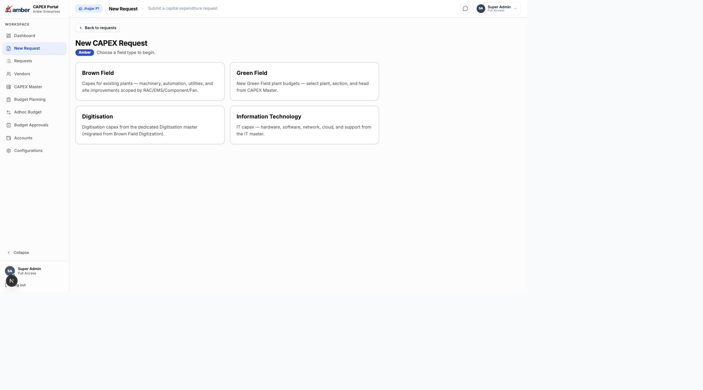

Four field types, and the choice changes the whole route:

| Field type | Meaning | Routing |
|---|---|---|
| **Brown Field** | Existing plants — machinery, automation, utilities | → **plant-head approval** |
| **Green Field** | A brand-new plant | → straight to sourcing |
| **Digitisation** | Digital/MES/ESG capex | → **plant-head approval** |
| **Information Technology** | Hardware, software, network, cloud | → **plant-head approval** |

## Slide 3.3 · Steps 2–4 — narrowing to a budget head

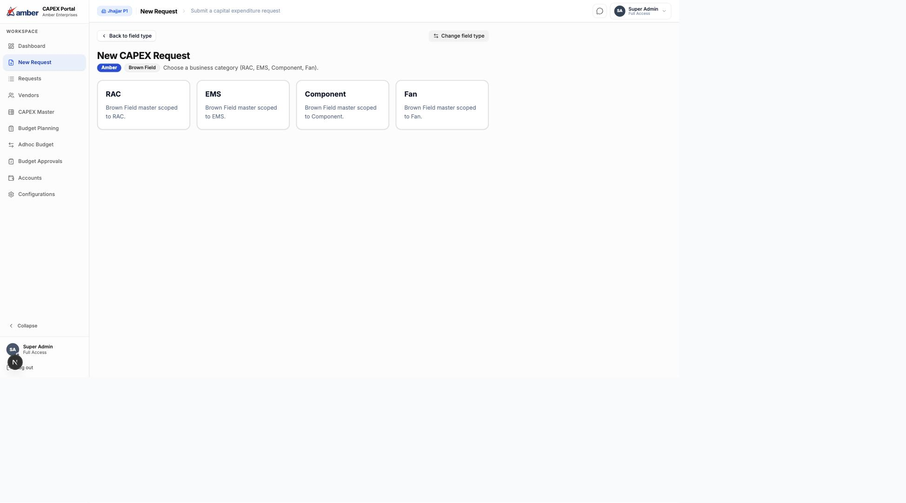
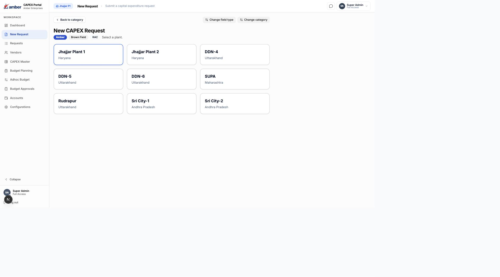
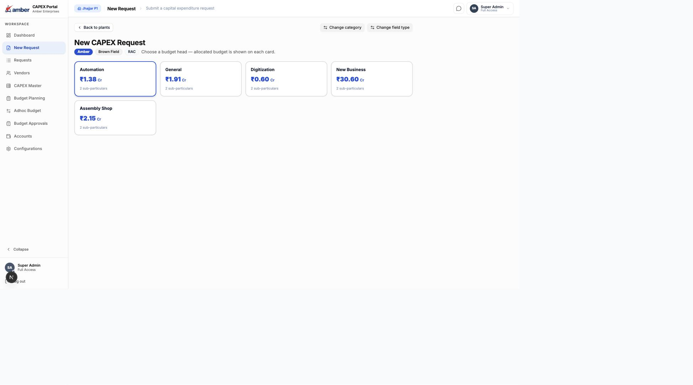

Business category → plant → budget head. The head cards **show the allocated budget** (₹1.38 Cr,
₹1.91 Cr, ₹30.60 Cr…) and heads with no approved lines simply don't appear. By the time you reach
the grid you are already inside approved money.

Every step has **Back** and **Change …** actions, and changing scope clears the dependent rows so
you can never carry a line item across budget heads by accident.

## Slide 3.4 · The line-item grid

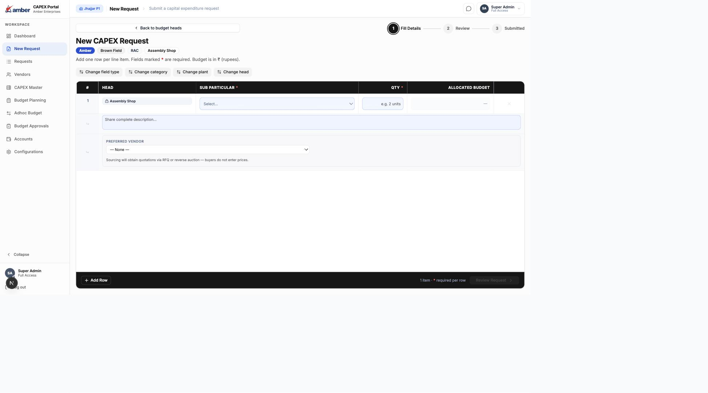

Columns: **# · Head (locked) · Sub Particular\* · Qty\* · Allocated Budget (read-only)**. The
**Sub Particular is a dropdown of that head's approved lines** — it *is* the item's identity, and it
carries the allocated figure with it. Beneath each row: a required **description** (this is the
specification) and an optional **preferred vendor** with a reason.

Note the hint: *"Sourcing will obtain quotations via RFQ or reverse auction — buyers do not enter
prices."* Requesters describe *what* they need; sourcing discovers *what it costs*.

## Slide 3.5 · Two lines filled

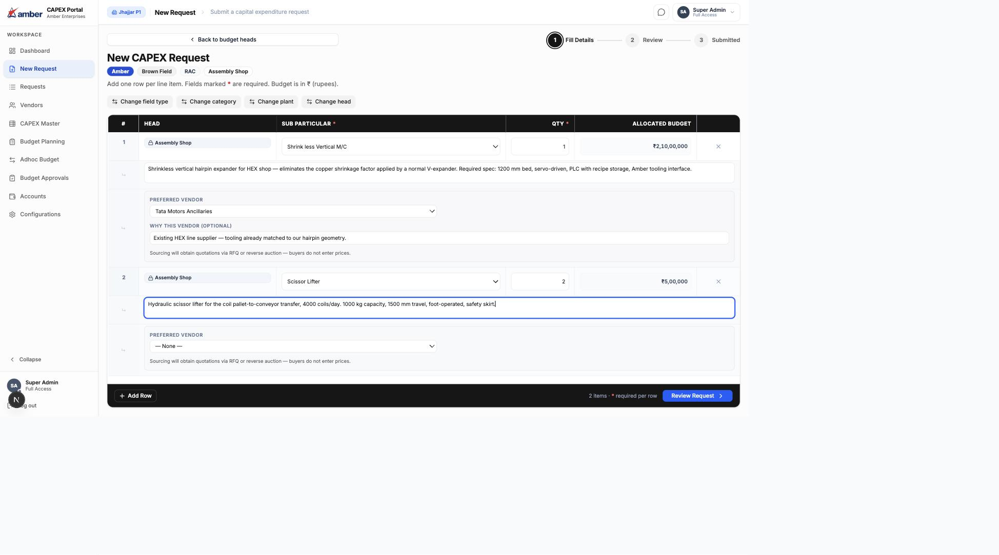

- **Shrink less Vertical M/C** — qty 1, allocated ₹2,10,00,000, preferred vendor Tata Motors
  Ancillaries with a stated reason.
- **Scissor Lifter** — qty 2, allocated ₹5,00,000.

## Slide 3.6 · Review and submit

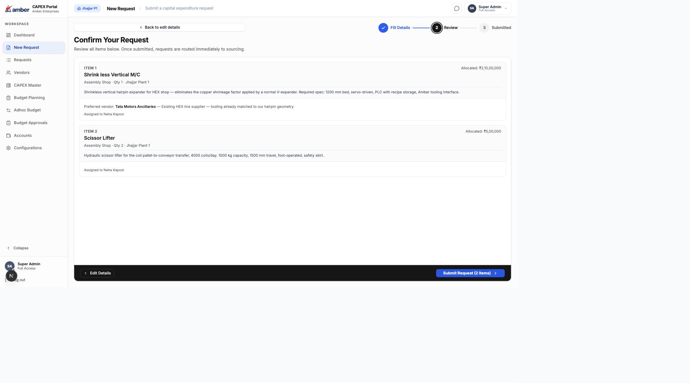
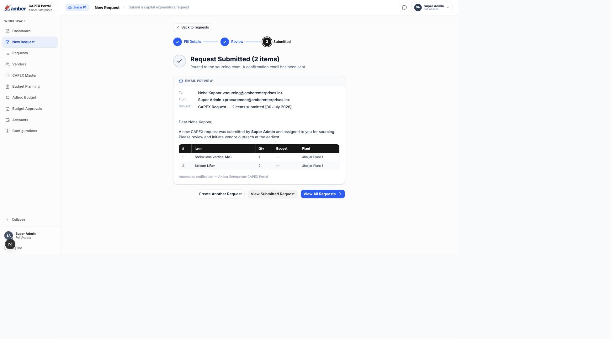

A three-step wizard (Fill Details → Review → Submitted). Review restates each line with its
allocation and preferred vendor. On submit the request gets a number, a sourcing engineer is
auto-assigned (buyers never pick one), and the confirmation screen shows the **notification email**
that went to sourcing with the item table inline.

## Slide 3.7 · The request list

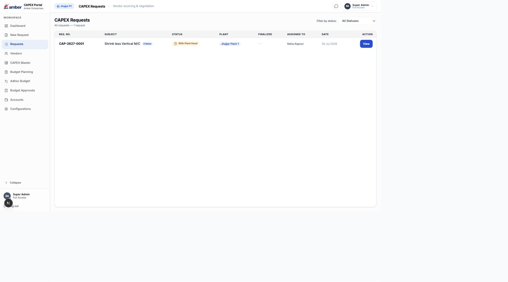

`CAP-2627-0001` · *Shrink less Vertical M/C* · **2 items** · **With Plant Head** · Jhajjar Plant 1 ·
assigned to Neha Kapoor. Request numbers encode the fiscal year: `CAP-`**2627**`-0001` = FY 2026-27,
sequence 1. The subject is derived from the first line's sub-particular, so it is never blank.

---

# Part 4 — Plant-head approval, by email

## Slide 4.1 · The request detail while it waits

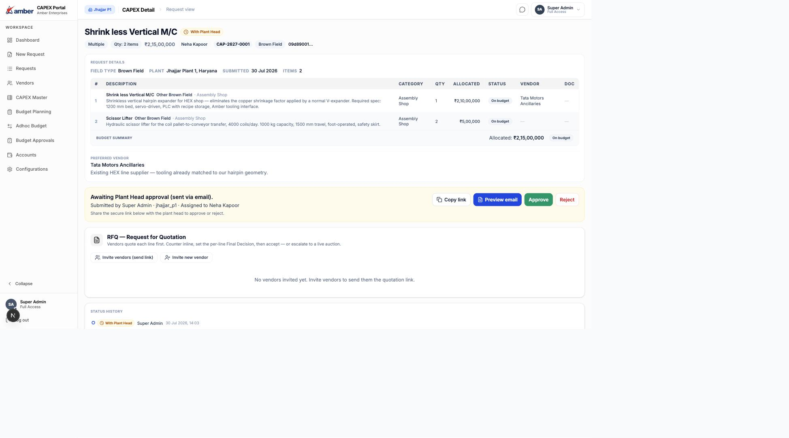

The detail page is the spine of the product. At this stage it shows:

- Both line items with **Allocated** and an **On budget / ₹X over** chip per line.
- The preferred vendor and the reason.
- An amber **"Awaiting Plant Head approval (sent via email)"** banner with **Copy link**,
  **Preview email**, and — for internal roles — direct **Approve / Reject**.
- The RFQ panel below, already waiting with **Invite vendors**.
- A **Status History** audit trail at the bottom, appended on every transition.

## Slide 4.2 · The email and the public page

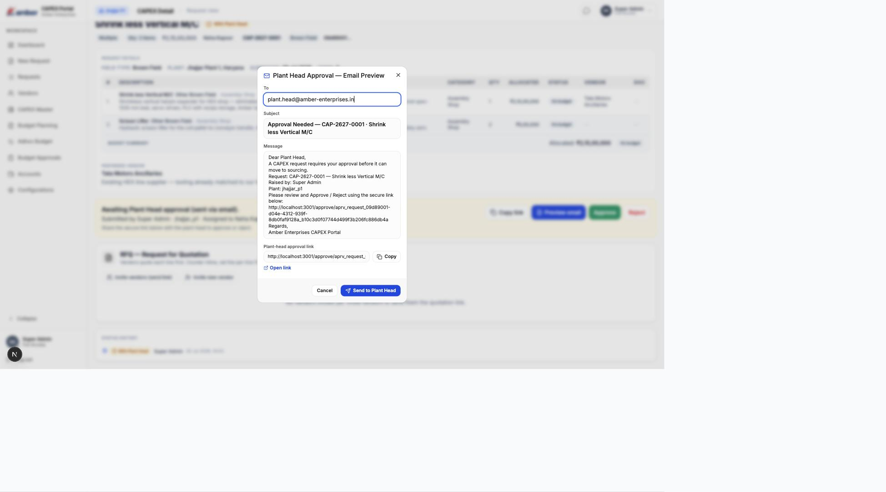
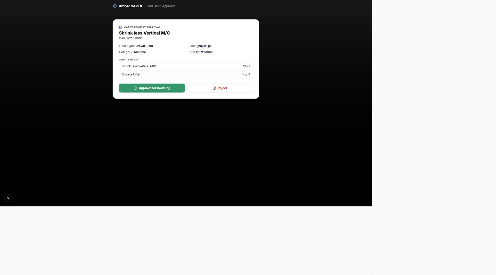

The plant head gets a compact card: request number, field type, plant, priority, the line items with
quantities, and **Approve for Sourcing / Reject**. Deliberately minimal — this gate is about
*"should we buy this at all?"*, not about price.

---

# Part 5 — Sourcing: the RFQ

## Slide 5.1 · In sourcing

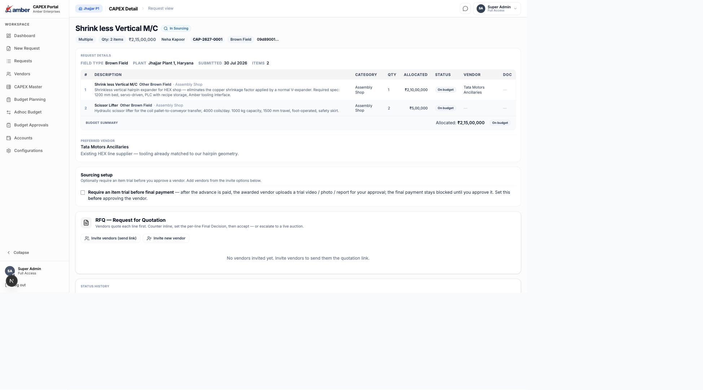

Approval flips the request to **In Sourcing** and two new sections appear:

- **Sourcing setup** — one switch: **Require an item trial before final payment**. Tick it *now*,
  before awarding, and the last payment milestone stays locked until the vendor's trial is approved.
  (Ticked in this run.)
- **RFQ — Request for Quotation** — Brown Field is RFQ-first by default. A reverse auction can only
  be *escalated* from an RFQ, never started cold.

## Slide 5.2 · Inviting vendors — and choosing their paperwork

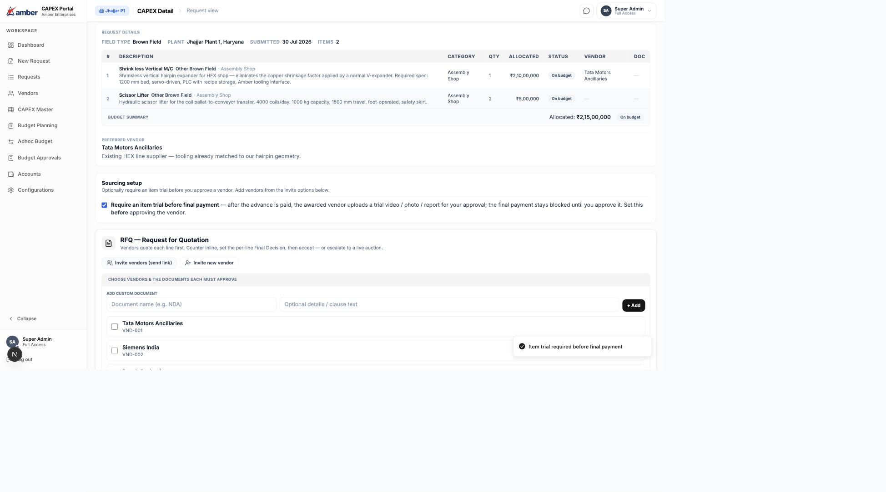
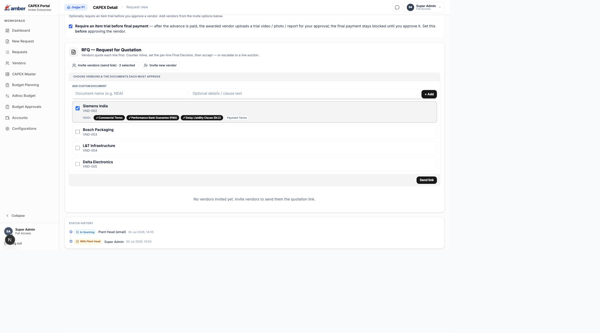

The picker is titled **"Choose vendors & the documents each must approve."** Per vendor you select
which contracts go out:

- **Commercial Terms**
- **Performance Bank Guarantee (PBG)** — 10% of order value, held through warranty
- **Delay Liability Clause (DLC)** — the penalty regime
- **Payment Terms** (defaulted on for one-time vendors)
- **+ Add custom document** — any extra clause, by name and text

This is per-vendor, not per-request: a long-standing supplier and a one-time vendor can receive
different packages in the same RFQ.

## Slide 5.3 · The comparison grid appears

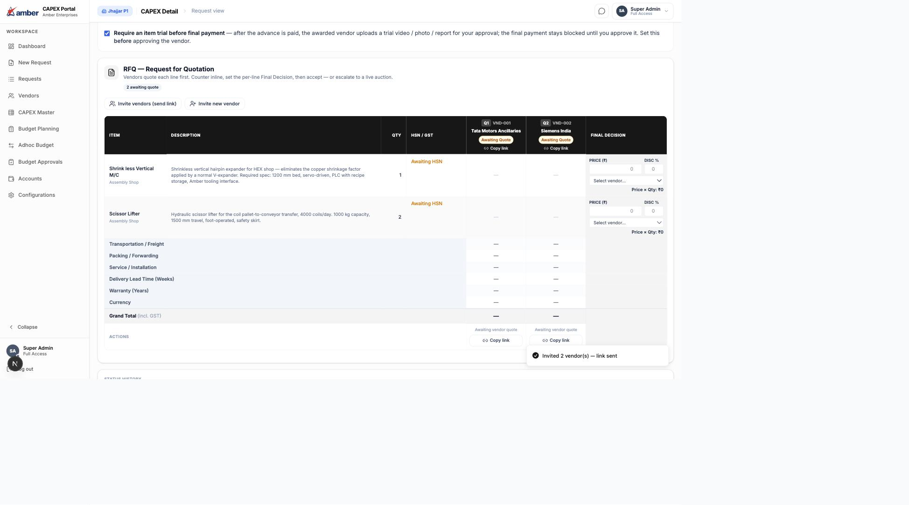

The grid is the sourcing team's working surface for the rest of the RFQ: **line items as rows,
vendors as columns**. Both vendors are *Awaiting Quote*; HSN reads *Awaiting HSN* (the vendor supplies
it); and the right-hand **Final Decision** column — Price, Disc %, Vendor, computed net — is already
there, per line.

## Slide 5.4 · The vendor's first screen: terms, not prices

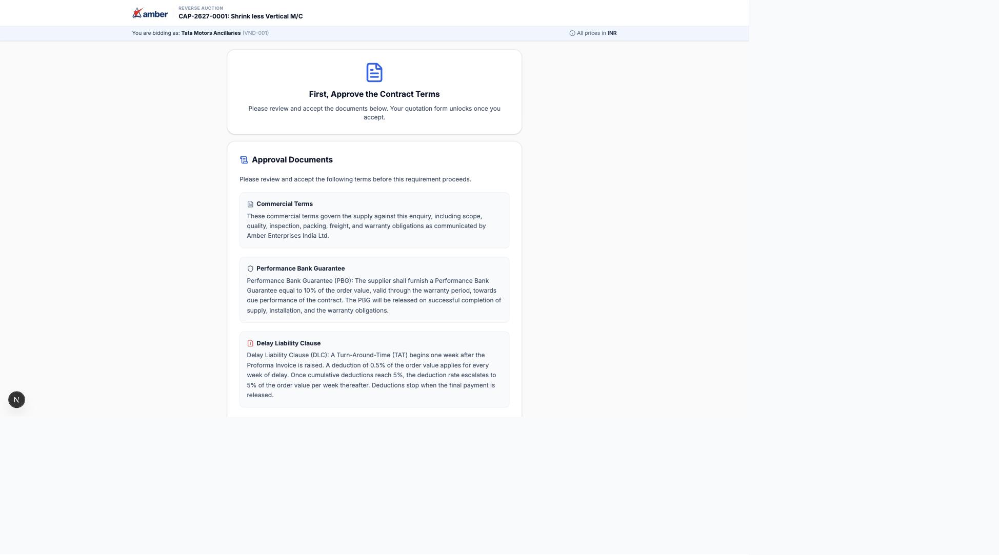
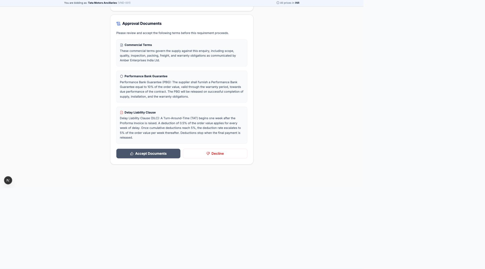

*"First, Approve the Contract Terms — your quotation form unlocks once you accept."* The vendor reads
the actual clauses (including the DLC in full: 0.5%/week, capped at 5%, then 5%/week) and must
**Accept Documents** before any price field appears. Declining locks the enquiry and sourcing can
re-send.

## Slide 5.5 · Quoting, line by line

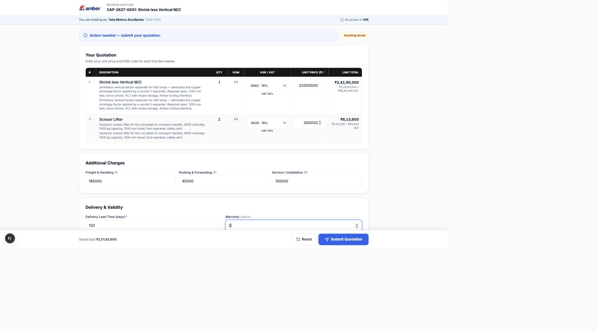

The unlocked form mirrors the internal grid: `# · Description · Qty · UOM · HSN/GST · Unit Price ·
Line Total`, then **Additional Charges** (freight / packing / service), then **Delivery & Validity**
(delivery lead time in **days**, warranty in years, currency).

**The vendor picks the HSN code, not sourcing.** HSN is a property of the *line item*, so once one
vendor sets it, every other vendor's form shows it read-only and GST is computed identically for all
of them — which is what makes the comparison honest. Sourcing can see the HSN but cannot override it.

## Slide 5.6 · GST is computed per line

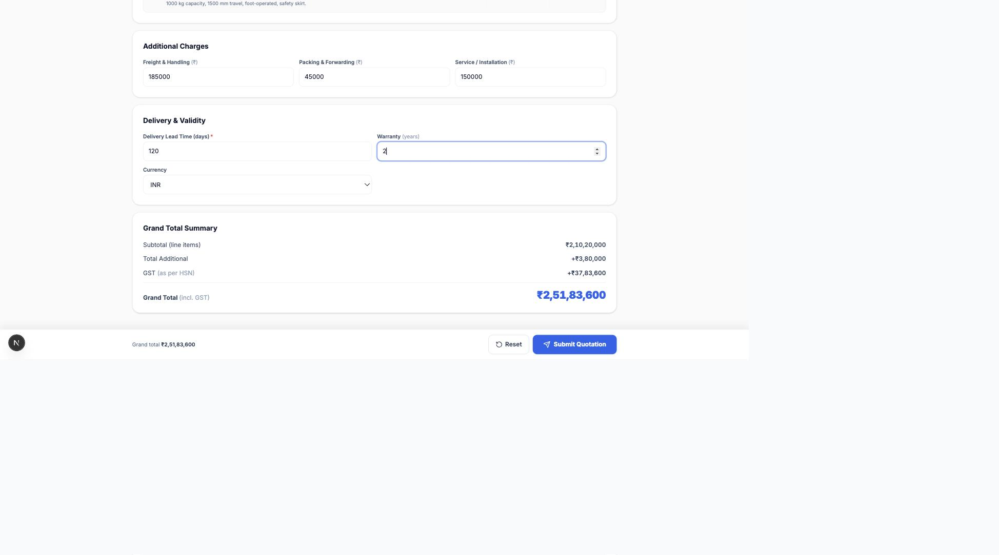

Tata's quotation: subtotal ₹2,10,20,000 + charges ₹3,80,000 + **GST ₹37,83,600** =
**₹2,51,83,600**. GST is per line from its HSN (8462 → 18%, 8428 → 18%); freight, packing and service
are **not** taxed.

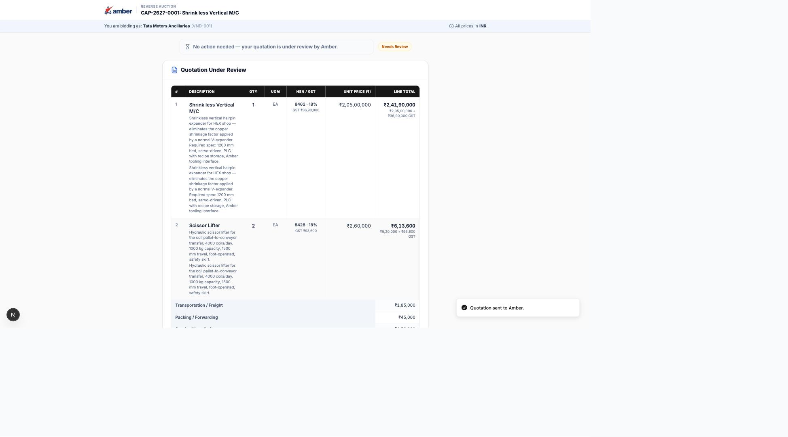

After submitting, the vendor sees a read-only summary and "under review by Amber".

## Slide 5.7 · Both quotes side by side

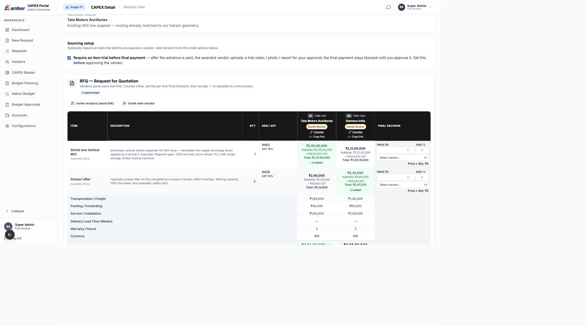

Now the grid earns its keep. Per line, the cheaper vendor is highlighted green with a **↓ Lowest**
chip — and they are **not the same vendor on both lines**:

| Line | Tata Motors | Siemens India | Lowest |
|---|---|---|---|
| Shrink less Vertical M/C | ₹2,05,00,000 (₹2,41,90,000 incl. GST) | ₹2,12,00,000 | **Tata** |
| Scissor Lifter | ₹2,60,000 | ₹2,32,000 (₹5,47,520 incl. GST) | **Siemens** |
| **Grand total** | **₹2,43,57,600** `L1` | ₹2,58,83,520 | |

Footer rows compare freight, packing, service, delivery, warranty and currency. The **L1** badge
marks the lowest whole quote.

## Slide 5.8 · Countering, inline

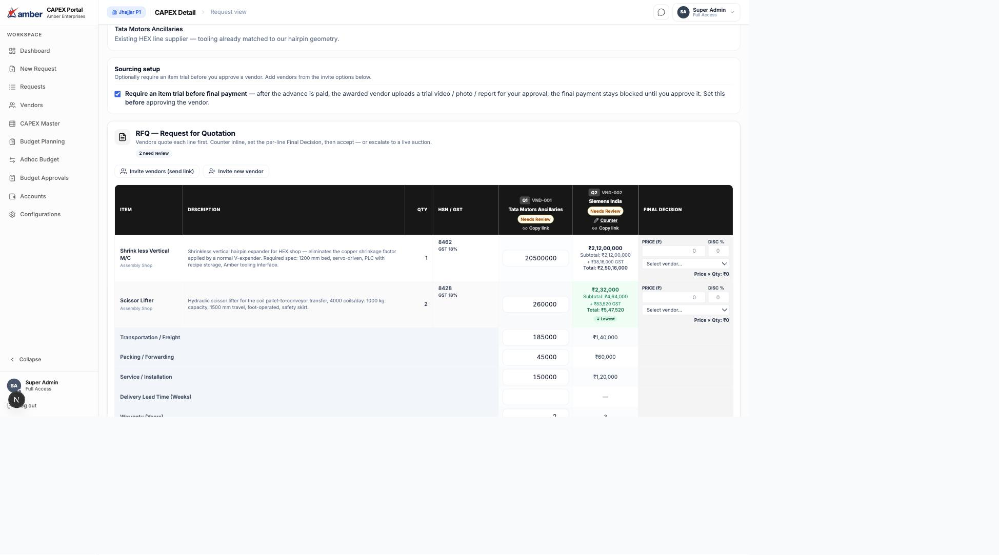

**Counter** turns one vendor's column into editable inputs — per-line unit prices *and* the footer
charges. Here Tata's unit price is pushed from ₹2,05,00,000 to ₹1,98,00,000 and sent back.

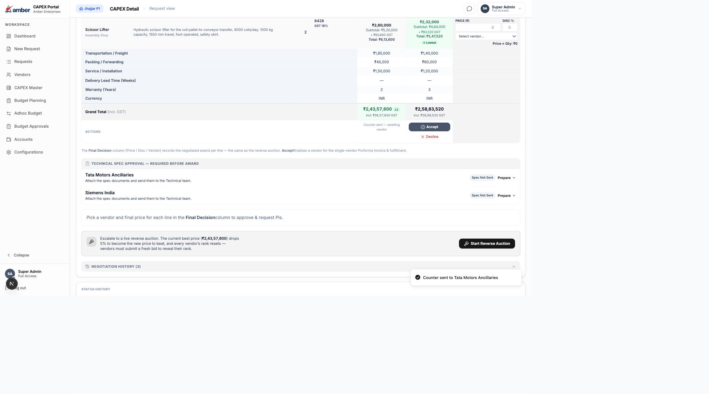

The column reads *"Counter sent — awaiting vendor"*, the grand total drops to **₹2,43,57,600**, and
**Negotiation History (5)** logs every move. The vendor can accept, counter back, or decline; either
side accepting closes the price.

## Slide 5.9 · The actions bar

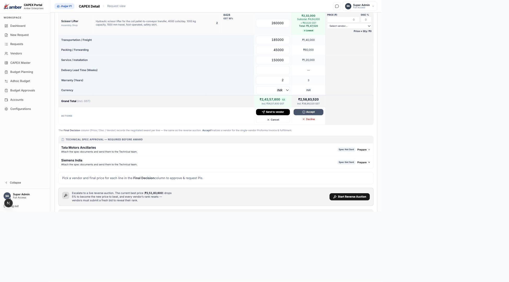

Below the grid, three things live together:

1. **Per-vendor actions** — Send to vendor / Accept / Decline / Cancel.
2. **Technical Spec Approval — required before award** (Part 6).
3. **Escalate to a live reverse auction** — with the offer spelled out: *"The current best price
   (₹2,43,57,600) drops 5% to become the new price to beat, and every vendor's rank resets."*

## Slide 5.10 · Both quotes agreed

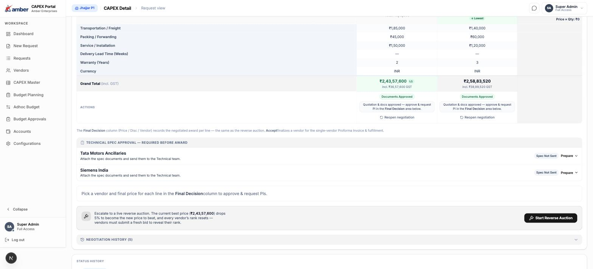

Both columns read **Quotation Approved** + **Documents Approved**, with *"approve & request PI in the
Final Decision area below."* Price and paperwork are settled. One gate to go.

---

# Part 6 — The technical specification gate

> *New in this build, and the most consequential change: you cannot award a vendor whose machine
> spec has not been signed off by Amber's Technical team.*

## Slide 6.1 · Why it is per vendor

Different vendors supply different machines, and a split award hands different lines to different
suppliers. So the gate is **per vendor**, not per request. Both vendors start at **Spec Not Sent** —
and `not_sent` blocks the award just as firmly as `rejected` does. The step cannot be skipped.

## Slide 6.2 · Sourcing prepares the package

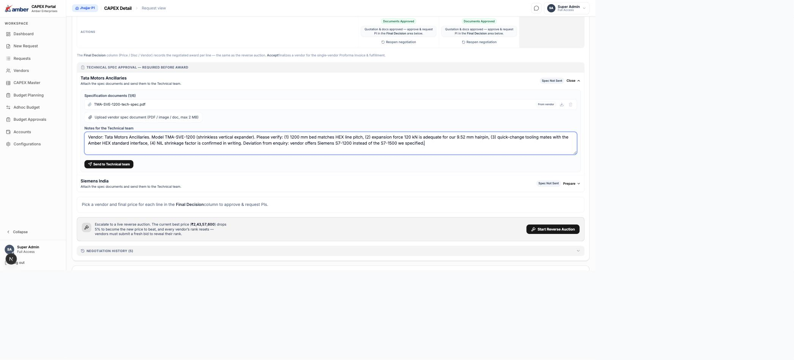

Per vendor: upload **the spec sheet the vendor supplied** (up to 6 files, ≤2 MB each — tagged
*"From vendor"*), plus free-text **Notes for the Technical team**. The notes are where sourcing flags
what to check:

> Model TMA-SVE-1200 (shrinkless vertical expander). Please verify: (1) 1200 mm bed matches HEX line
> pitch, (2) expansion force 120 kN is adequate for our 9.52 mm hairpin, (3) quick-change tooling
> mates with the Amber HEX standard interface, (4) NIL shrinkage factor is confirmed in writing.
> **Deviation from enquiry: vendor offers Siemens S7-1200 instead of the S7-1500 we specified.**

## Slide 6.3 · Sent to the Technical team

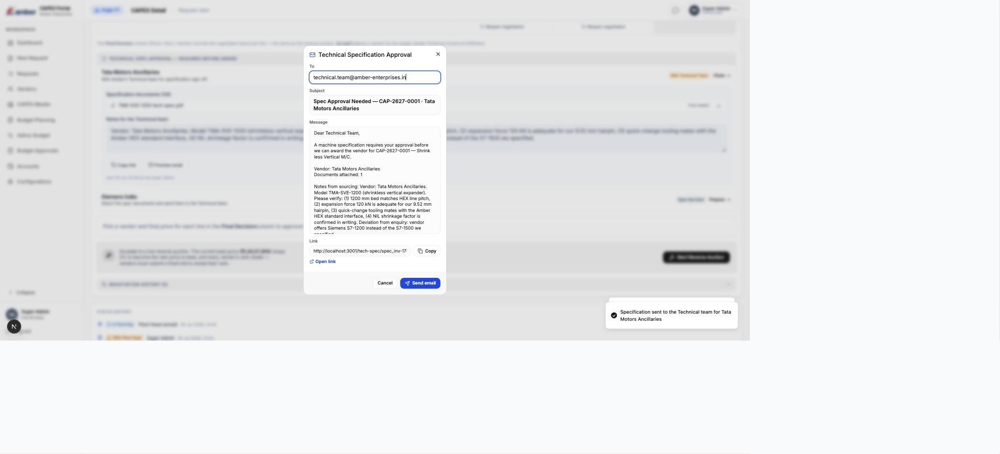

Save and send happen in **one** pass, so the notes can never be lost between the two. The email
carries the vendor, the document count, the notes verbatim, and the secure link.

## Slide 6.4 · The Technical team's page

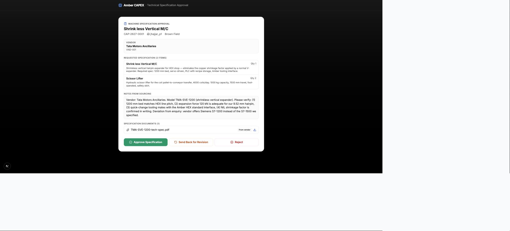

No login. They see the request, the vendor, the **requested** specification (the line-item
descriptions), sourcing's notes, and the downloadable documents — then decide:

- **Approve Specification** → this vendor becomes awardable.
- **Send Back for Revision** → returns to sourcing with a **required** remark; sourcing revises and
  re-sends with a **rotated** token; the loop repeats.
- **Reject** → also requires a remark.

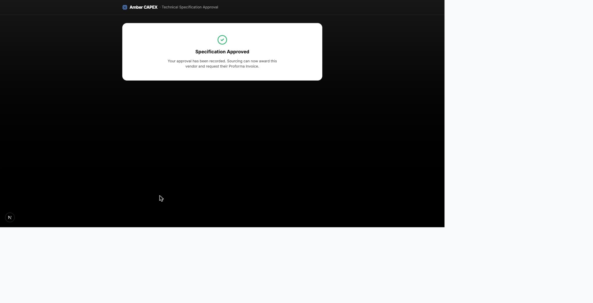

*"Sourcing can now award this vendor and request their Proforma Invoice."* The token is burned, so a
stale link cannot re-decide.

---

# Part 7 — Award: one request, two vendors

## Slide 7.1 · Filling the Final Decision

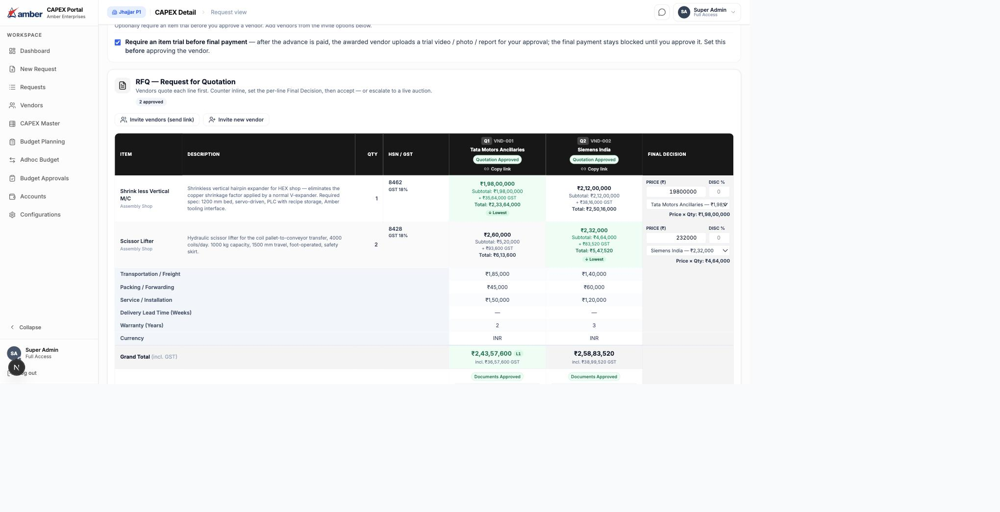

Per line, sourcing picks the winning vendor and the final price. Choosing a vendor **auto-fills that
line's price** from their quoted unit price, and there is a Disc % field plus a computed
`Price × Qty`. The decision persists as you type — no separate save needed before awarding.

Here the split is the obvious one: line 1 → **Tata** at ₹1,98,00,000 (the countered price);
line 2 → **Siemens** at ₹2,32,000.

## Slide 7.2 · Approve & Request PI

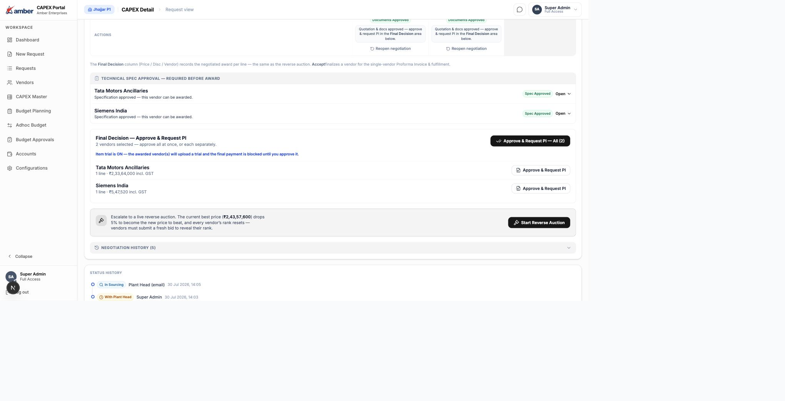

Both specs now read **Spec Approved — this vendor can be awarded**, and the award bar offers:

- **Approve & Request PI — All (2)** — award every selected vendor at once, or
- **Approve & Request PI** per vendor — award Tata now, Siemens later.

It also reminds you: *"Item trial is ON — the awarded vendor(s) will upload a trial and the final
payment is blocked until you approve it."*

Result — **two independent awards**:

| Vendor | Lines | Award value (incl. GST) |
|---|---|---|
| Tata Motors Ancillaries | Shrink less Vertical M/C × 1 | **₹2,33,64,000** |
| Siemens India | Scissor Lifter × 2 | **₹5,47,520** |

**Each award now runs its own complete fulfilment track** — its own PI, FA codes, PO, payment
milestones, trial and TAT clock. The request header changes to **PI Requested · 0 / 2 awards
complete**, and the request only reaches *Completed* when **every** award does.

Because the vendors already accepted the Commercial Terms, PBG and DLC to quote, there is **no
post-award terms step**. Sourcing goes straight to requesting the Proforma Invoice.

---

# Part 8 — The reverse auction

> Run on a second request, `CAP-2627-0002` (*Centralised Material Feeding for Molding Machines*,
> allocated ₹1.50 Cr), to show the other sourcing path end to end.

## Slide 8.1 · Auctions are escalated, never started cold

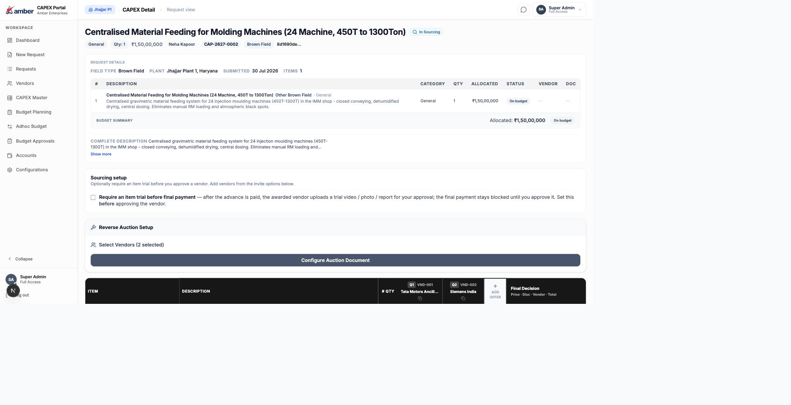

A reverse auction can only be escalated from an RFQ that already has **≥ 2 vendor quotations** —
otherwise there is no price to beat. On escalation each vendor's RFQ quotation is carried in as an
**opening bid**, and the panel switches to **Reverse Auction Setup**.

## Slide 8.2 · Configuring the auction

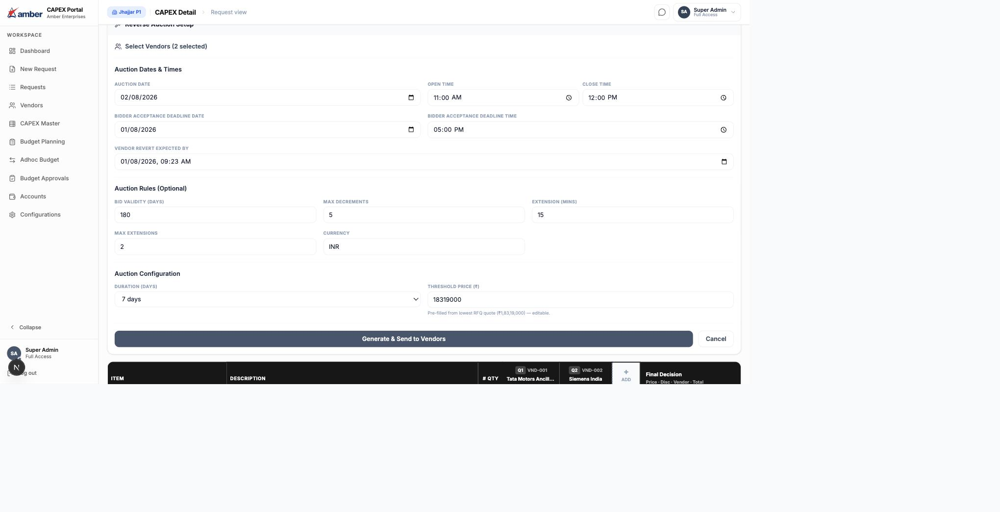

One form, four blocks:

- **Auction Dates & Times** — auction date, open time, close time, **bidder acceptance deadline**,
  and the **vendor revert expected by** timestamp.
- **Auction Rules** — bid validity (180 days), max decrements per bid (5), time extension
  (15 min, max 2 per bidder), currency.
- **Auction Configuration** — duration and **Threshold Price**, *pre-filled from the lowest RFQ
  quote (₹1,83,19,000) and editable*.
- **Generate & Send to Vendors**.

## Slide 8.3 · The Business Rules document

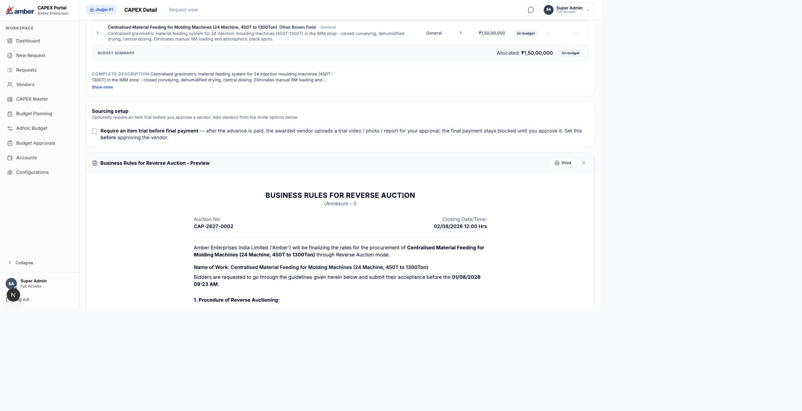

The portal generates a printable **"Business Rules for Reverse Auction (Annexure – I)"** —
auction number, closing date/time, name of work, the acceptance deadline, the procedure, and the
embedded Commercial Terms, PBG and DLC. This is the document vendors legally accept in order to bid.

## Slide 8.4 · Nobody bids until they've accepted

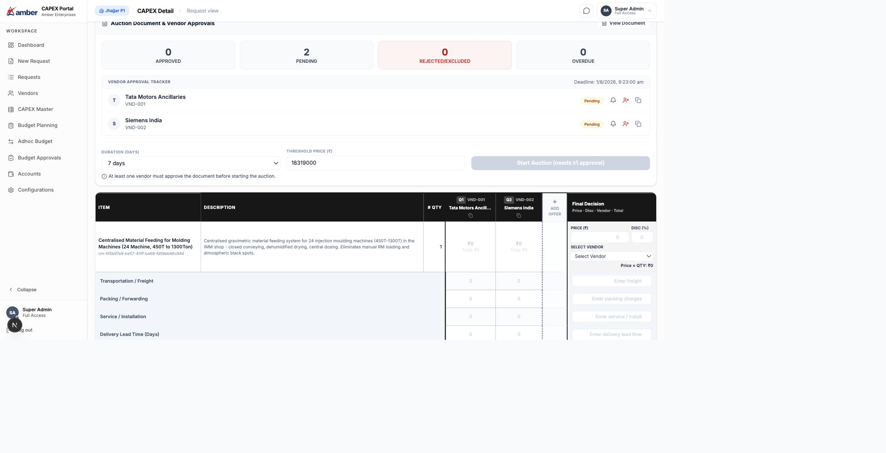

The **Vendor Approval Tracker** counts *Approved / Pending / Rejected-Excluded / Overdue*, shows the
revert deadline, and per vendor offers a **reminder**, **exclude**, and **copy link**. **Start
Auction is disabled** — *"At least one vendor must approve the document before starting the
auction."*

## Slide 8.5 · The vendor's acceptance screen

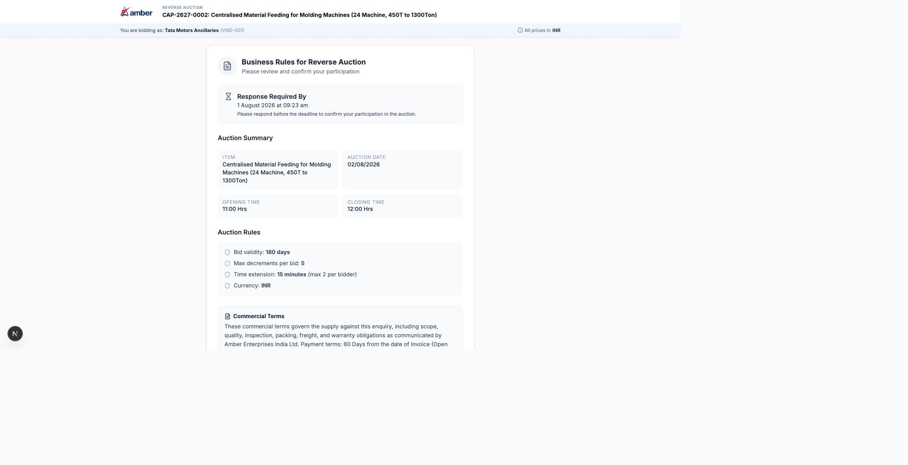
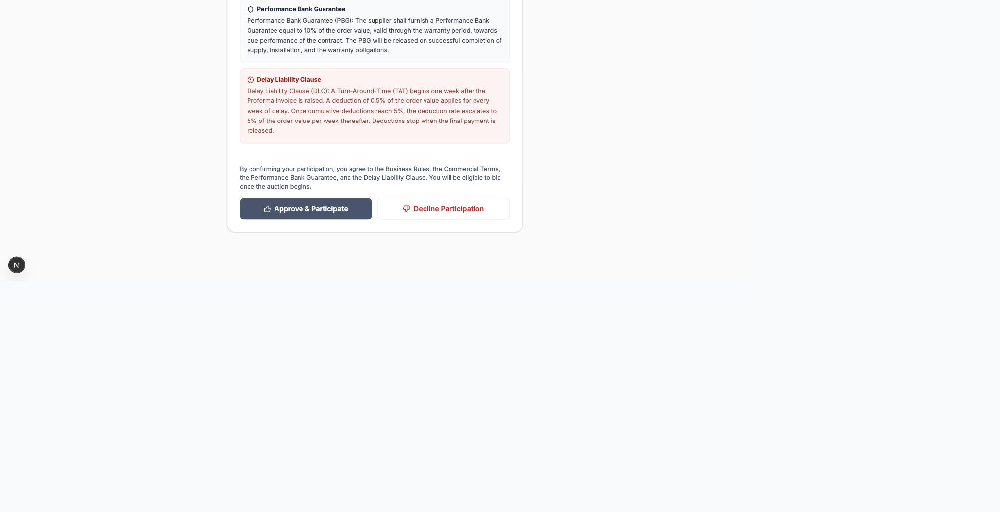

Response deadline, auction summary (item, date, opening and closing times), the four auction rules,
then Commercial Terms, PBG and DLC in full, and the binding sentence:

> By confirming your participation, you agree to the Business Rules, the Commercial Terms, the
> Performance Bank Guarantee, and the Delay Liability Clause. You will be eligible to bid once the
> auction begins.

→ **Approve & Participate** / **Decline Participation**.

## Slide 8.6 · Live

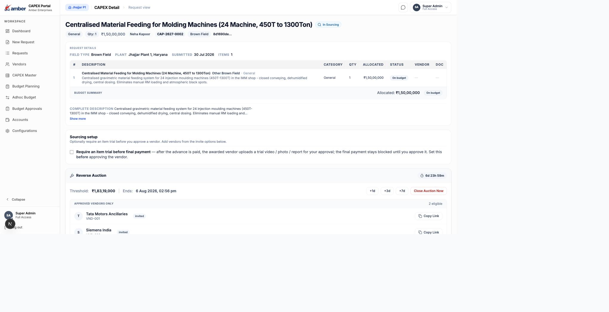

With both vendors approved the auction starts. Sourcing gets a **countdown** (6d 23h 59m), the
threshold, the eligible-vendor list with copy links, quick **+1d / +3d / +7d** extensions, and
**Close Auction Now** — the auction can end on the clock or on demand.

## Slide 8.7 · The bid screen, and the one number that matters

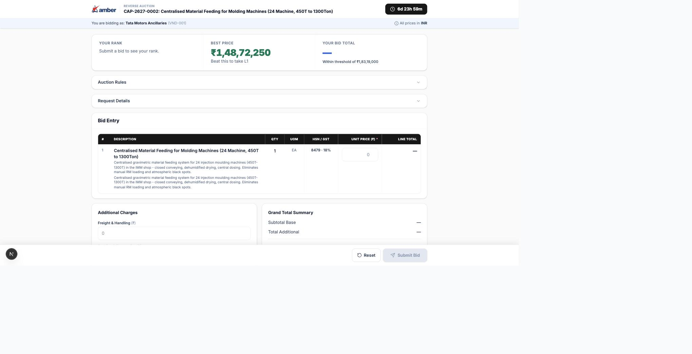

The vendor's auction screen is built around three figures:

| | |
|---|---|
| **Your Rank** | *"Submit a bid to see your rank"* — ranks come only from real bids; escalation resets everyone |
| **Best Price** | **₹1,48,72,250** — *"Beat this to take L1"* |
| **Your Bid Total** | live, with *"Within threshold of ₹1,83,19,000"* |

**Where ₹1,48,72,250 comes from.** The lowest RFQ quotation was ₹1,56,55,000 (Tata: ₹1,48,00,000 +
₹3,20,000 freight + ₹85,000 packing + ₹4,50,000 service). The auction **opens at that minus 5%**.
Thereafter it moves **only when a vendor actually beats it** — a bid above it leaves the opening
price standing.

There is deliberately **one** price to beat, for the **whole quote** — no per-line best price. It is
compared on an **INR basis**, so a foreign-currency bid can't be mistaken for the lowest.

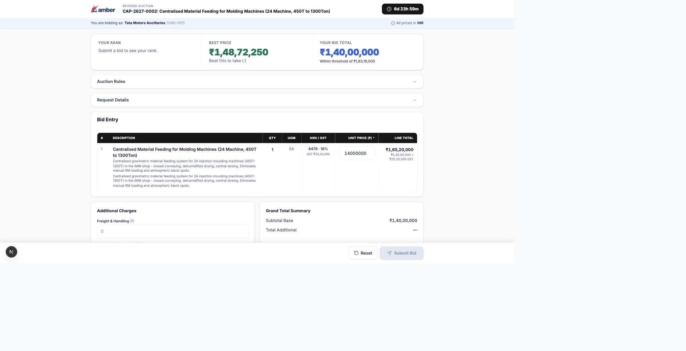

Bidding ₹1,40,00,000 base gives a bid total of ₹1,48,00,000 — under the best price, so this bid takes
L1. Below the line, the vendor still fills the same charges/delivery/warranty fields, and GST is still
derived from the line's HSN (₹25,20,000 here).

After the auction ends, sourcing awards through the **same per-line Final Decision column and the
same split-award bar** as the RFQ path (Part 7) — including the same per-vendor technical-spec gate.
The two paths converge completely from the award onward.

---

# Part 9 — Fulfilment: from award to the last rupee

> Followed here for the **Tata award** (₹2,33,64,000). The Siemens award runs the identical track in
> parallel, with its own documents, tokens, PO and payments.

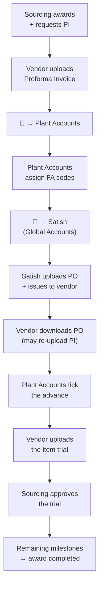
```mermaid
flowchart TD
  A["Sourcing awards<br/>+ requests PI"] --> B["Vendor uploads<br/>Proforma Invoice"]
  B --> C["📧 → Plant Accounts"]
  C --> D["Plant Accounts<br/>assign FA codes"]
  D --> E["📧 → Satish<br/>(Global Accounts)"]
  E --> F["Satish uploads PO<br/>+ issues to vendor"]
  F --> G["Vendor downloads PO<br/>(may re-upload PI)"]
  G --> H["Plant Accounts tick<br/>the advance"]
  H --> I["Vendor uploads<br/>the item trial"]
  I --> J["Sourcing approves<br/>the trial"]
  J --> K["Remaining milestones<br/>→ award completed"]
```

## Slide 9.1 · The vendor uploads the Proforma Invoice

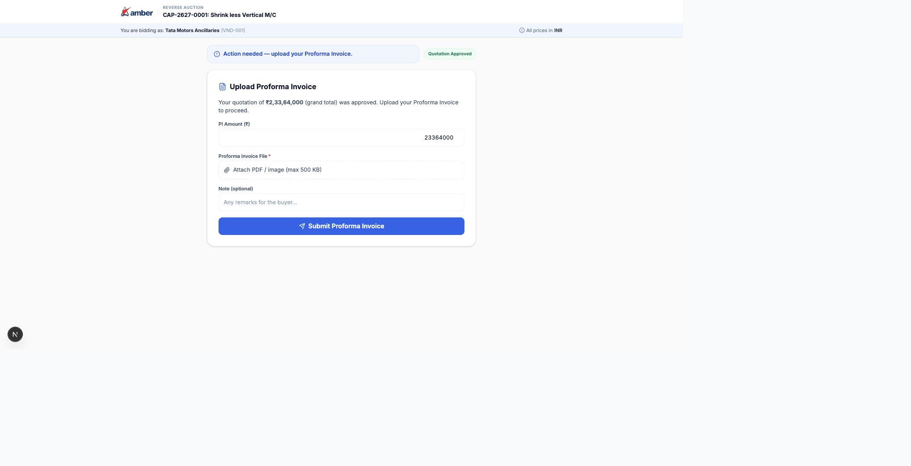

*"Your quotation of ₹2,33,64,000 was approved. Upload your Proforma Invoice to proceed."* — PI
amount (pre-filled), the file, and a note to the buyer.

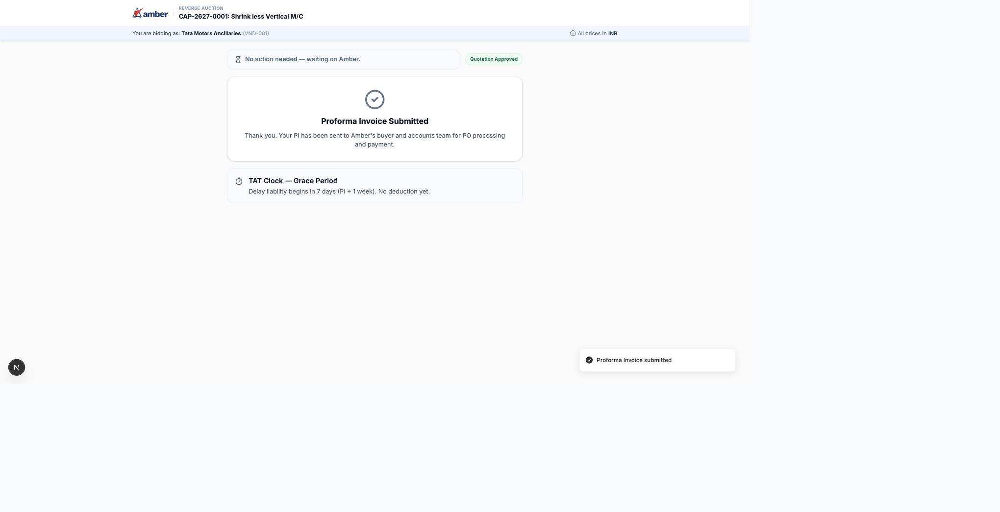

On submit, the **TAT clock** starts: *"Delay liability begins in 7 days (PI + 1 week). No deduction
yet."* From here the DLC the vendor accepted becomes live arithmetic — 0.5% per week, cumulative cap
5%, then 5% per week, stopping when the final payment is released.

## Slide 9.2 · The internal view fans out per award

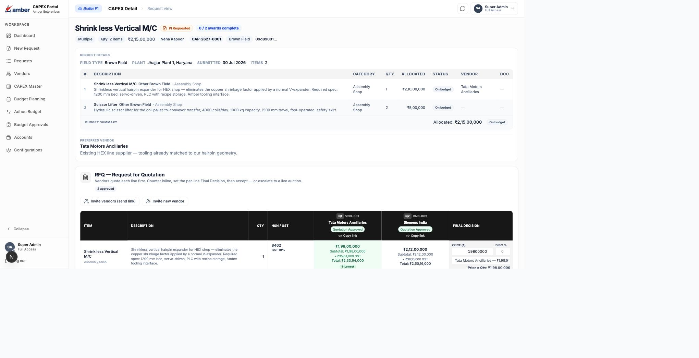
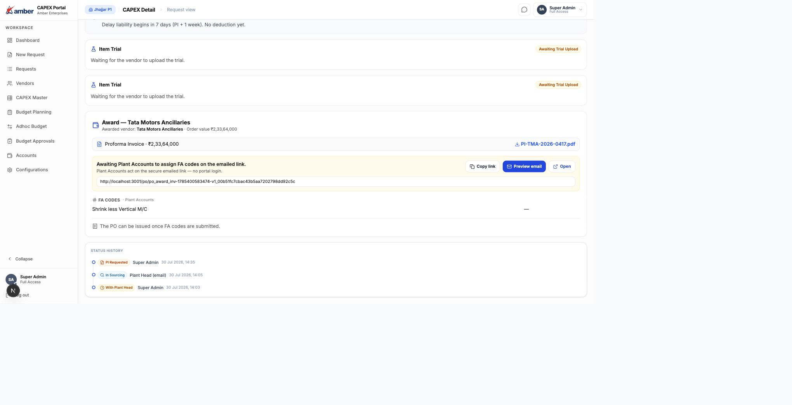

**Award — Tata Motors Ancillaries**: order value, the downloadable PI, an **Item Trial** card per
award (*Awaiting Trial Upload*), the FA-code table, and the handoff banner — *"Awaiting Plant Accounts
to assign FA codes on the emailed link. Plant Accounts act on the secure emailed link — no portal
login."*

Internally this whole panel is **read-only**. Nobody with a portal seat can type an FA code or tick a
payment; they can only see the state and re-send the link. That separation is the point.

## Slide 9.3 · Email 1 — to Plant Accounts

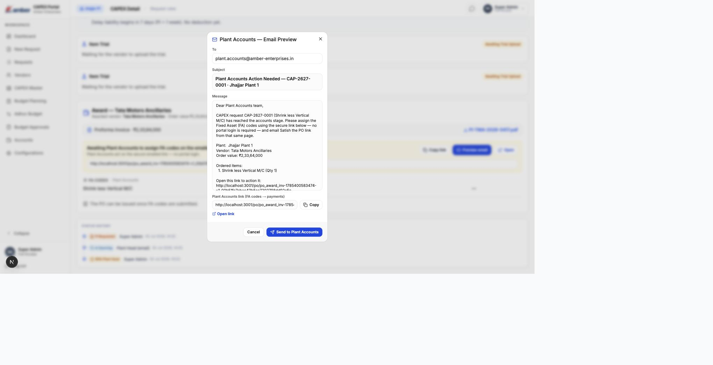

Plant, vendor, order value, the ordered items, and the link. Body text spells out both jobs:
*"assign the Fixed Asset (FA) codes … and email Satish the PO link from that same page."*

## Slide 9.4 · Plant Accounts, step 1 — FA codes

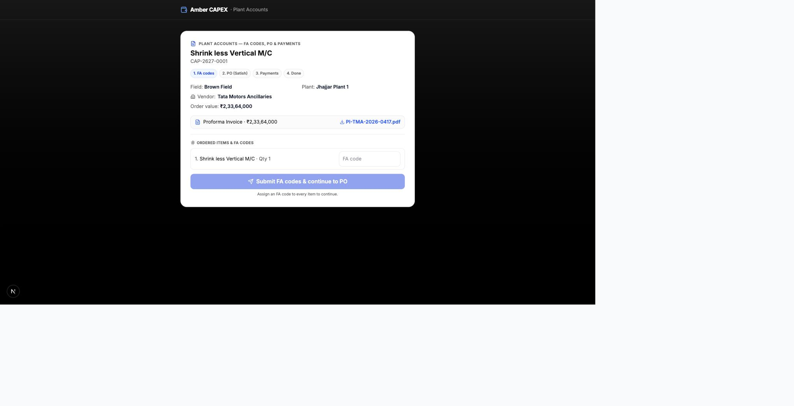
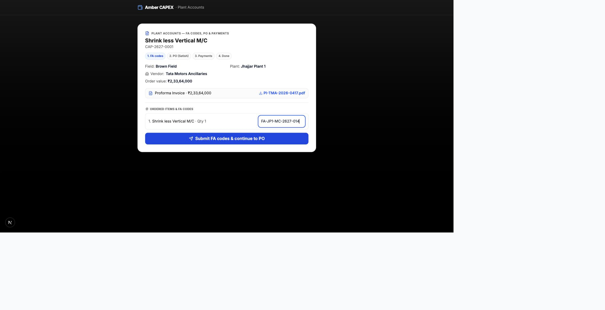

Their page carries a four-step rail — **1. FA codes → 2. PO (Satish) → 3. Payments → 4. Done** — so
they always know where the track stands. They see the vendor, the order value, the PI to download,
and an FA-code field **per ordered item**. Submit is gated until every item has one.

## Slide 9.5 · Email 2 — auto-composed to Satish

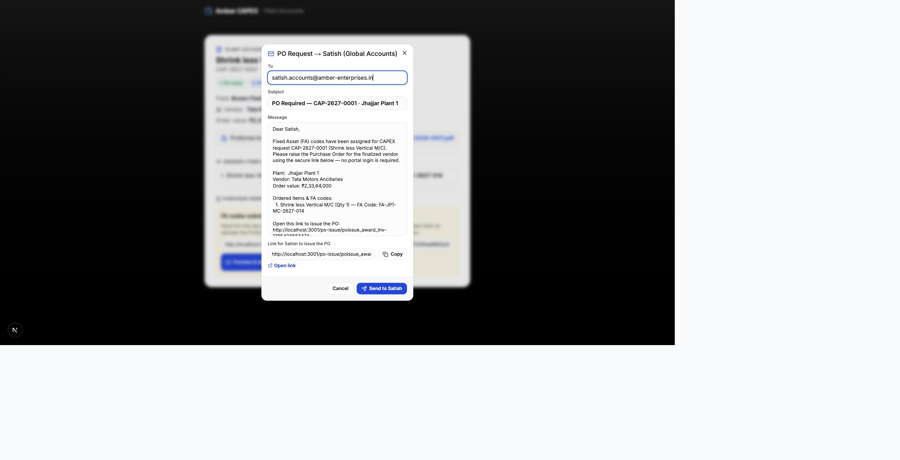

Submitting the FA codes mints Satish's token **and immediately opens the email to him**, pre-filled
with the items and their FA codes. Plant Accounts don't have to remember the next step — it opens in
their face.

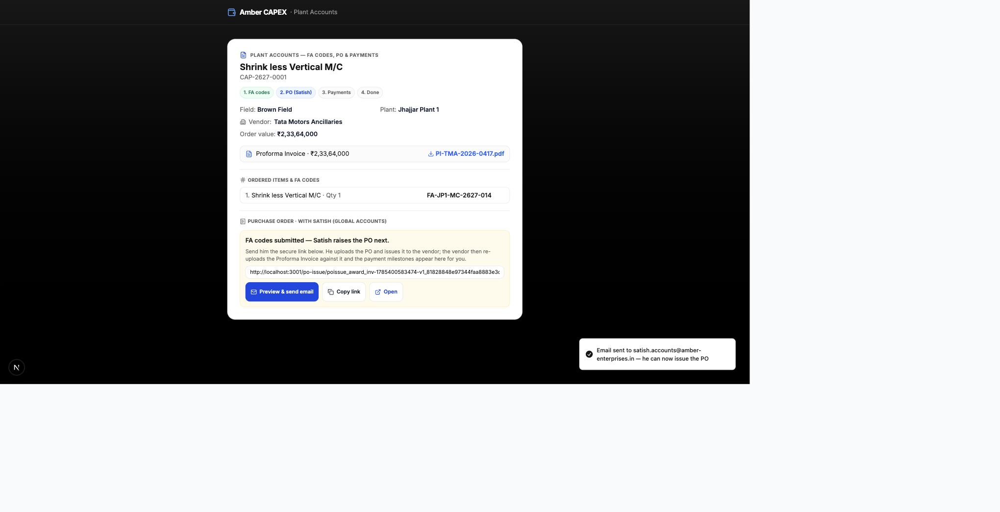

The rail advances to **2. PO (Satish)** and the panel keeps copy-link / re-send / open, so the handoff
can be repeated without regenerating anything.

## Slide 9.6 · Global Accounts issues the PO

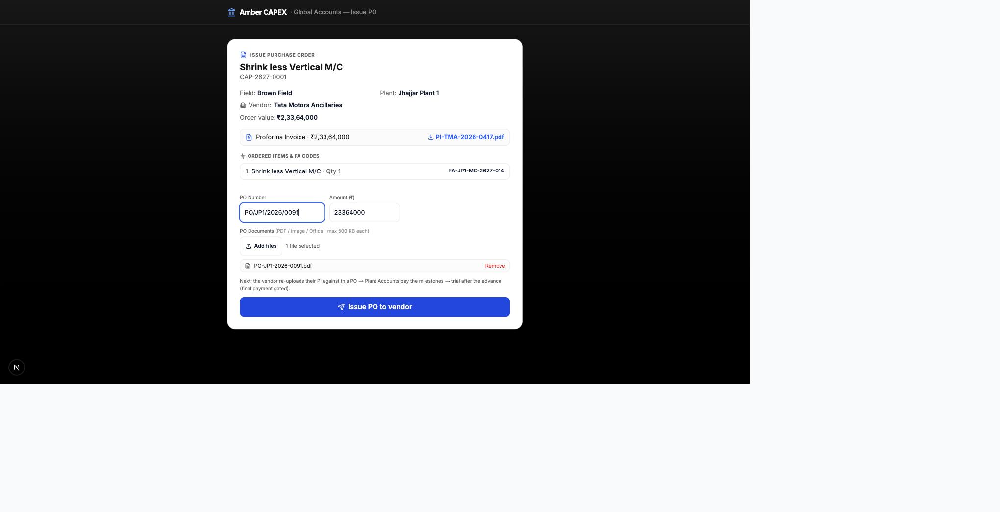

Satish's page — a **different token on a different URL**; each page rejects the other's token
outright, so one link can never do the other's job. He sees the PI and the FA codes, then enters the
**PO number**, confirms the amount, and attaches the **PO document(s)**.

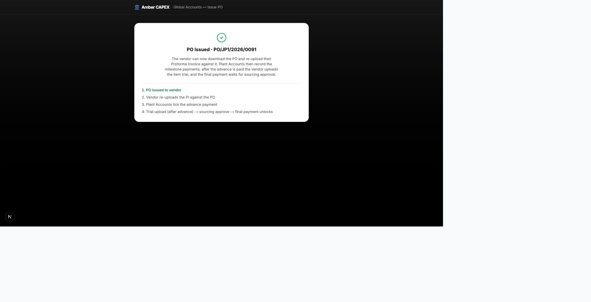

**PO Issued · PO/JP1/2026/0091**, with the remaining sequence restated: vendor re-uploads the PI →
Plant Accounts tick the advance → trial → final payment.

## Slide 9.7 · The vendor gets the PO

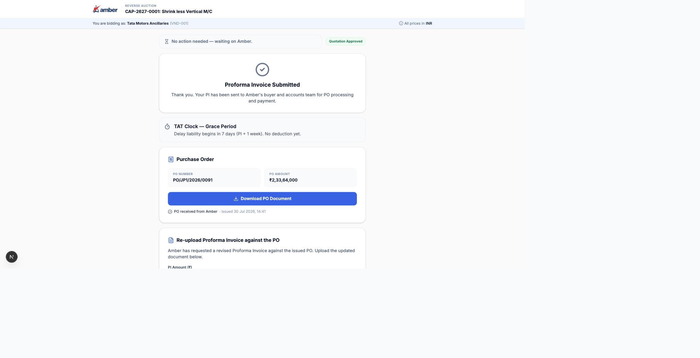

A **Purchase Order** card with number, amount, **Download PO Document**, and the issue timestamp —
plus a **Re-upload Proforma Invoice against the PO** card, because a PI raised before the PO often
needs to be reissued against it.

That window **closes on the first payment**. Once money has moved against the PI on file, revising it
would change what was already paid.

## Slide 9.8 · Payment milestones

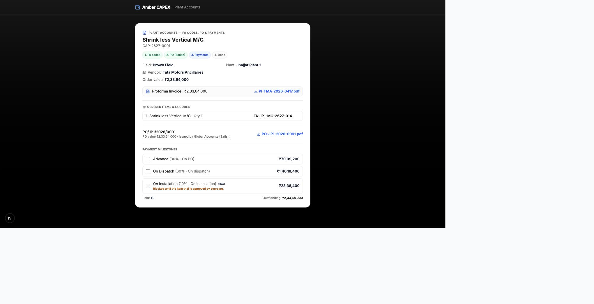

Milestones come from the vendor's payment terms:

| Milestone | Share | Amount | Trigger |
|---|---|---|---|
| Advance | 30% | ₹70,09,200 | On PO |
| On Dispatch | 60% | ₹1,40,18,400 | On dispatch |
| **On Installation** `FINAL` | 10% | ₹23,36,400 | On installation |

The final one is visibly **locked**: *"Blocked until the item trial is approved by sourcing."* Not
just greyed in the UI — the mutation itself refuses.

Ticking the advance stamps `advancePaidAt`, which starts the expected final-payment date calculation
from the vendor's delivery lead time, and opens the trial.

## Slide 9.9 · The trial

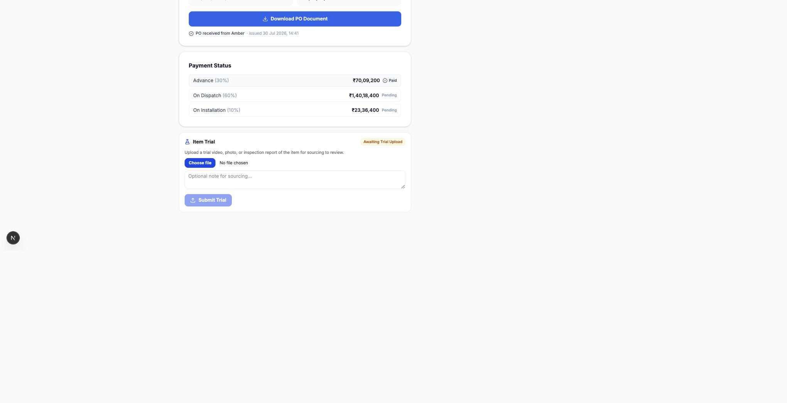
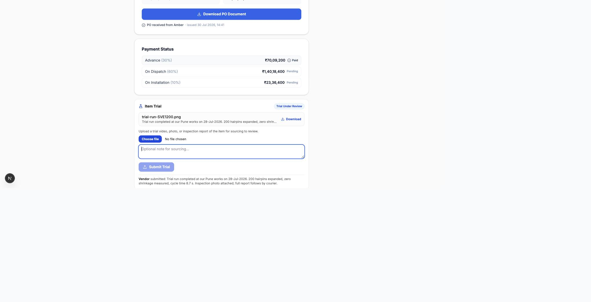

*"Upload a trial video, photo, or inspection report of the item for sourcing to review."* The vendor
attaches evidence and a note:

> Trial run completed at our Pune works on 28-Jul-2026. 200 hairpins expanded, zero shrinkage
> measured, cycle time 8.7 s.

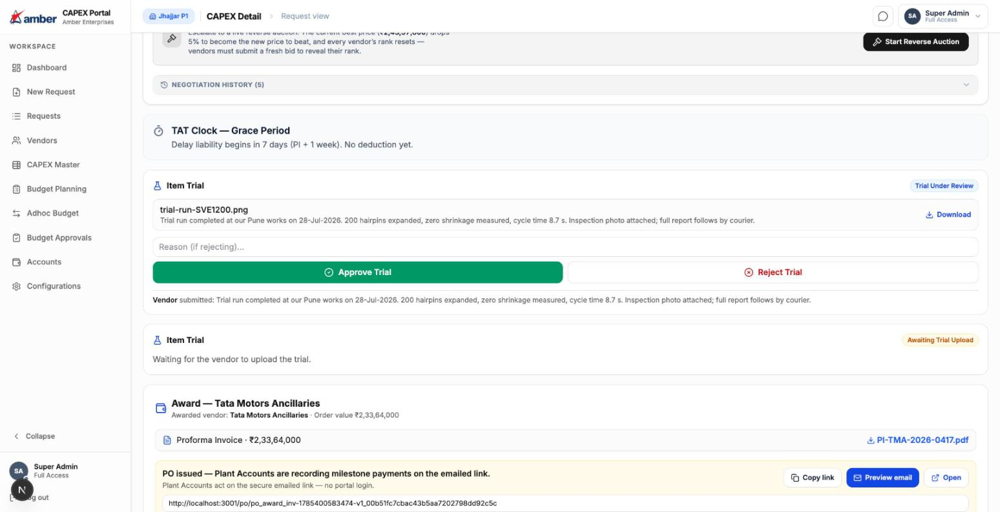

Sourcing reviews it on the request detail: download the file, read the note, then **Approve Trial** or
**Reject Trial** with a reason (rejection sends the vendor back to re-upload).

## Slide 9.10 · Settled

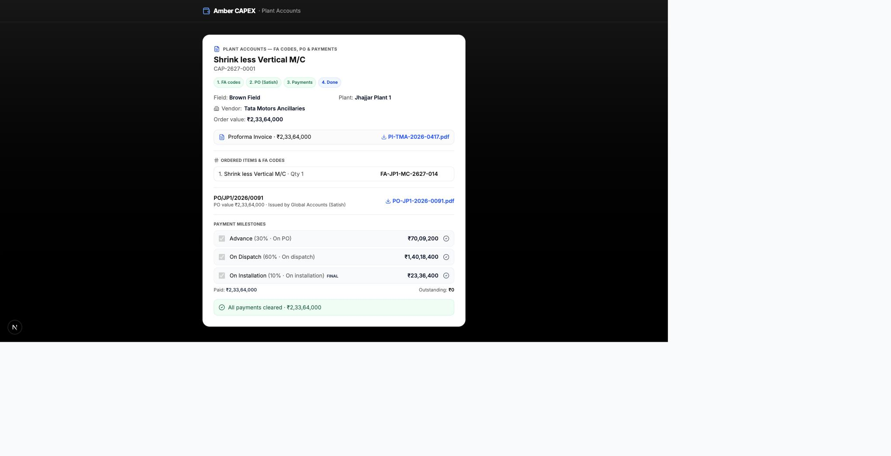

With the trial approved the final milestone unlocks. All three ticked:
**Paid ₹2,33,64,000 · Outstanding ₹0 · All payments cleared**, rail on **4. Done**, and the award is
`completed`. The TAT clock stops.

The **request** stays at *PI Requested* until the Siemens award finishes too — coarse status at the
request level, granular truth per award.

---

# Part 10 — Trackers, admin and reporting

## Slide 10.1 · Accounts Queue

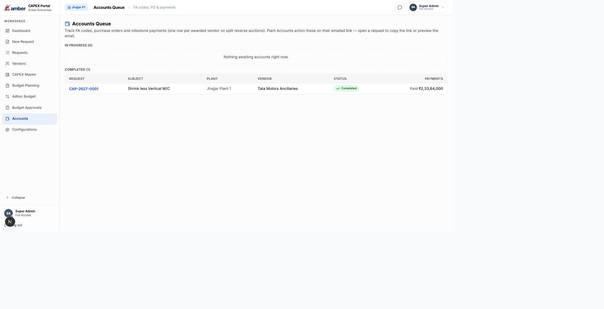

A **read-only** tracker (sourcing member + super admin), **one row per awarded vendor** —
so a split award appears twice. Split into *In Progress* and *Completed*, with the paid figure. It
answers "where is every rupee?" without granting anyone the power to move it.

## Slide 10.2 · Adhoc Budget Reallocation

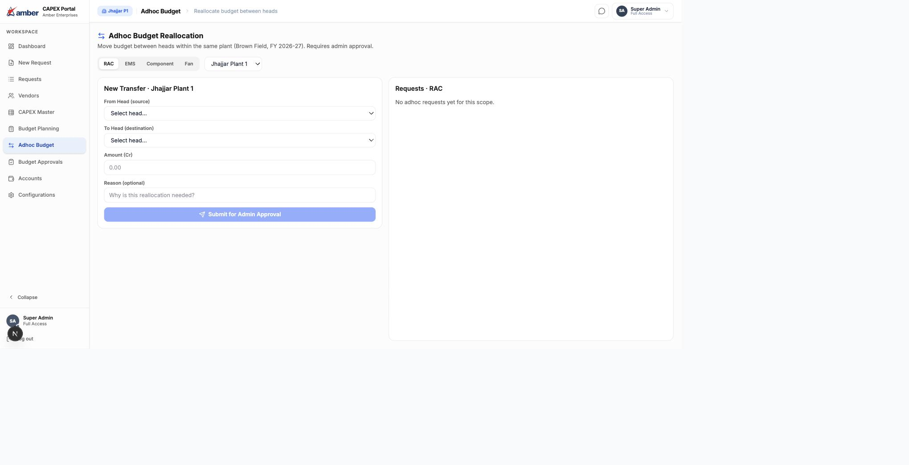

The only mid-year change to an approved budget. Move money **from one head to another within the same
plant and FY**: source head, destination head, amount in Cr, reason. It goes to the **super admin**
for approval, and once approved it writes a per-head allocation override that the master honours
instead of the summed line items.

## Slide 10.3 · Dashboard

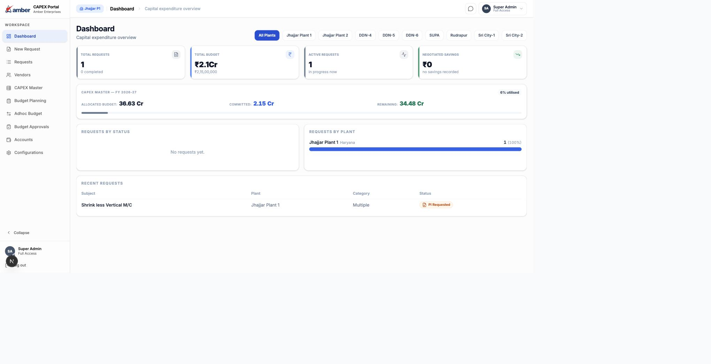

Plant filter, four KPI tiles (Total Requests · Total Budget · Active Requests · Negotiated Savings),
the FY utilisation bar — **Allocated ₹36.63 Cr · Committed ₹2.15 Cr · Remaining ₹34.48 Cr, 6%
utilised** — requests by status, requests by plant, and recent requests. Green means savings or
headroom; red means over-budget. That colour rule holds across the whole product.

## Slide 10.4 · Configurations

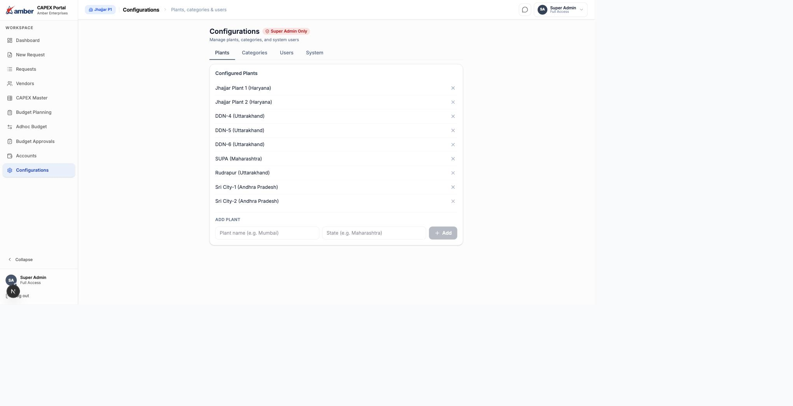

**Super admin only.** Four tabs — Plants, Categories, Users, System — for the reference data the rest
of the portal depends on.

---

# Part 11 — Every email in one place

The portal composes and previews mail; it does not send it. Each email carries a **single-purpose
token** for exactly one job.

| # | Trigger | To | Purpose | Token / page |
|---|---|---|---|---|
| 1 | Budget proposal submitted | Plant head | Approve / edit-and-send-back / reject a budget | `approvalToken` → `/approve/…` |
| 2 | Admin approves the budget | Global Accounts (Satish) | Final sign-off — **publishes the FY** | `accountsToken` → `/approve/…` |
| 3 | Request submitted | Sourcing engineer | Notification of a new request | *(informational)* |
| 4 | Brown Field / Digitisation / IT request submitted | Plant head | Approve the request for sourcing | `approvalToken` → `/approve/…` |
| 5 | Vendors invited | Vendor | Terms + quotation link | `token` → `/supplier/…` |
| 6 | Spec sent | Technical team | Approve the machine specification, per vendor | `techSpec.token` → `/tech-spec/…` |
| 7 | PI submitted | Plant Accounts | FA codes, then payments | `poToken` → `/po/…` |
| 8 | FA codes submitted | Global Accounts (Satish) | Issue the PO | `poIssueToken` → `/po-issue/…` |

Tokens are CSPRNG-generated. Decision tokens (budget sign-off, technical spec) are **burned on use**
and **rotated on re-send**, so a forwarded link cannot re-decide. The accounts tokens are not burned,
because those pages are revisited across several steps.

---

# Part 12 — How it is built (and what is not real yet)

## Slide 12.1 · Architecture, in plain terms

| | |
|---|---|
| **Framework** | Next.js 16 (App Router), TypeScript strict, Tailwind v4, shadcn/ui |
| **Backend** | **None.** Entirely client-side |
| **State** | One React context (`CapexProvider`) is the single source of truth |
| **Persistence** | `localStorage` key `capex_data_v2` for workflow state |
| **Files** | PIs, POs, spec sheets, trials, attachments live in **IndexedDB**, kept out of localStorage so the ~5 MB quota is never hit |
| **Route groups** | `(internal)` = authenticated portal · `(public)` = tokenised pages, no auth |
| **Cross-tab** | A `storage` listener re-syncs requests, invites, budget proposals and the master, so a decision made on a public page shows up in the portal tab |

State transitions are enforced in the context, not just the UI: `ALLOWED_TRANSITIONS` rejects an
invalid move and returns the record unchanged. The gates behave the same way — `awardAndRequestPi`,
`finalizeSplitAward` and `requestProformaInvoice` all refuse a vendor whose technical spec is not
approved, and `markPaymentMade` refuses the final milestone while a trial is outstanding. Disabling a
button is the courtesy; the mutation is the rule.

## Slide 12.2 · What is deliberately mock

Be clear-eyed about this when demoing:

- **Authentication.** Picking a role *is* logging in. No passwords, no server-side authorisation.
- **Email.** Composed and previewed, never transmitted. You copy the link and send it yourself.
- **Storage.** Per-browser. Clearing site data clears the portal. There is no shared database, so two
  people on two machines do not see each other's work.
- **Tokens.** Unguessable, but validated client-side against local data.
- **Currency.** A static FX table converts to an INR basis for comparison; no live rates.
- **No test suite.** `npx tsc --noEmit` is the verification gate, then `npm run build`, then
  role-switching smoke tests. (`npm run lint` is broken in this Next 16 / ESLint 9 setup.)

Everything *workflow* — the gates, the transitions, the tokens, the split awards, the arithmetic —
is real and enforced. What is mocked is the plumbing around it.

## Slide 12.3 · Appendix — request status flow

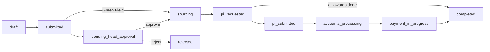
```mermaid
flowchart LR
  d[draft] --> s[submitted]
  s --> ph[pending_head_approval]
  ph -->|approve| so[sourcing]
  s -->|Green Field| so
  so --> pir[pi_requested]
  pir --> pis[pi_submitted]
  pis --> ap[accounts_processing]
  ap --> pip[payment_in_progress]
  pip --> c[completed]
  pir -->|all awards done| c
  ph -.reject.-> rej[rejected]
```

For a **split award** the request status stays coarse — `pi_requested` while awards are in flight,
`completed` once every award completes — and the granular chain
(`awarded → pi_requested → pi_submitted → accounts_processing → payment_in_progress → completed`)
runs per vendor.

## Slide 12.4 · Appendix — every gate, and what enforces it

| Gate | Who clears it | Enforced by |
|---|---|---|
| Budget — plant head | Plant head (email link) | `decideBudgetPlantHead`, status-guarded |
| Budget — admin | Super admin | `decideBudgetProposal`, `pending_admin` only |
| Budget — publish | Global Accounts (email link) | `decideBudgetAccounts`, `pending_accounts` only, token burned |
| Request approval | Plant head (email link) | `decideRequestPlantHead`; Green Field skips |
| Contract terms | Vendor | Quote form gated until `docApprovalStatus = approved` |
| Incoterms (foreign vendors) | Vendor + sourcing | `incoTermsBlocksAward` folded into `canRequestPi` |
| **Technical spec** | Technical team (email link) | `techSpecBlocksAward` in all three award mutations |
| Auction participation | Vendor | `canStartAuction` needs ≥ 1 approval |
| Final payment | Sourcing (trial approval) | `finalPaymentBlockedByTrial` in `markPaymentMade` |

## Slide 12.5 · Appendix — rough edges seen during this run

Recorded honestly, because a walkthrough that hides them is not useful:

1. **Target FY must be saved before submitting.** Typing a new Target FY and clicking
   **Submit to Plant Head** in one go fails validation — the submit handler validates the *saved*
   proposal, so the new FY isn't seen yet. Clicking **Save Draft** first works. Worth fixing by
   validating the pending edits.
2. **Delivery lead time shows `—`.** Suppliers enter delivery in **days**, but the read-only quote
   summary and the comparison-grid footer row are labelled *(Weeks)* and render `—`. The value is
   captured; only the display is wrong.
3. **Line descriptions render twice** on the supplier quotation table.
4. **Native `confirm()` dialogs** guard Accept / Decline / Reopen / Start-auction. Fine for humans,
   but they block browser automation and can't be styled — an in-app confirm would be better.
5. **A `Machinery` head surfaces under a card labelled `Assembly Shop`** (a canonical-head mapping in
   `greenFieldConstants.ts`), which can read as a mislabel to a budget author.

---

## Closing slide · The story in one paragraph

A maintenance engineer writes next year's budget from a blank sheet, uploads it as a spreadsheet, and
it clears three independent gates — plant head, admin, Global Accounts — before a single rupee is
spendable. A plant buyer then raises a request that can only point at money already approved. The
plant head waves it through by email. Sourcing invites two vendors, who accept Amber's contract terms
before they are allowed to see a price field, quote line by line with their own HSN codes, and get
countered inline. Amber's Technical team signs off each machine on its own link. Sourcing splits the
award across both vendors, and each award runs its own track: the vendor raises a PI, Plant Accounts
code the asset, Global Accounts issue the PO, the vendor proves the machine with a trial, and the
final 10% is only released once sourcing accepts it. Every handoff outside the buying team is a
single-purpose emailed link, every gate is enforced in the data layer rather than the button, and
every rupee is traceable from the budget line it came out of to the milestone it was paid against.
