# Amber CAPEX Portal — Product Walkthrough

**Every screen in this document was captured from the running product on 22 August 2026.** Nothing
here is a mock-up or a wireframe. A fiscal year was written from a blank sheet, pushed through three
approval gates, spent against by eighteen requests across five plants, sourced from five onboarded vendors and one
foreign one-time supplier, negotiated, split between two suppliers, taken through a reverse auction, and settled down to the
last rupee — and the screens you see are what the people doing that work actually saw.

Read it front to back and you will know the product as well as someone who has used it. You should
not need to open the portal to follow any of it.

| | |
|---|---|
| **Product** | Amber CAPEX Portal — capital-expenditure management for Amber Enterprises India Ltd |
| **What it covers** | Budget planning, budget approval, capital requests, vendor sourcing, price negotiation, reverse auctions, technical sign-off, awards, purchase orders, milestone payments and management reporting |
| **Who uses it** | Plant buyers, the sourcing team, maintenance/budget authors and the administrator inside Amber; plant heads, the technical team, both accounts teams and every vendor from outside, by email |
| **In this document** | 93 screens across 15 parts |

---

# Part 0 — The one-minute version

## Slide 0.1 · The problem this solves

Amber commits capital across nine plants. Before this portal that money moved through spreadsheets,
email threads and phone calls: a plant asks for a machine, somebody chases quotations, somebody else
argues the price down, a third person raises the purchase order, and Accounts find out last. Nobody
could answer *"where is this request, and who is sitting on it?"* without ringing four people, and
nobody could answer *"how much of this year's budget have we actually committed?"* at all.

The portal turns that into **one tracked pipeline with named gates**, where every rupee can be traced
from the budget line it came out of to the milestone it was paid against.

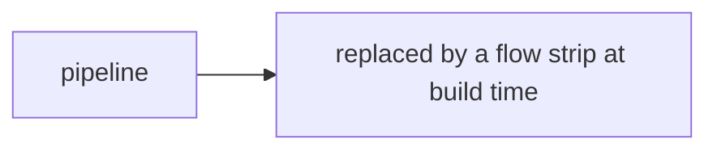
```mermaid
flowchart LR
  A[pipeline] --> B[replaced by a flow strip at build time]
```

Two ideas carry the whole product:

1. **Money is pre-approved before it can be asked for.** Every request must point at a specific
   sub-particular inside an approved budget head. You cannot request what was never budgeted, and
   every screen shows allocated against committed.
2. **People outside the buying team never get a login.** Plant heads, the technical team, both
   accounts teams and every vendor act on a single-purpose link sent to them by email. They see the
   one thing they are being asked to do, and nothing else.

## Slide 0.2 · Who does what

| Who | How they get in | What they are responsible for |
|---|---|---|
| **Plant buyer** (one per plant) | Portal login | Raises capital requests against their own plant's approved budget |
| **Maintenance / budget author** | Portal login | Writes next year's budget and puts it up for approval |
| **Sourcing team** | Portal login | Vendors, quotations, negotiation, reverse auctions, awards, trial approval |
| **Super admin** | Portal login | The middle budget gate, ad-hoc budget transfers, configuration, full visibility |
| **Plant head** | Emailed link | Approves the plant's budget, and approves each request before it is sourced |
| **Technical team** | Emailed link | Signs off the machine specification, separately for each vendor |
| **Plant Accounts** | Emailed link | Assigns the fixed-asset codes, then records milestone payments |
| **Global Accounts** | Emailed link | Final budget sign-off; issues the purchase order to the vendor |
| **Vendors** | Emailed link | Accept Amber's terms, quote, negotiate, bid, raise the invoice, prove the machine |

```mermaid
flowchart LR
  A[inside vs outside] --> B[flow strip]
```

## Slide 0.3 · The product is two connected systems

- **The budget system** — *how much may be spent, per plant, per head, per line item, per year.*
  Written by maintenance, approved by the plant head, then the admin, then Global Accounts, and only
  then published as the live budget everybody spends against.
- **The procurement system** — *spending it.* Request → plant-head approval → sourcing (quotation or
  reverse auction) → technical sign-off → award → invoice → FA codes → purchase order → milestone
  payments → done.

Everything else in the product — the dashboards, the ad-hoc transfers, the delay penalties, the
accounts queue — hangs off those two.

## Slide 0.4 · The gates, and why they hold

A gate in this product is not a greyed-out button. Each one is enforced on the record itself, so a
step cannot be skipped even by someone who knows the system well.

| Gate | Who clears it | What it prevents |
|---|---|---|
| Budget — plant head | Plant head, by email | A budget going forward that the plant has not seen |
| Budget — admin | Super admin | A plant budget entering the books without a central check |
| Budget — publish | Global Accounts, by email | Money becoming spendable without a finance sign-off |
| Request approval | Plant head, by email | Sourcing effort spent on something the plant does not want |
| Contract terms | The vendor | A vendor quoting before accepting Amber's terms and penalties |
| Incoterms | Vendor and sourcing | A foreign order awarded with delivery and duty responsibility unsettled |
| **Technical specification** | Technical team, by email | Awarding a machine that engineering has not approved |
| Auction participation | The vendor | A vendor bidding without agreeing to the auction rules |
| Final payment | Sourcing, after the trial | The last instalment leaving before the machine is proven |

---

# Part 1 — Getting in

## Slide 1.1 · Sign in

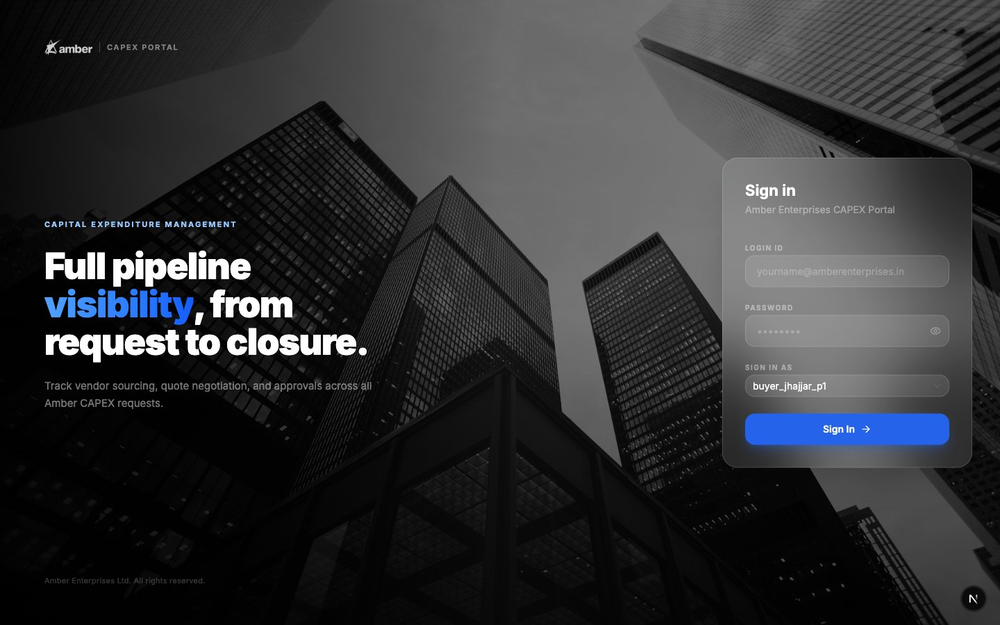

One sign-in screen for the whole company. The user picks who they are and lands in a portal shaped
to that job — a plant buyer sees three menu items, the administrator sees ten.

## Slide 1.2 · The four portal seats

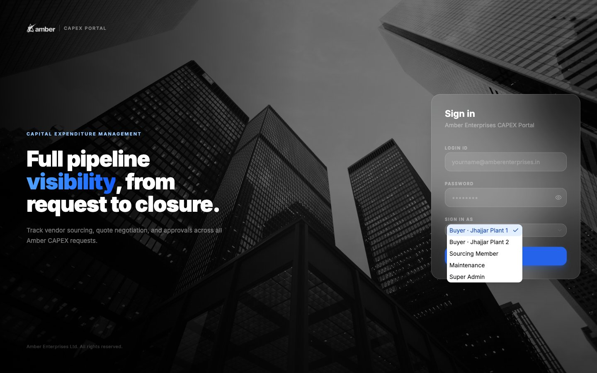

Only four kinds of people get a seat in the portal, and two of those are plant-scoped buyers:

- **Buyer · Jhajjar Plant 1** and **Buyer · Jhajjar Plant 2** — each sees only their own plant's
  budget, their own requests and their own numbers.
- **Sourcing Member** — runs quotations, negotiations, auctions and awards across all plants.
- **Maintenance** — writes next year's budget.
- **Super Admin** — the middle budget gate, ad-hoc transfers, configuration, and full visibility.

Everyone else in the chain works from an emailed link. That is deliberate: a plant head who approves
four budgets a year should not have to remember a password, and a vendor should never be inside
Amber's systems at all.

## Slide 1.3 · A clean slate

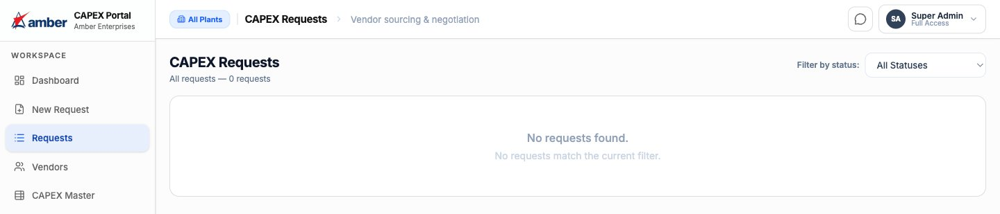

This run starts genuinely empty — no requests, no committed spend, no budget. The left-hand
navigation is the whole internal product: Dashboard, New Request, Requests, Vendors, CAPEX Master,
Budget Planning, Ad-hoc Budget, Budget Approvals, Accounts and Configurations. Each entry is filtered
by role.

## Slide 1.4 · Switching between people

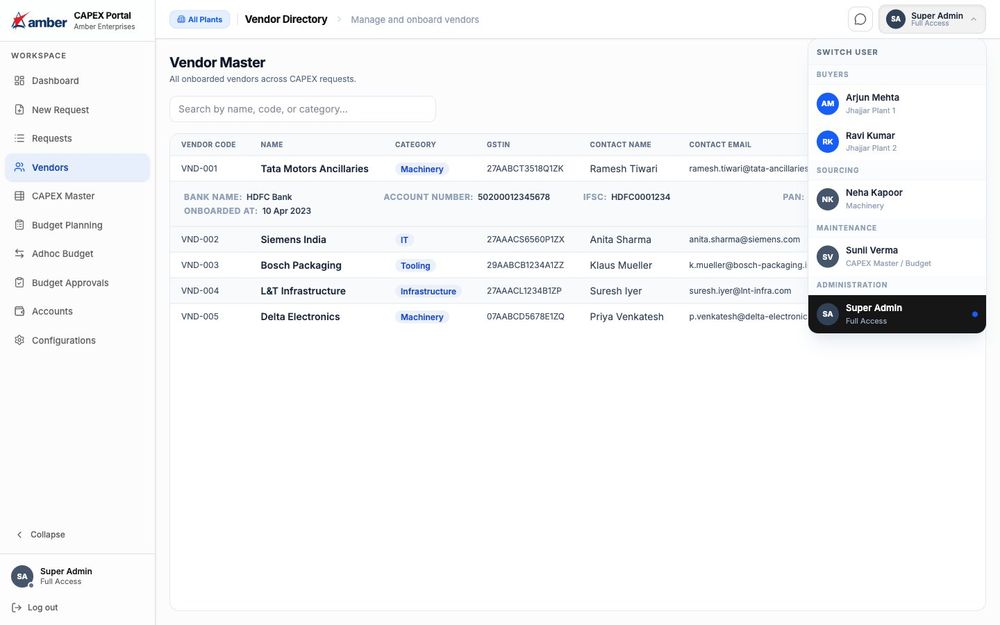

The portal names the person, not just the role — Arjun Mehta at Jhajjar Plant 1, Ravi Kumar at
Jhajjar Plant 2, Neha Kapoor in sourcing, Sunil Verma in maintenance. Throughout this document you
will see the same names, so you can always tell whose screen you are looking at.

---

# Part 2 — The budget year

> This is where the product starts. Until a budget exists and has been approved, no request can be
> raised at all, because every line of a request has to point at an approved budget line.

## Slide 2.1 · The register of approved money starts empty

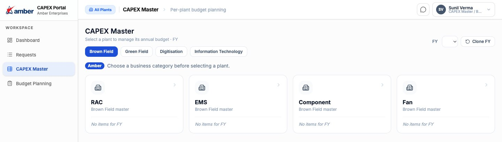

**CAPEX Master** is the register of approved money. It is organised into four kinds of capital
expenditure — **Brown Field** (existing plants), **Green Field** (new plants), **Digitisation** and
**Information Technology** — and Brown and Green Field are further split by business category
(**RAC · EMS · Component · Fan**), so one plant can run four independent budgets.

Every category reads *"No items for FY"*. FY 2026-27 is about to be written from scratch.

## Slide 2.2 · Budget Planning — a deliberately blank sheet

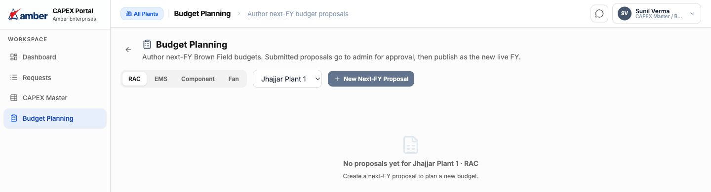
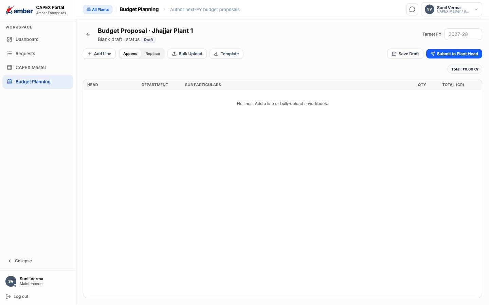

Sunil Verma picks the category and the plant and clicks **New Next-FY Proposal**. What he gets is a
**blank draft** — the portal never pre-fills last year's lines. That is a deliberate product
decision: each year is argued on its own merits rather than inherited by default.

He sets the target year to 2026-27, and has three ways to fill it: type rows by hand, download the
Excel template, or upload a filled workbook.

## Slide 2.3 · The Excel template, and bulk upload

The downloadable template is not an empty grid. Its columns are exactly the ones the portal reads —
S.No · Head · Department · Sub Particulars · Qty · Total Cost (Cr) · Reason for Requirement ·
Benefits · ROI — and it arrives pre-filled with worked examples from that plant's own history, so
the expected shape is never ambiguous. A downloaded template can be edited and uploaded back
unchanged.

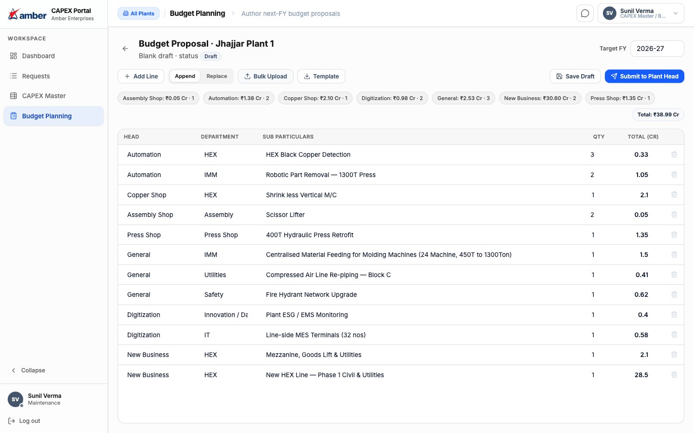

The uploaded workbook lands as **12 lines totalling ₹38.99 Cr**, grouped into seven budget heads —
Automation ₹1.38 Cr, Copper Shop ₹2.10 Cr, Assembly Shop ₹0.05 Cr, Press Shop ₹1.35 Cr, General
₹2.53 Cr, Digitization ₹0.98 Cr and New Business ₹30.60 Cr. Every cell stays editable afterwards.

## Slide 2.4 · Submitted — and handed to the plant head by email

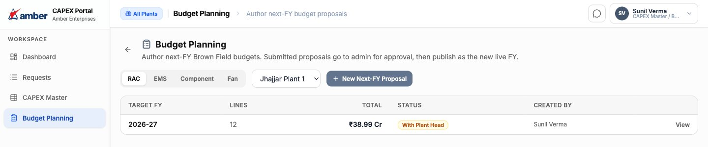
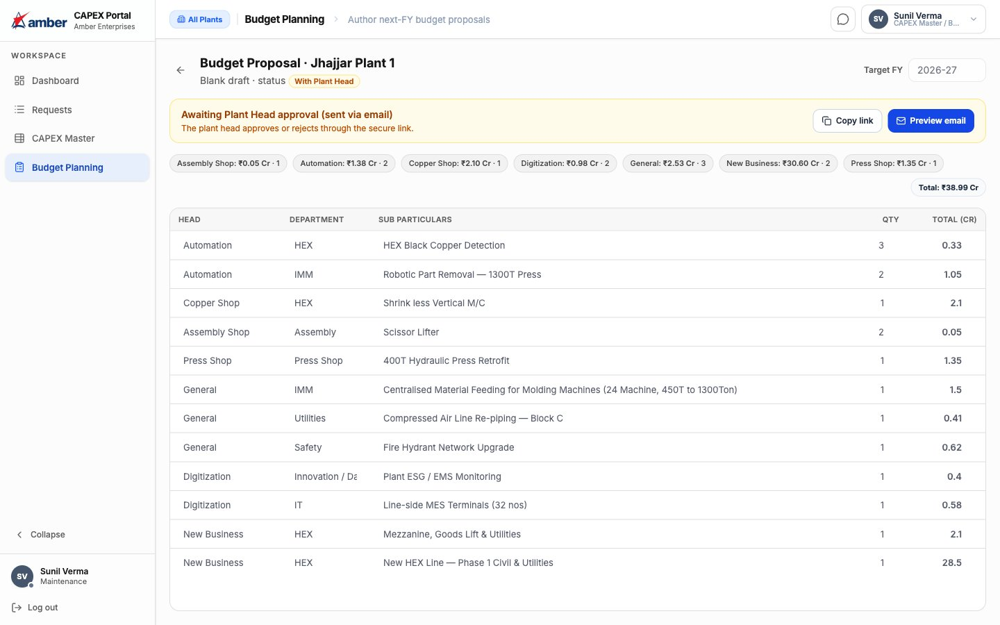

**Submit to Plant Head** moves the proposal to *With Plant Head* and mints a single-use approval
link. The author now sees a banner with two things he can do: **copy the link**, or **preview the
email**.

## Slide 2.5 · The email

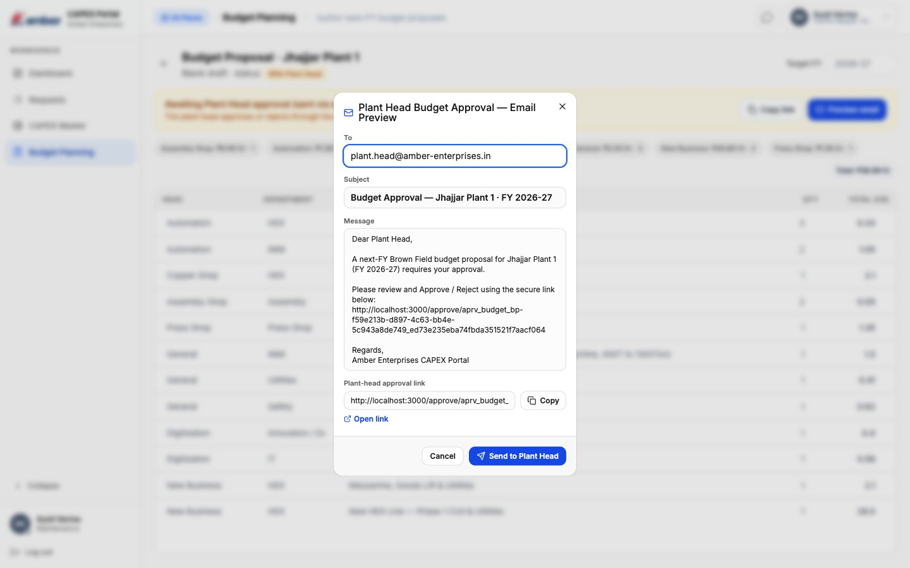

Recipient, subject and body are written for him and are editable; the secure link appears in the body
and again as a copyable field. The same email panel is reused at every handoff in the product, so
there is one thing to learn rather than eight.

## Slide 2.6 · What the plant head sees

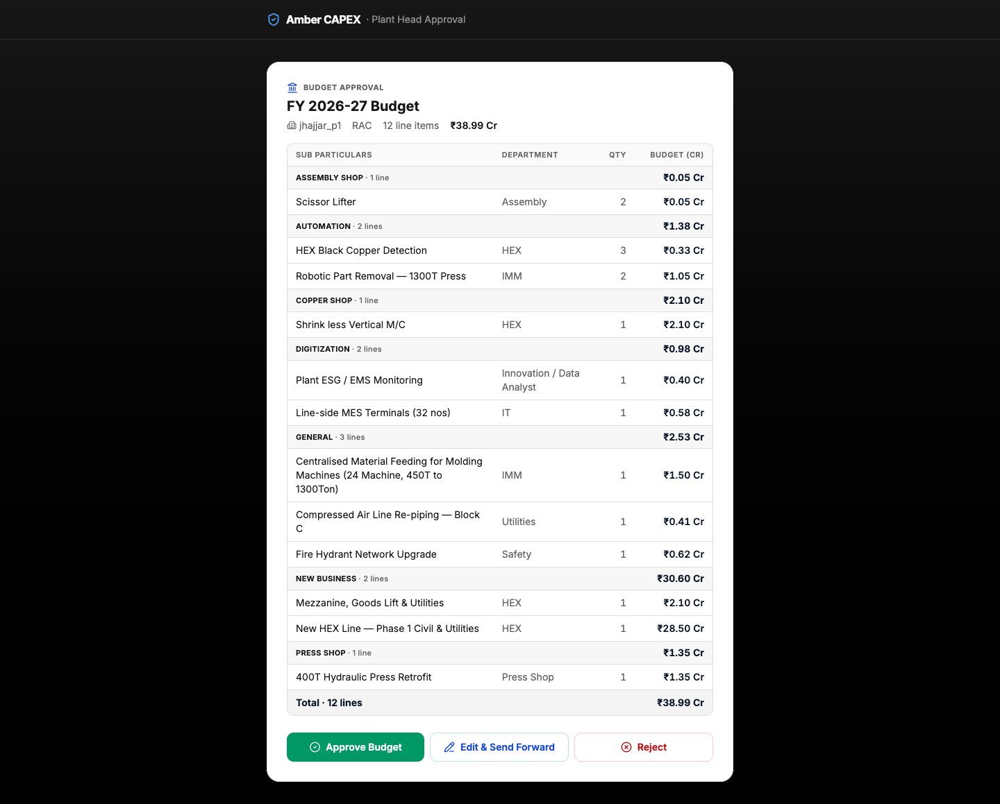

No login, no menu, no navigation — a single page titled **Plant Head Approval** showing the whole
proposal grouped by head, with every sub-particular, its department, its quantity and its budget, a
subtotal per head and a grand total. Every approver in the chain reviews this same breakdown, so no
two gates are ever looking at different numbers.

Three things he can do: approve it, reject it, or — the interesting one — **edit it and send it
forward**.

## Slide 2.7 · Approvers edit and send forward; they do not send back

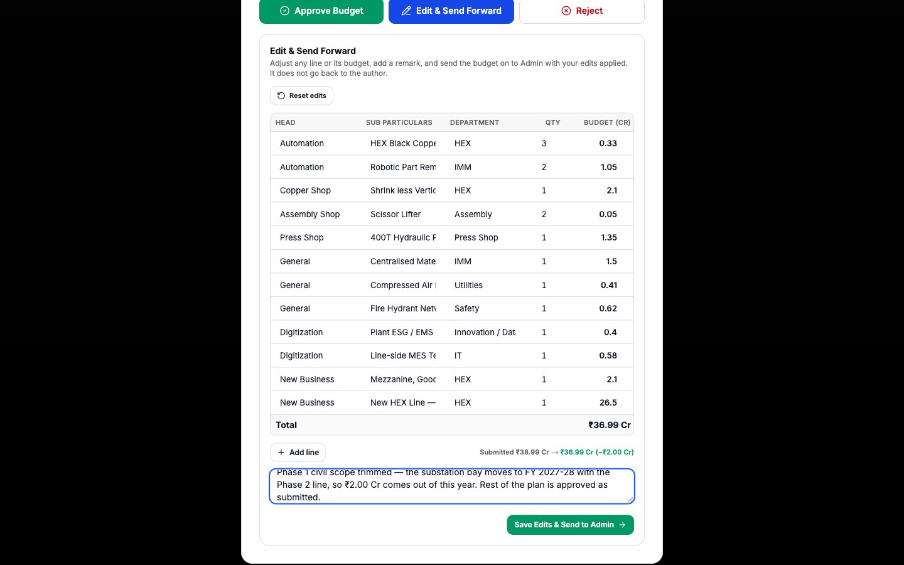

The plant head can change any line's budget, quantity, department or description, add lines, remove
lines, and attach a remark — then approve **with those edits applied, in one action**. The panel
shows the effect live: **submitted ₹38.99 Cr → revised ₹36.99 Cr (−₹2.00 Cr)**, with a **Reset
edits** control if he changes his mind.

Here he trims the new HEX line's Phase 1 civil scope by ₹2.00 Cr, and says why:

> *"Phase 1 civil scope trimmed — the substation bay moves to FY 2027-28 with the Phase 2 line, so
> ₹2.00 Cr comes out of this year. Rest of the plan is approved as submitted."*

This replaced an older send-it-back-for-correction loop. An approver who knows what the number should
be can simply set it, and the budget keeps moving forward instead of bouncing.

The link is consumed the moment he decides, so a forwarded copy of the email cannot be used to decide
again.

## Slide 2.8 · Stage 2 — the administrator sees exactly what changed

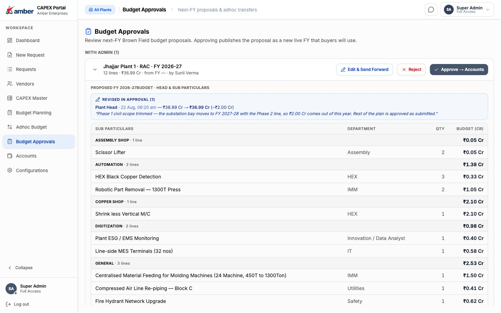

**Budget Approvals** is the super admin's screen. The proposal is now *With Admin*, and above the
breakdown sits the revision trail: **Plant Head · 22 Aug — ₹38.99 Cr → ₹36.99 Cr (−₹2.00 Cr)**, with
the plant head's remark quoted underneath.

The next approver never has to ask what was changed or why. The admin has the same three options —
approve, edit and send forward, or reject — and approving here does **not** publish the budget. It
moves it to the third gate.

## Slide 2.9 · Stage 3 — Global Accounts sign-off publishes the year

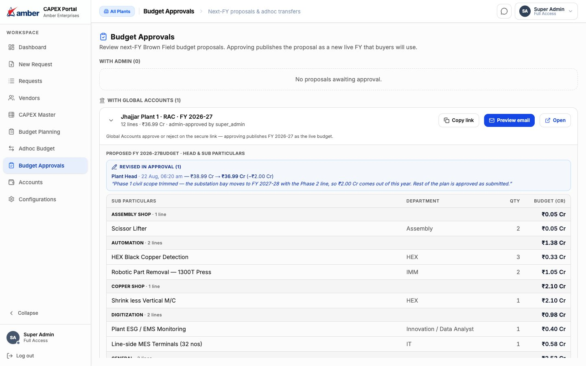
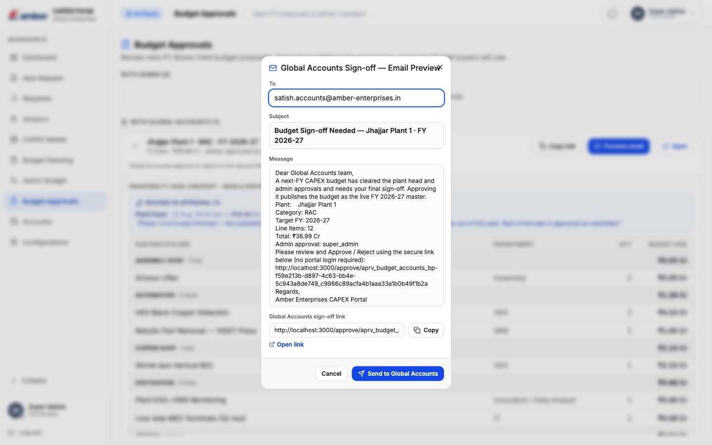

Approving at the admin stage mints the Global Accounts link and moves the row into *With Global
Accounts*, where the admin can copy the link, preview the email or open it directly.

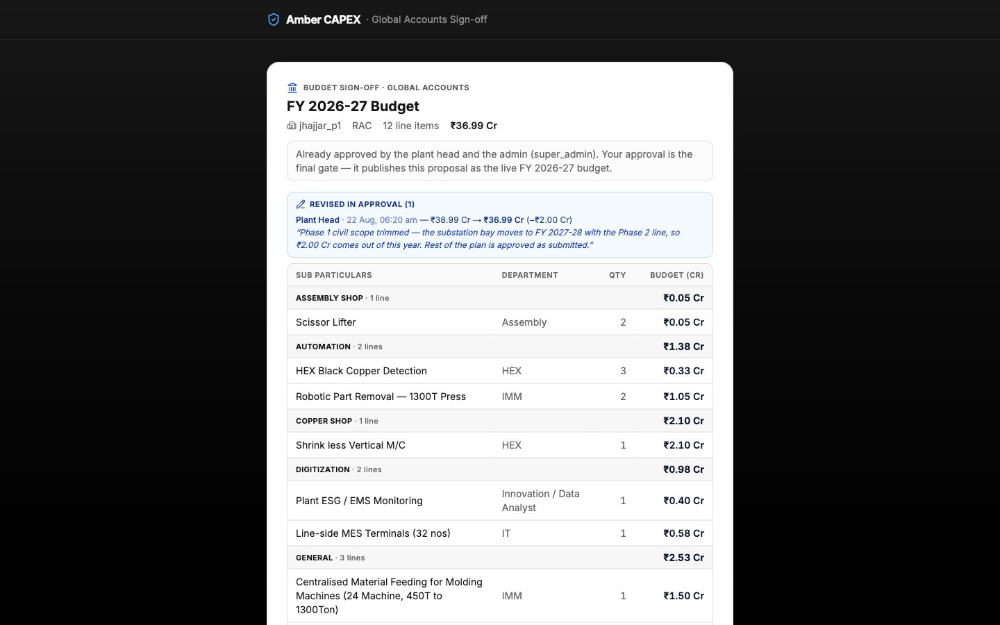

The page tells him plainly what his click does: *"Already approved by the plant head and the admin.
Your approval is the final gate — it publishes this proposal as the live FY 2026-27 budget."* He sees
the same breakdown and the same revision trail as everyone before him.

## Slide 2.10 · The budget approval chain, in one picture

```mermaid
flowchart LR
  A[budget flow] --> B[flow strip]
```

## Slide 2.11 · FY 2026-27 is now live money

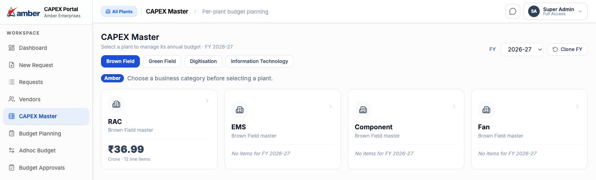
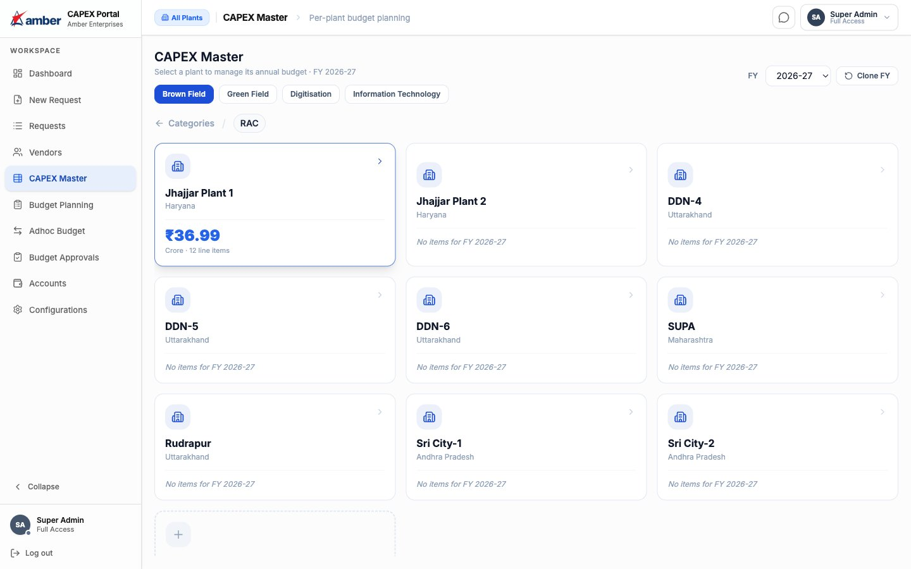

The proposal's twelve lines are now the live FY 2026-27 budget. Drill down category → plant → head →
line item: RAC ₹36.99 Cr → Jhajjar Plant 1 ₹36.99 Cr, with every other plant reading *"No items for
FY 2026-27"* until it publishes its own.

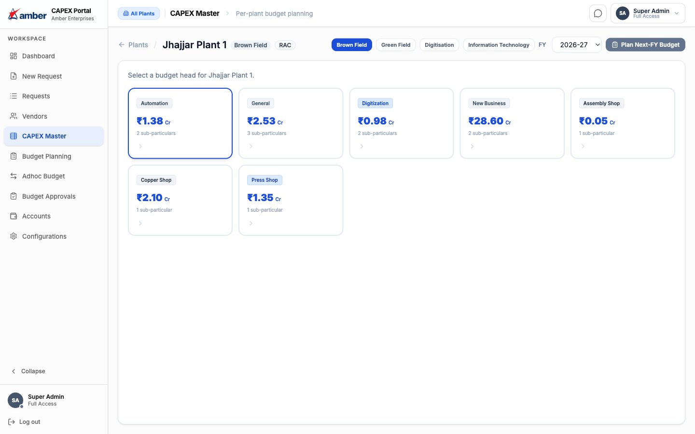
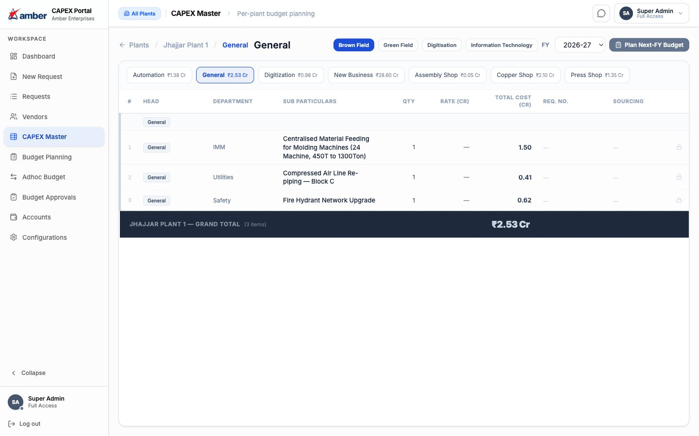

Two things worth noticing on the line-item table:

- The **padlock** on each row. A live budget year is **read-only**. Nobody can quietly edit approved
  money. The only mid-year change is an ad-hoc transfer between heads, which itself needs the
  administrator's approval (Part 13).
- The **Req. No.** and **Sourcing** columns. Once a request consumes a budget line, it appears here,
  so the budget row and the spend against it sit side by side.

---

# Part 3 — The supply base

## Slide 3.1 · Vendor Master

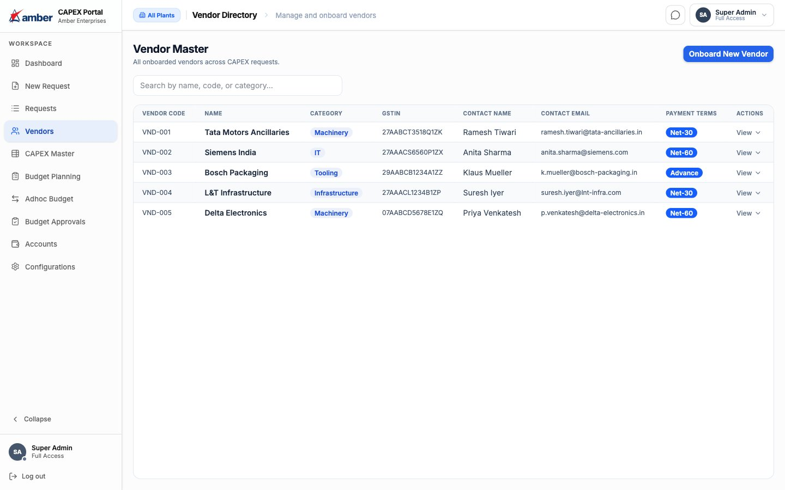

Every onboarded supplier, with its code, category, GSTIN, contact and payment terms. The payment
terms matter later: they are what generates the milestone split on the purchase order — the 30 / 60 /
10 you will see in Part 9 comes from the vendor record, not from a number somebody typed.

Expanding a row shows the banking and registration detail that Accounts need.

## Slide 3.2 · Adding a vendor

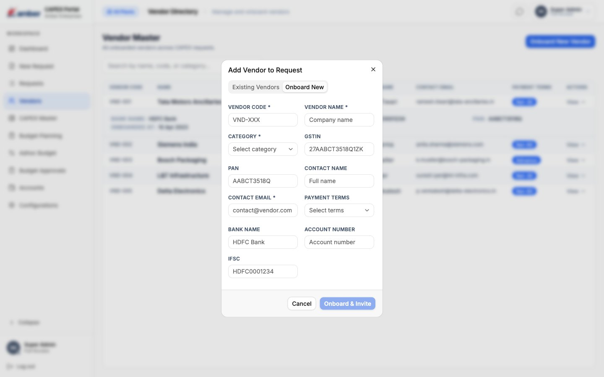

Vendors can be onboarded formally here, or added on the fly by the sourcing team during a quotation
round — including a **one-time vendor** who is quoting for a single machine and will never be
onboarded, and a **foreign vendor**, which switches on the Incoterms questionnaire (Part 10).

---

# Part 4 — Raising a request

## Slide 4.1 · Step 1 — what kind of capital expenditure is this?

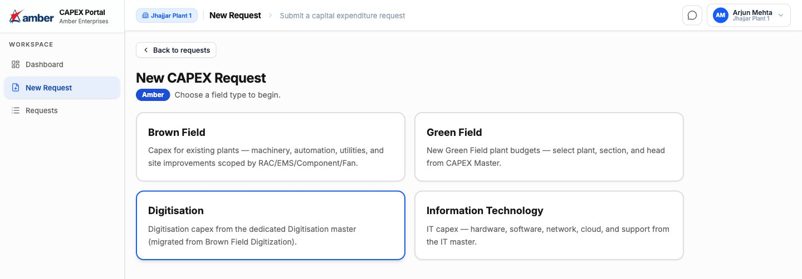

Arjun Mehta, the buyer at Jhajjar Plant 1, starts a request. The first choice changes the route the
request takes:

| Kind | What it means | How it is routed |
|---|---|---|
| **Brown Field** | Existing plants — machinery, automation, utilities, site work | Needs **plant-head approval** first |
| **Green Field** | A brand-new plant being built | Goes **straight to sourcing** |
| **Digitisation** | Digital, MES and ESG capital expenditure | Needs **plant-head approval** |
| **Information Technology** | Hardware, software, network, cloud | Needs **plant-head approval** |

## Slide 4.2 · Steps 2 to 4 — narrowing down to approved money

Business category, then plant. Notice that the buyer at Jhajjar Plant 1 is offered exactly one plant.
A plant buyer cannot raise a request against another plant's budget; there is no dropdown to get it
wrong in.

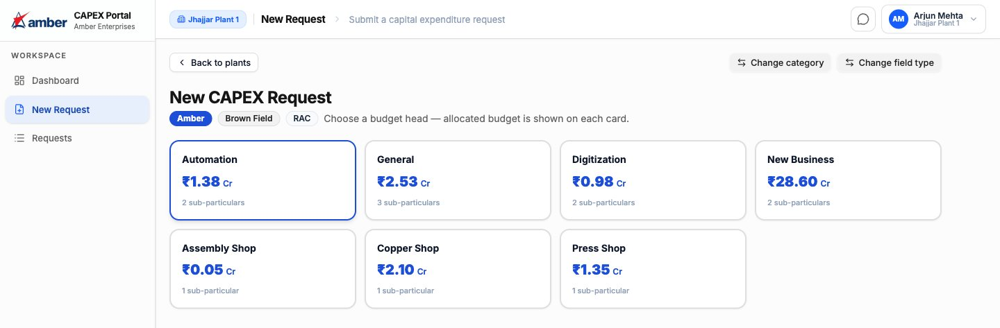

Then the budget head — and each card **shows the money approved against it**. Heads with no approved
lines simply do not appear. By the time the buyer reaches the grid, he is already inside approved
money.

Every step has **Back** and **Change…** controls, and changing the scope clears the dependent rows,
so a line item can never be carried across into the wrong budget head by accident.

## Slide 4.3 · The line-item grid

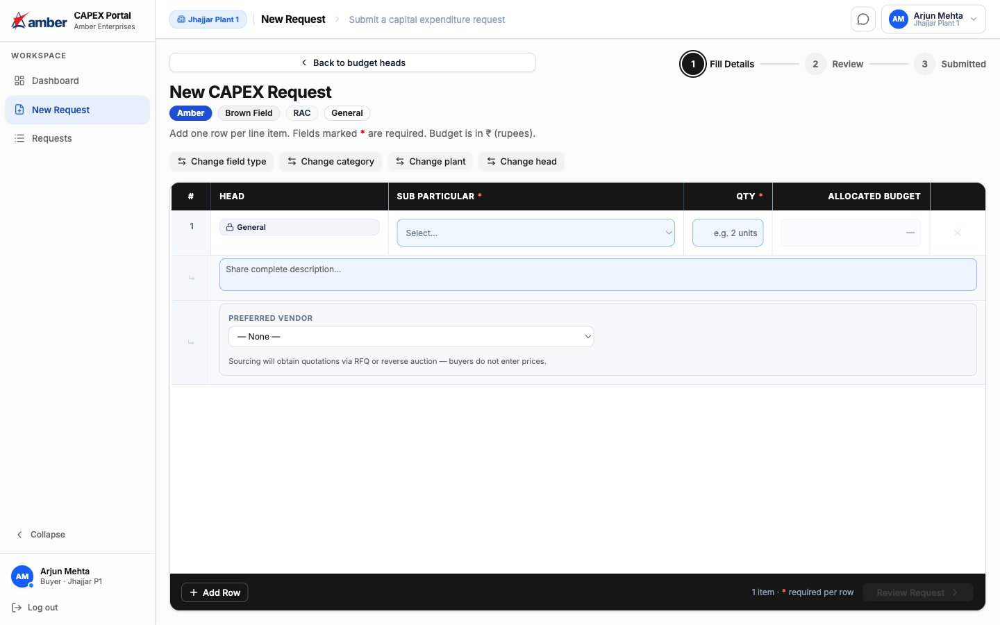

Columns: **# · Head (locked) · Sub Particular · Qty · Allocated Budget (read-only)**.

The **Sub Particular is a dropdown of that head's approved lines** — it *is* the item's identity, and
selecting it pulls the approved allocation in with it. Beneath each row sits a required description,
which is the specification the vendors will quote against, and an optional preferred vendor with a
reason.

Note the line under the vendor box: *"Sourcing will obtain quotations via RFQ or reverse auction —
buyers do not enter prices."* Requesters describe **what** they need. Sourcing discovers **what it
costs**. That separation is the point.

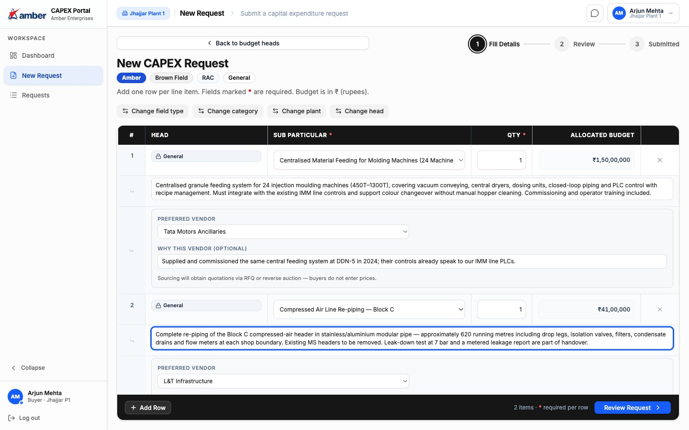

Two lines, both under the General head:

- **Centralised Material Feeding for Molding Machines** — qty 1, allocated ₹1,50,00,000, preferred
  vendor Tata Motors Ancillaries, with the reason recorded.
- **Compressed Air Line Re-piping — Block C** — qty 1, allocated ₹41,00,000, preferred vendor L&T
  Infrastructure.

## Slide 4.4 · Review, submit, and the notification that goes out

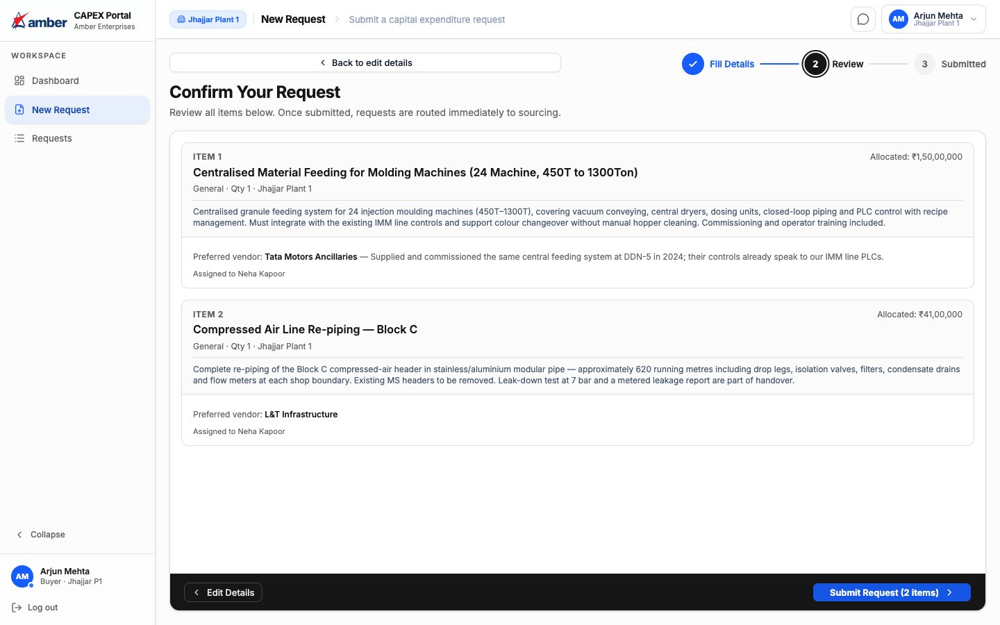

A three-step wizard — Fill Details, Review, Submitted. Review restates each line with its allocation,
its specification and its preferred vendor.

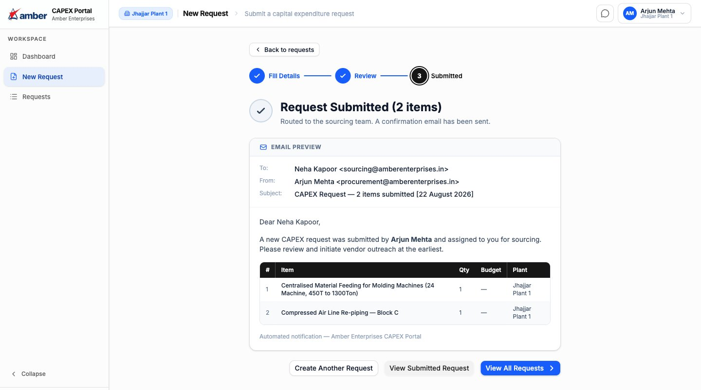

On submit the request gets its number, a sourcing engineer is assigned automatically — buyers never
pick one — and the confirmation screen shows the notification that went to sourcing, with the item
table inline.

## Slide 4.5 · The request list

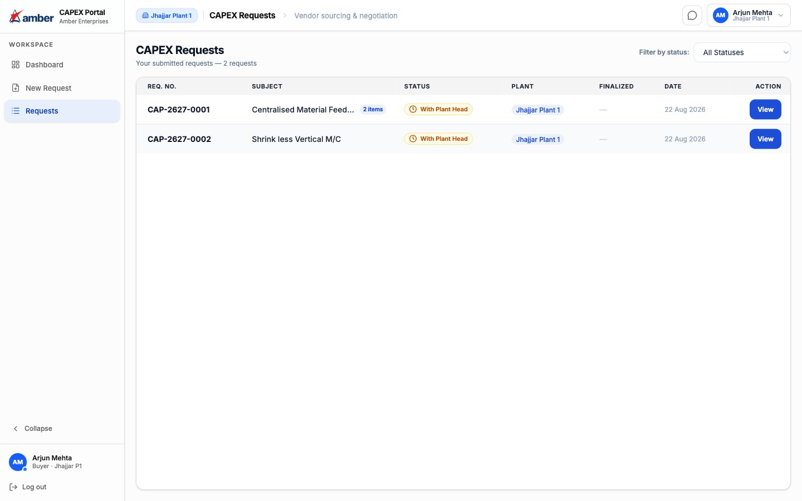

`CAP-2627-0001` · *Centralised Material Feeding…* · **2 items** · **With Plant Head** · Jhajjar Plant
1 · assigned to Neha Kapoor. The number encodes the year: `CAP-`**2627**`-0001` is the first request
of FY 2026-27.

A second request, `CAP-2627-0002` for a *Shrink less Vertical M/C* against the Copper Shop head, was
raised the same way. It is the one that goes to a reverse auction in Part 11.

## Slide 4.6 · The request detail — allocated against estimated, per line

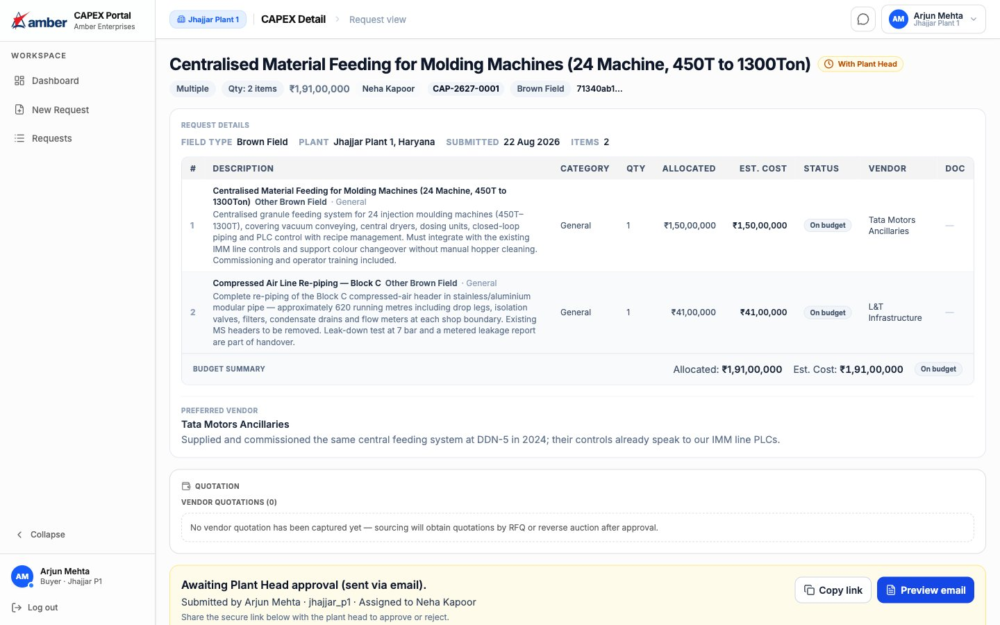

The detail page is the spine of the product; everyone in the chain works from it. At this stage it
shows both line items with the money **allocated** to them, the **estimated cost**, and an **on
budget / ₹X over** chip per line, plus a summary row totalling both. Underneath sit the preferred
vendor and reason, an empty quotation section, and the amber banner handing the request to the plant
head.

Right at the bottom of the page — visible in later screens — is the **status history**: every
transition, who made it and when, appended and never edited.

---

# Part 5 — Plant-head approval, by email

## Slide 5.1 · The email

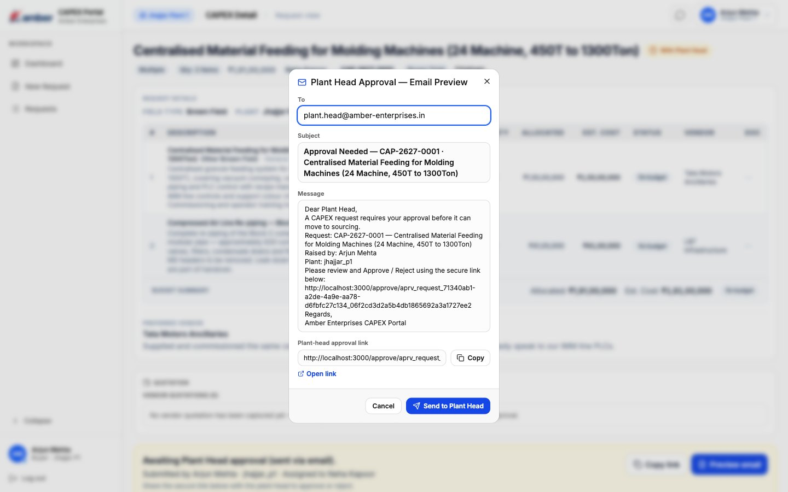

The same email panel as the budget gate, addressed to the plant head, carrying a link that does
exactly one thing.

## Slide 5.2 · The plant head's page

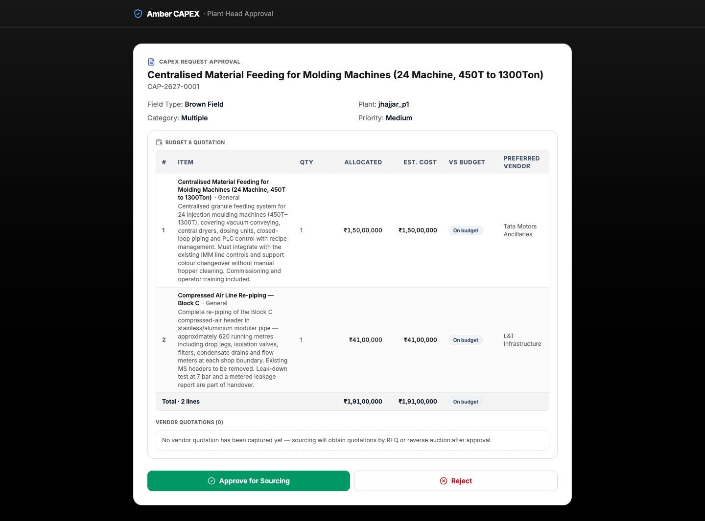

Request number, field type, plant, priority, and a table of the requested items with **allocated**,
**estimated cost** and a **vs budget** chip on each line and on the total. If quotations had already
been captured, they would be listed here too, compared on a common basis.

Two buttons: **Approve for Sourcing** or **Reject**. This gate is deliberately about *"should we buy
this at all?"* — not about price, which nobody knows yet.

---

# Part 6 — Sourcing: the quotation round

## Slide 6.0 · The shape of a sourcing round

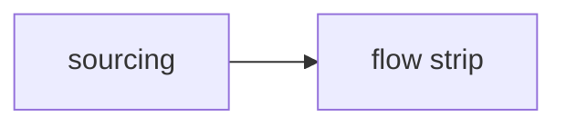
```mermaid
flowchart LR
  A[sourcing] --> B[flow strip]
```

## Slide 6.1 · In sourcing

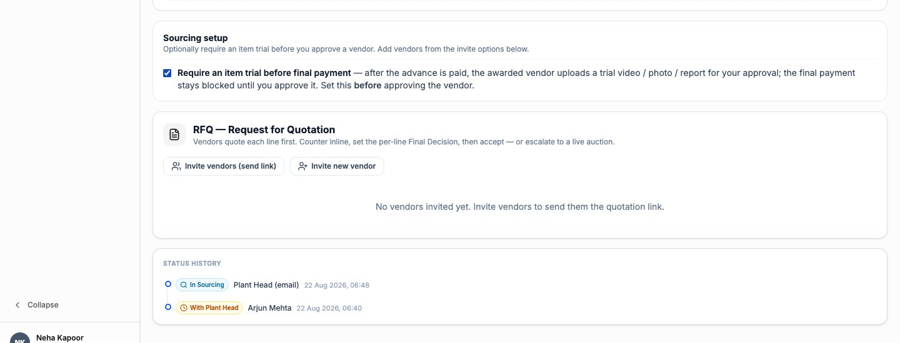

Approval flips the request to **In Sourcing** and hands it to Neha Kapoor. Two new sections appear on
the detail page.

The first is **Sourcing setup**, and it carries one switch: **require an item trial before final
payment**. Ticked *before* awarding, it means the winning vendor will have to upload evidence that
the machine works, and the last payment instalment stays locked until sourcing accepts it. It is
ticked for this request.

The second is the **RFQ panel**. Brown Field requests are quotation-first by default; a reverse
auction can only be escalated out of a quotation round that already has competing prices, never
started cold.

## Slide 6.2 · Inviting vendors — and choosing their paperwork

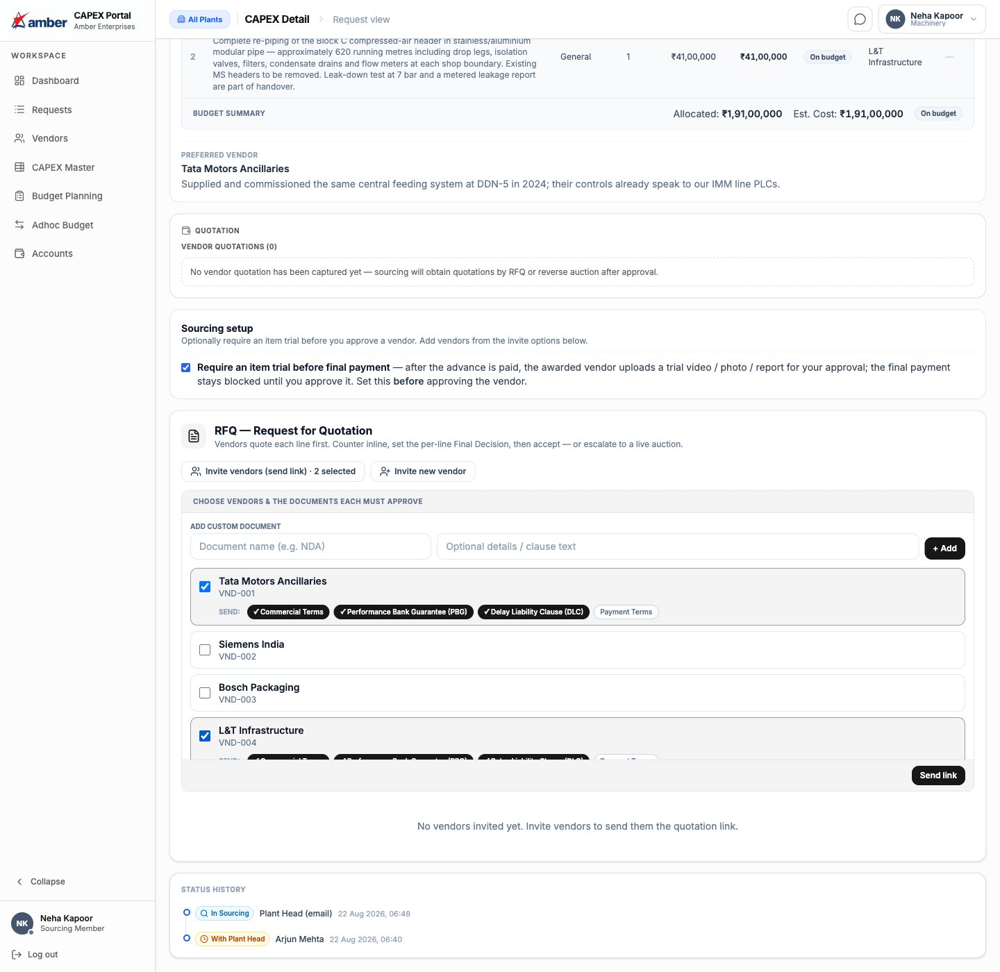

The picker is titled **"Choose vendors & the documents each must approve."** Per vendor, sourcing
selects which contracts go out with the enquiry:

- **Commercial Terms**
- **Performance Bank Guarantee** — 10% of order value, held through the warranty period
- **Delay Liability Clause** — the penalty regime for late delivery
- **Payment Terms** — defaulted on for one-time vendors
- **Add custom document** — any additional clause, by name and text

This is per vendor, not per enquiry: a long-standing supplier and a one-time vendor can be sent
different packages in the same round.

## Slide 6.3 · The comparison grid appears

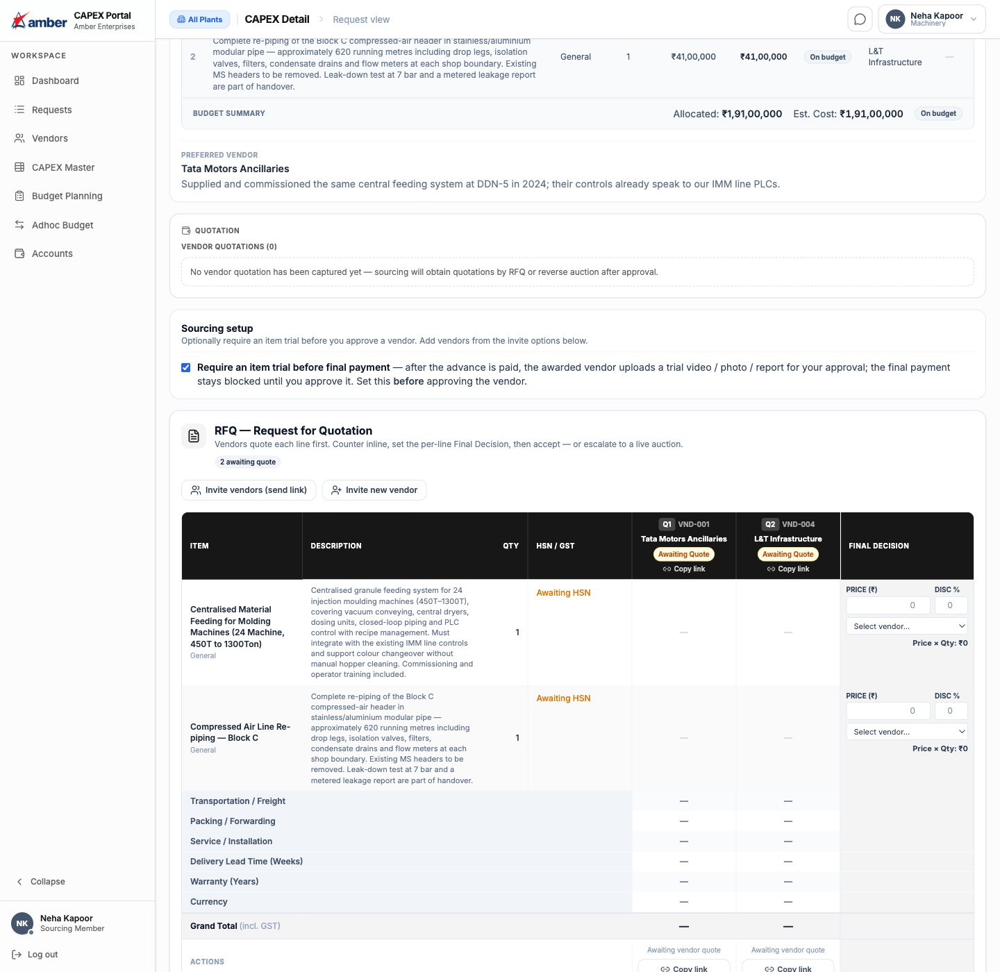

This grid is the sourcing team's working surface for the rest of the round: **line items as rows,
vendors as columns**. Both vendors read *Awaiting Quote*; the HSN column reads *Awaiting HSN*, because
the vendor supplies it; and the right-hand **Final Decision** column — price, discount, vendor,
computed net — is already there, per line.

## Slide 6.4 · The vendor's first screen is terms, not prices

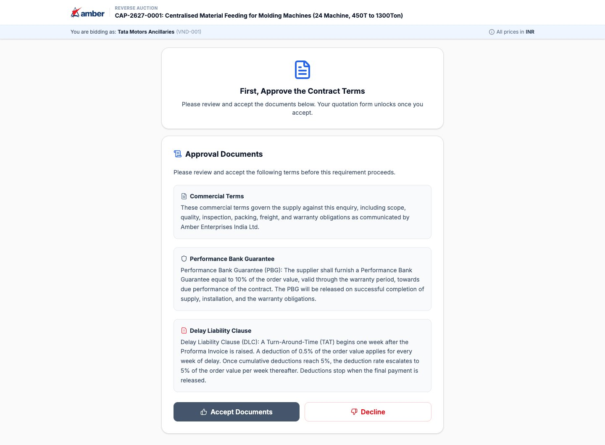

*"First, approve the contract terms — your quotation form unlocks once you accept."*

The vendor reads the actual clauses, including the delay penalty in full — 0.5% of order value per
week, capped at a cumulative 5%, then 5% per week thereafter — and must accept before any price field
exists. Declining locks the enquiry, and sourcing can re-send.

This is the single most useful thing in the sourcing flow: Amber's commercial terms are agreed
**before** the commercial conversation starts, not argued about after the price is settled.

## Slide 6.5 · Quoting, line by line

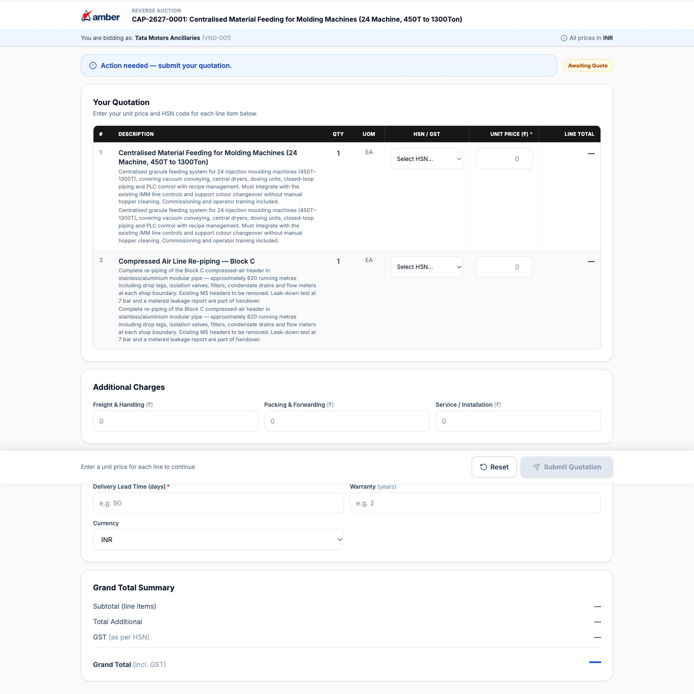

The unlocked form mirrors the internal grid: number, description, quantity, unit of measure, HSN and
GST, unit price and line total; then additional charges — freight, packing, service and installation;
then delivery lead time in days, warranty in years, and currency.

**The vendor picks the HSN code, not Amber.** The HSN belongs to the item, so once one vendor sets it
every other vendor's form shows it read-only and GST is computed identically for all of them. That is
what makes the comparison honest — sourcing can see the code but cannot change it.

## Slide 6.6 · GST is computed per line, from the HSN

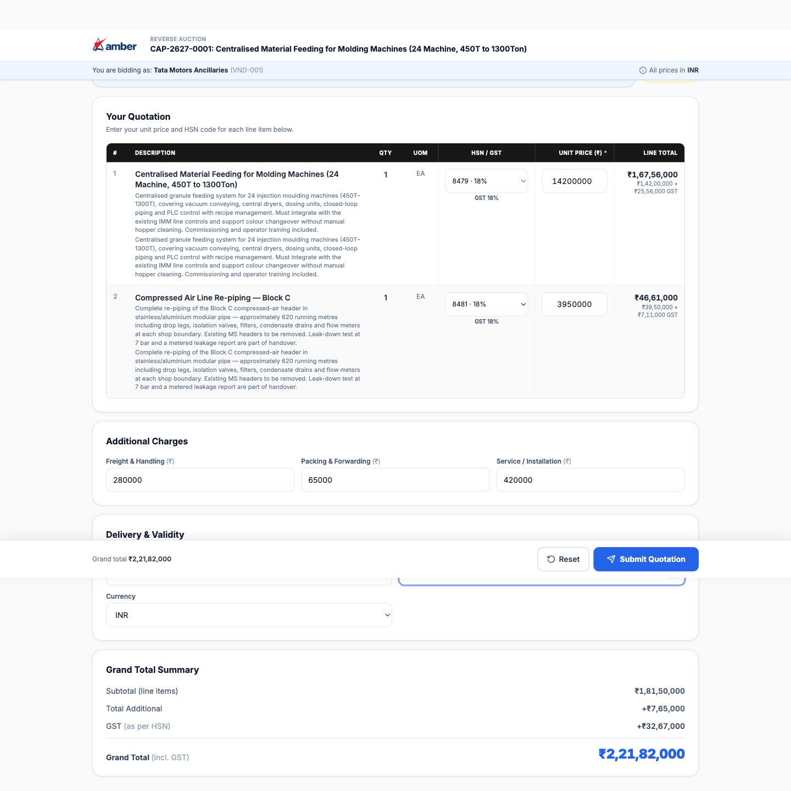

Tata's quotation: line items ₹1,81,50,000 + charges ₹7,65,000 + **GST ₹32,67,000** =
**₹2,21,82,000**. GST is calculated line by line from each item's own HSN code; freight, packing and
service are not taxed.

After submitting, the vendor sees a read-only summary and a plain statement that it is under review.

## Slide 6.7 · Two quotations side by side

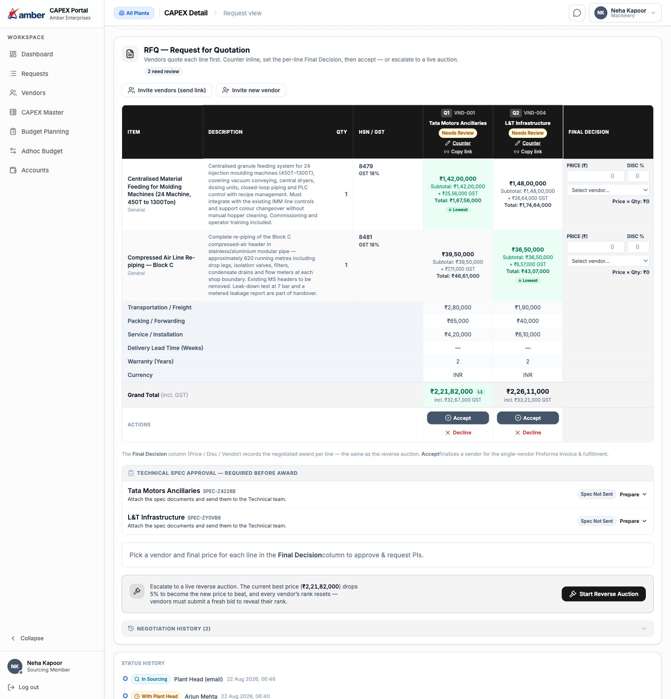

Now the grid earns its keep. Per line, the cheaper vendor is highlighted green with a **↓ Lowest**
chip — and it is **not the same vendor on both lines**:

| Line | Tata Motors Ancillaries | L&T Infrastructure | Cheaper |
|---|---|---|---|
| Centralised Material Feeding | ₹1,42,00,000 (₹1,67,56,000 incl. GST) | ₹1,48,00,000 | **Tata** |
| Compressed Air Re-piping | ₹39,50,000 | ₹36,50,000 (₹43,07,000 incl. GST) | **L&T** |
| **Whole quotation** | **₹2,21,82,000** `L1` | ₹2,26,11,000 | |

Footer rows compare freight, packing, service, delivery lead time, warranty and currency. The `L1`
badge marks the cheapest whole quotation.

Notice what this makes possible: the buyer's preferred vendors were Tata for one line and L&T for the
other, and the market agrees — but with two vendors quoting both lines, Amber can see it rather than
assume it.

## Slide 6.8 · Countering, inline

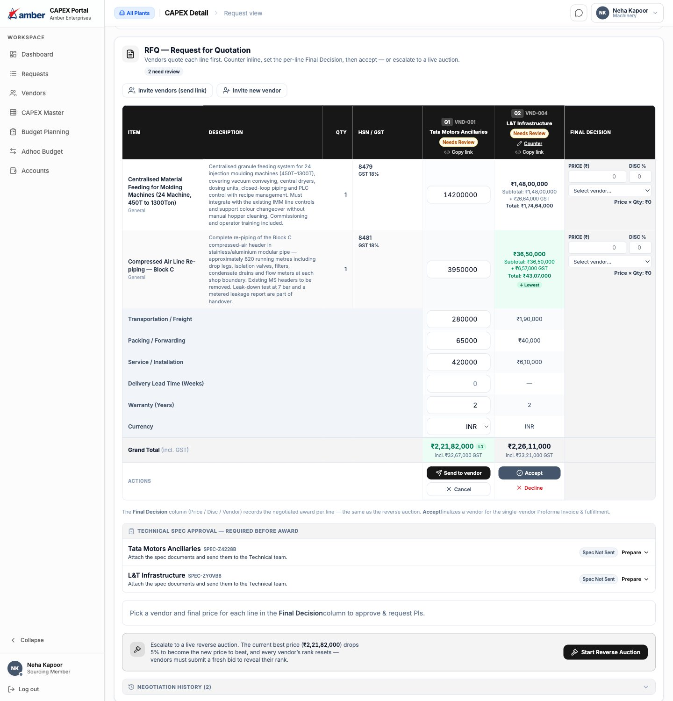

**Counter** turns one vendor's column into editable fields — per-line unit prices *and* the footer
charges. Here Tata's unit price is pushed from ₹1,42,00,000 to ₹1,36,50,000 and the freight from
₹2,80,000 to ₹2,20,000.

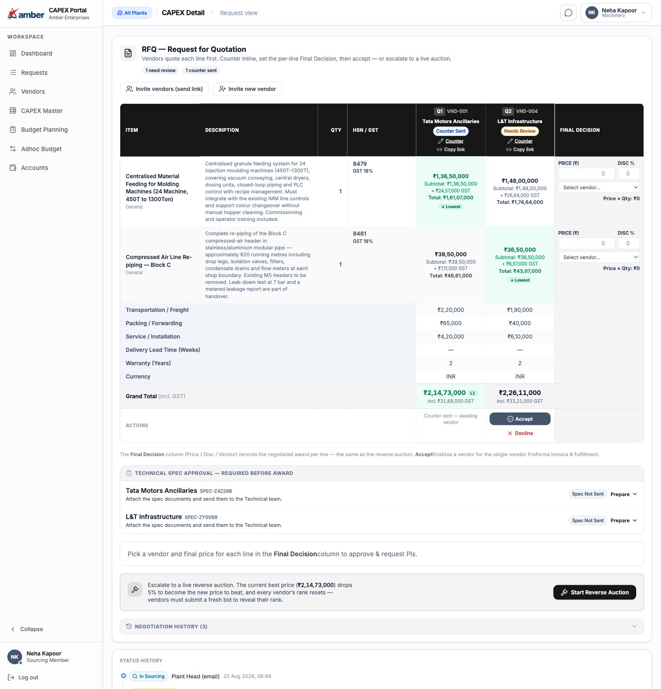

The column reads *"Counter sent — awaiting vendor"*, the total drops to **₹2,14,73,000**, and the
negotiation history logs every move by both sides.

## Slide 6.9 · The vendor answers

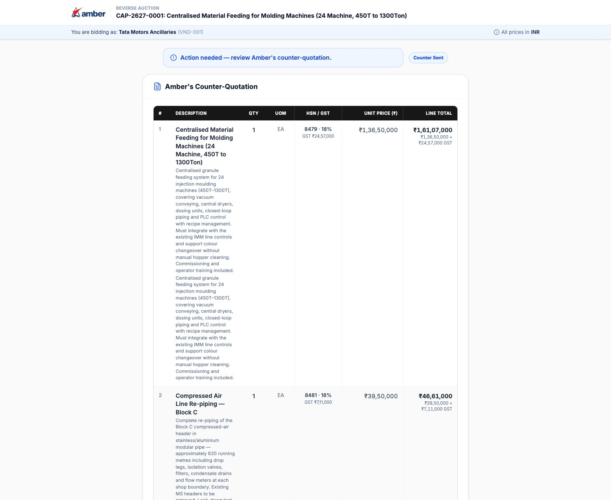

The vendor sees Amber's revised numbers laid out exactly as they will stand if accepted, and can
**approve**, **counter back**, or **decline**. Either side accepting closes the price.

Tata accepts. The quotation is settled at ₹2,14,73,000 — **₹7,09,000 below their opening number**,
which is the kind of figure that shows up later as negotiation savings on the sourcing dashboard.

---

# Part 7 — The technical specification gate

> The most consequential rule in the product: **a vendor cannot be awarded until Amber's technical
> team has signed off that vendor's machine specification.**

## Slide 7.1 · Why it is per vendor, not per request

Different vendors offer different machines, and a split award hands different lines to different
suppliers. So the gate is per vendor. Both vendors start at **Spec Not Sent** — and *not sent* blocks
an award exactly as firmly as *rejected* does. The step cannot be skipped by ignoring it.

## Slide 7.2 · Sourcing prepares the package

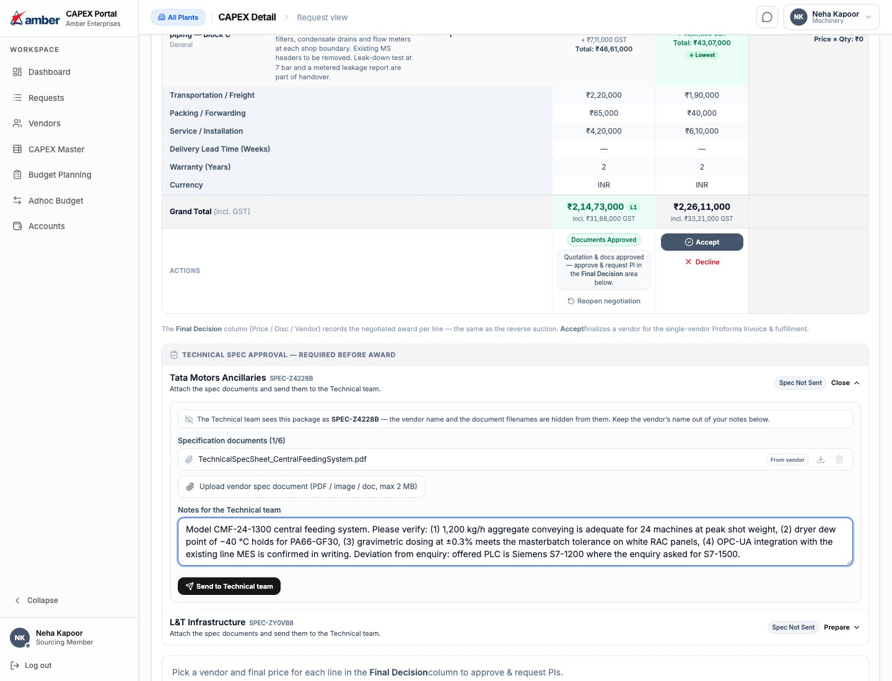

Per vendor, sourcing uploads the spec sheet **the vendor supplied**, and writes notes telling the
technical team what to check. Here:

> *"Model CMF-24-1300 central feeding system. Please verify: (1) 1,200 kg/h aggregate conveying is
> adequate for 24 machines at peak shot weight, (2) dryer dew point of −40 °C holds for PA66-GF30,
> (3) gravimetric dosing at ±0.3% meets the masterbatch tolerance on white RAC panels, (4) OPC-UA
> integration with the existing line MES is confirmed in writing. **Deviation from enquiry: offered
> PLC is Siemens S7-1200 where the enquiry asked for S7-1500.**"*

**The vendor's identity is withheld from the technical team.** The banner across the top of the panel
says so: *"The Technical team sees this package as SPEC-Z4228B — the vendor name and the document
filenames are hidden from them. Keep the vendor's name out of your notes below."*

That is a real anti-bias control. Engineering assesses the machine on technical merit, not on which
supplier it came from — and because vendors habitually name their datasheets after themselves, the
filenames are replaced too.

## Slide 7.3 · Sent to the technical team

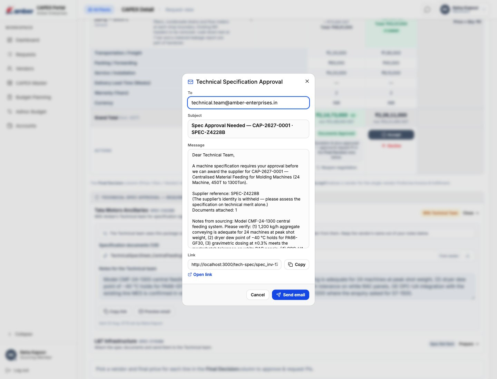

The email carries the anonymous reference, the document count, sourcing's notes verbatim, and the
link. Its subject line is *"Spec Approval Needed — CAP-2627-0001 · SPEC-Z4228B"* and the body states
the withholding explicitly.

## Slide 7.4 · The technical team's page

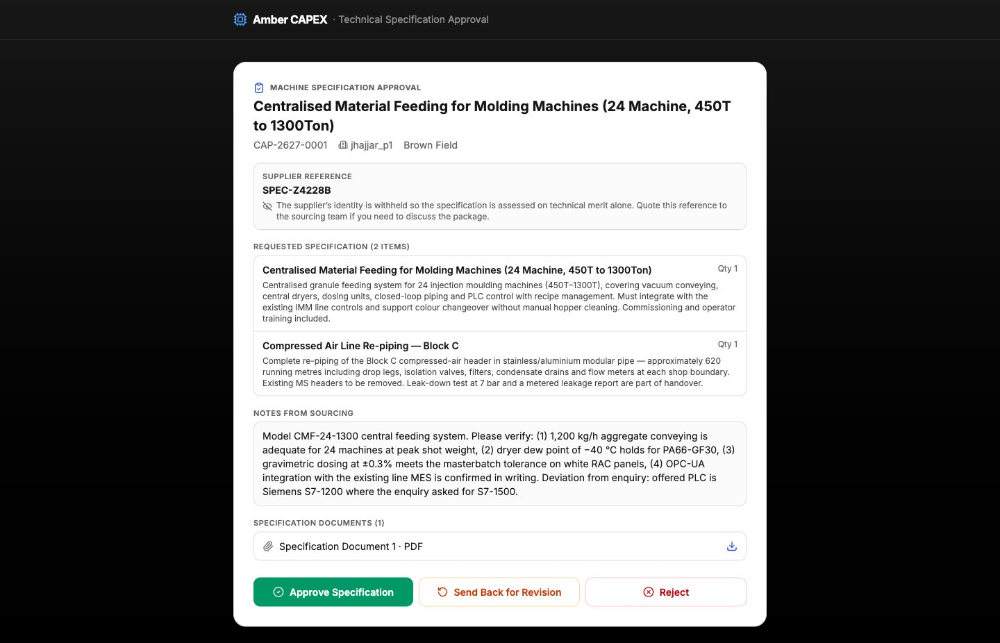

No login. They see the request, the **supplier reference SPEC-Z4228B** in place of a name, the
specification Amber asked for, sourcing's notes, and the documents to download — renamed
*"Specification Document 1 · PDF"*.

Then they decide:

- **Approve Specification** — this vendor becomes awardable.
- **Send Back for Revision** — returns to sourcing with a remark, which is required. Sourcing revises
  and re-sends on a fresh link, and the loop repeats until it is right.
- **Reject** — also requires a remark.

The link is consumed on decision, so a forwarded copy cannot re-decide. Both vendors on this request
were sent, reviewed and approved separately.

---

# Part 8 — The award

## Slide 8.1 · Filling the Final Decision, line by line

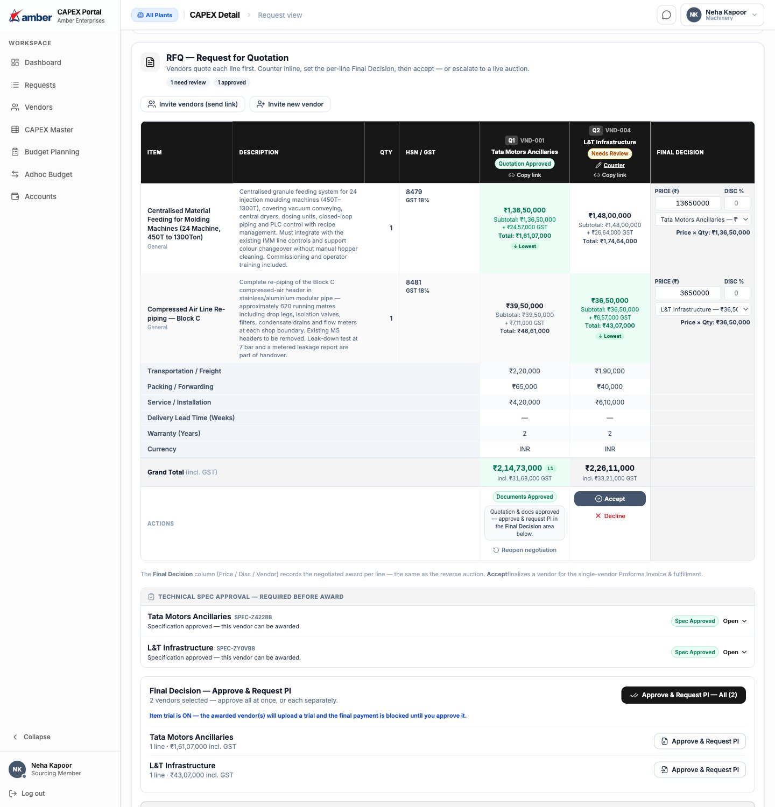

Per line, sourcing picks the winning vendor and the final price. Choosing a vendor **auto-fills that
line's price** from what they actually quoted, and there is a discount field and a computed
price × quantity beside it. The decision saves as it is typed.

Both technical specifications now read **Spec Approved — this vendor can be awarded**. Until they
did, the award bar underneath refused to act and said why.

The split is the one the market indicated:

- Line 1, Centralised Material Feeding → **Tata Motors Ancillaries** at ₹1,36,50,000 (the countered
  price)
- Line 2, Compressed Air Re-piping → **L&T Infrastructure** at ₹36,50,000

## Slide 8.2 · Approve and request the invoices

The award bar offers **Approve & Request PI — All (2)** to award both vendors at once, or a button
per vendor to award them separately — Tata now, L&T next week. It also reminds sourcing that *"Item
trial is ON — the awarded vendor(s) will upload a trial and the final payment is blocked until you
approve it."*

The result is **two independent awards**:

| Vendor | Line awarded | Order value (incl. GST) |
|---|---|---|
| Tata Motors Ancillaries | Centralised Material Feeding × 1 | **₹1,61,07,000** |
| L&T Infrastructure | Compressed Air Re-piping × 1 | **₹43,07,000** |

## Slide 8.3 · One request, two fulfilment tracks

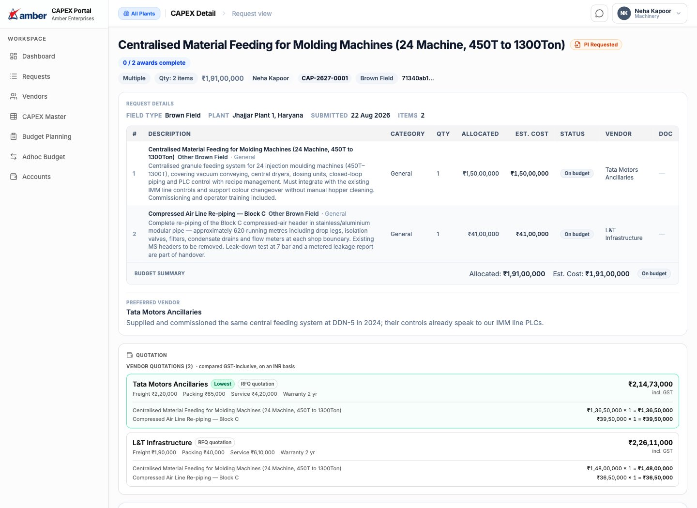

The request header now reads **PI Requested · 0 / 2 awards complete**. Each award runs its **own
complete track** from here — its own proforma invoice, its own FA codes, its own purchase order, its
own payment milestones, its own trial, its own delay clock. The request is only *Completed* when
every award is.

Also visible on this screen: the **quotation record**. Every quotation captured against the request
stays on the page, compared GST-inclusive on a common rupee basis, with the cheapest flagged. An
approver looking at this request in six months can see what the alternatives were.

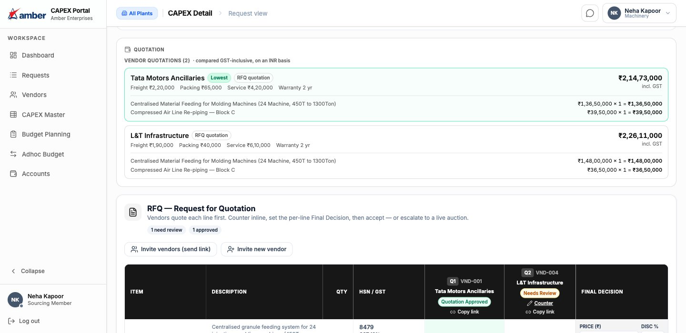

Because both vendors accepted the Commercial Terms, the Performance Bank Guarantee and the Delay
Liability Clause before they were allowed to quote, there is **no post-award terms round**. Sourcing
goes straight to asking for the invoice.

---

# Part 9 — Fulfilment: from award to the last rupee

> Followed here for the **Tata award (₹1,61,07,000)**. The L&T award ran the identical track in
> parallel with its own documents, links, purchase order and payments.

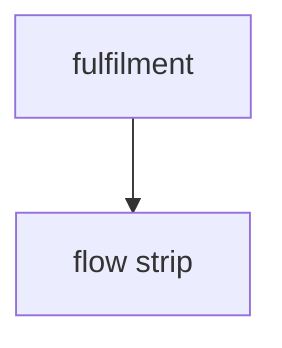
```mermaid
flowchart TD
  A[fulfilment] --> B[flow strip]
```

## Slide 9.1 · The vendor raises the proforma invoice

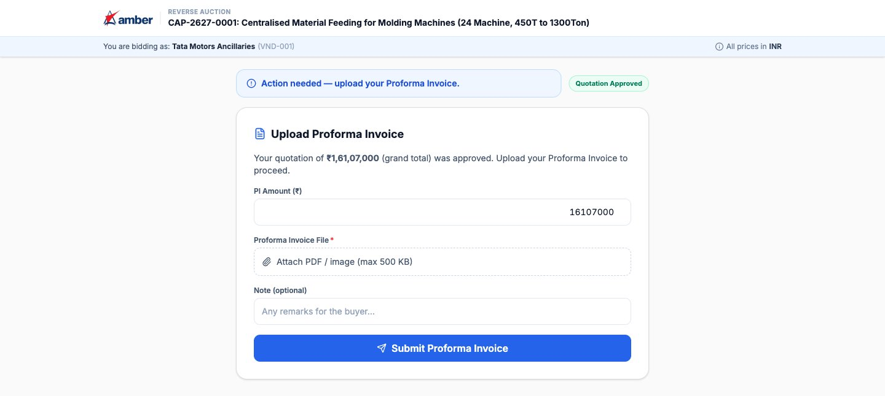

*"Your quotation of ₹1,61,07,000 was approved. Upload your Proforma Invoice to proceed."* — the
amount is pre-filled from the agreed price, so the invoice and the award cannot silently drift apart.

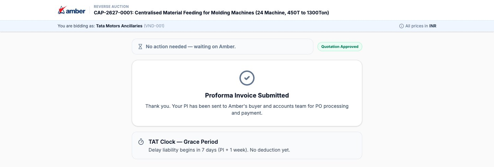

On submit, the **delay clock starts**: *"Delay liability begins in 7 days (PI + 1 week). No deduction
yet."* From this moment the penalty clause the vendor accepted in Part 6 becomes live arithmetic —
0.5% per week, cumulative cap 5%, then 5% per week — and it stops when the final payment is released.

## Slide 9.2 · Internally, the request fans out per award

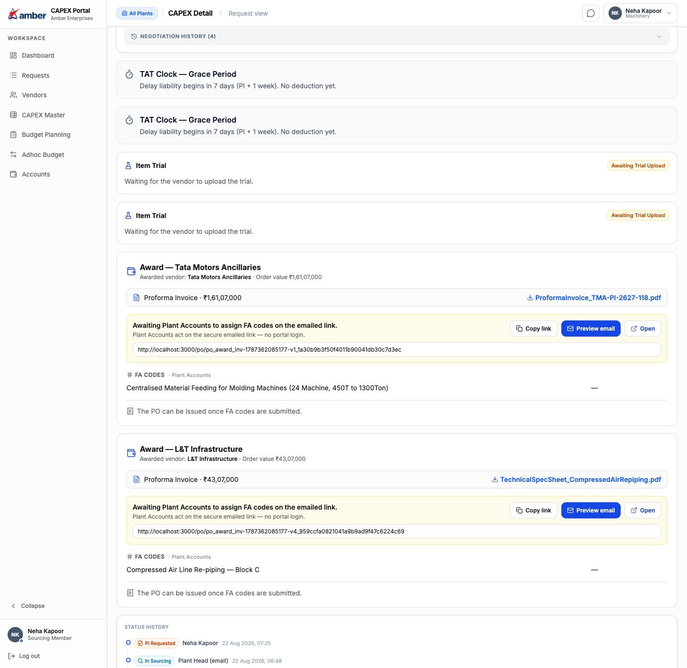

**Award — Tata Motors Ancillaries**: order value, the downloadable invoice, an item-trial card, the
FA-code table, a live delay clock, and the handoff banner — *"Awaiting Plant Accounts to assign FA
codes on the emailed link. Plant Accounts act on the secure emailed link — no portal login."*

The same block appears again for L&T, with its own everything.

**This whole panel is read-only for everyone with a portal seat.** Nobody inside the portal can type
an FA code or tick a payment. They can see the state and re-send the link. That separation is the
point of the design, not a limitation of it.

## Slide 9.3 · Email 1 — to Plant Accounts

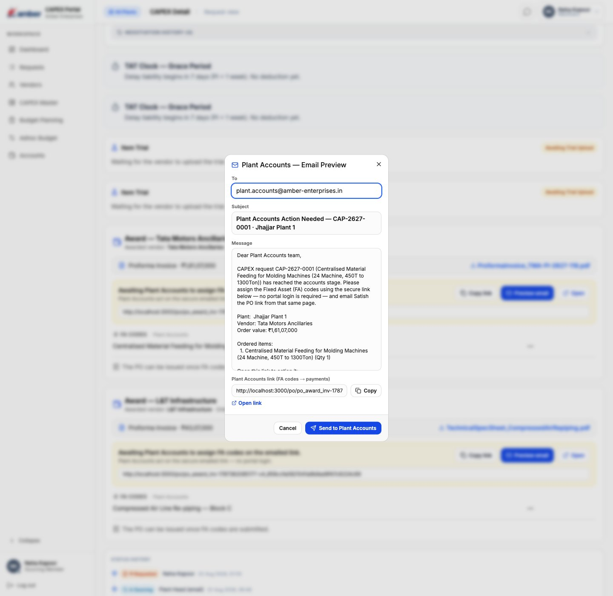

Plant, vendor, order value, the ordered items and the link. The body spells out both of their jobs:
assign the fixed-asset codes, and then email Global Accounts the purchase-order link from that same
page.

## Slide 9.4 · Plant Accounts, step 1 — the FA codes

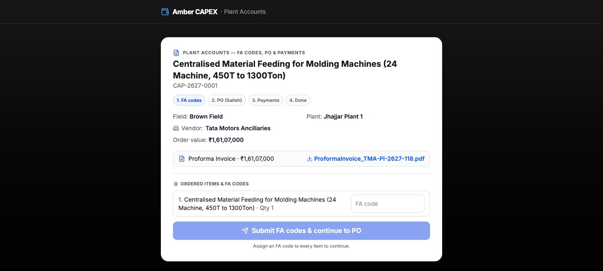

Their page carries a four-step rail — **1. FA codes → 2. PO (Satish) → 3. Payments → 4. Done** — so
they always know where the order stands. They see the vendor, the order value, the invoice to
download, and an FA-code field per ordered item.

Submit is blocked until every item has a code.

## Slide 9.5 · Email 2 — composed for them, automatically

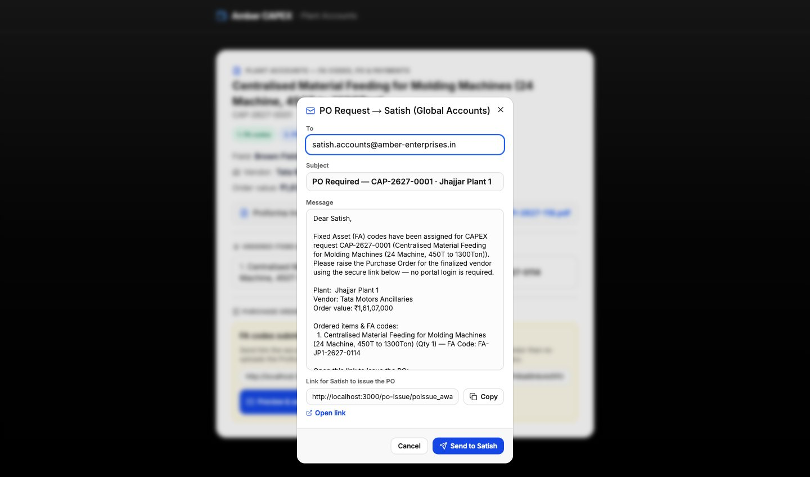

Submitting the FA codes mints the Global Accounts link **and immediately opens the email**, pre-filled
with the items and the codes just assigned. Plant Accounts do not have to remember what happens next
— it opens in front of them.

The rail advances to **2. PO (Satish)** and the panel keeps copy-link, re-send and open, so the
handoff can be repeated without regenerating anything.

## Slide 9.6 · Global Accounts issues the purchase order

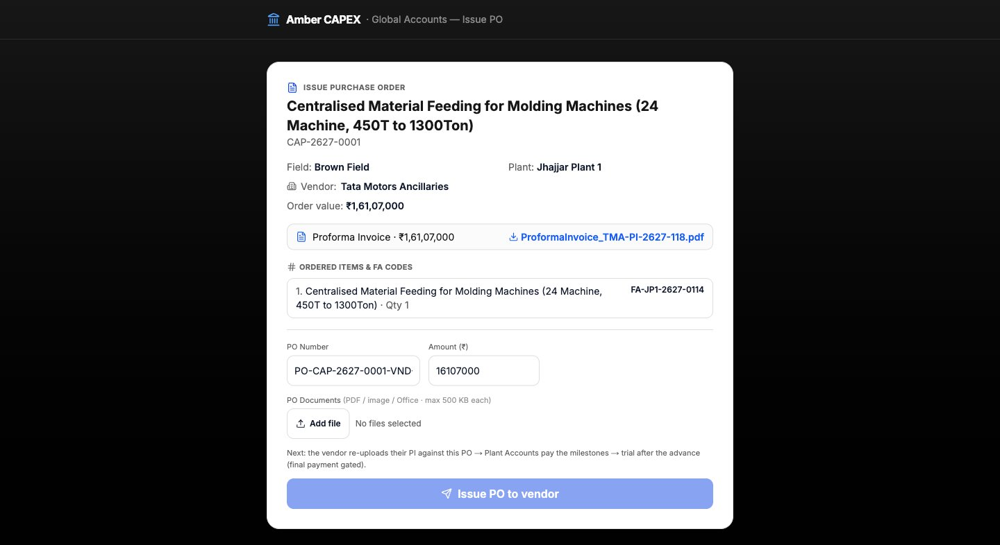

A **different link on a different page** — and each page rejects the other's link outright, so one
person's link can never do the other's job. Satish sees the invoice and the FA codes, enters the PO
number, confirms the amount and attaches the PO document.

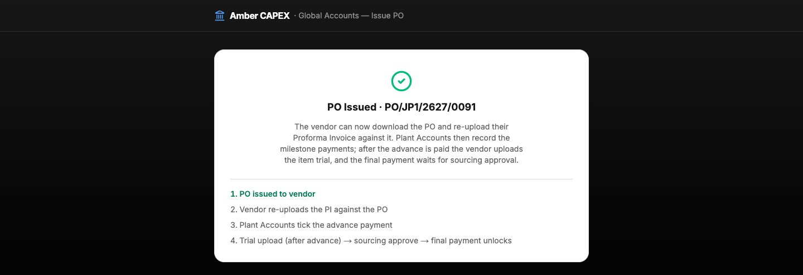

**PO Issued · PO/JP1/2627/0091**, with the remaining sequence restated so nobody has to hold it in
their head.

## Slide 9.7 · The vendor gets the purchase order

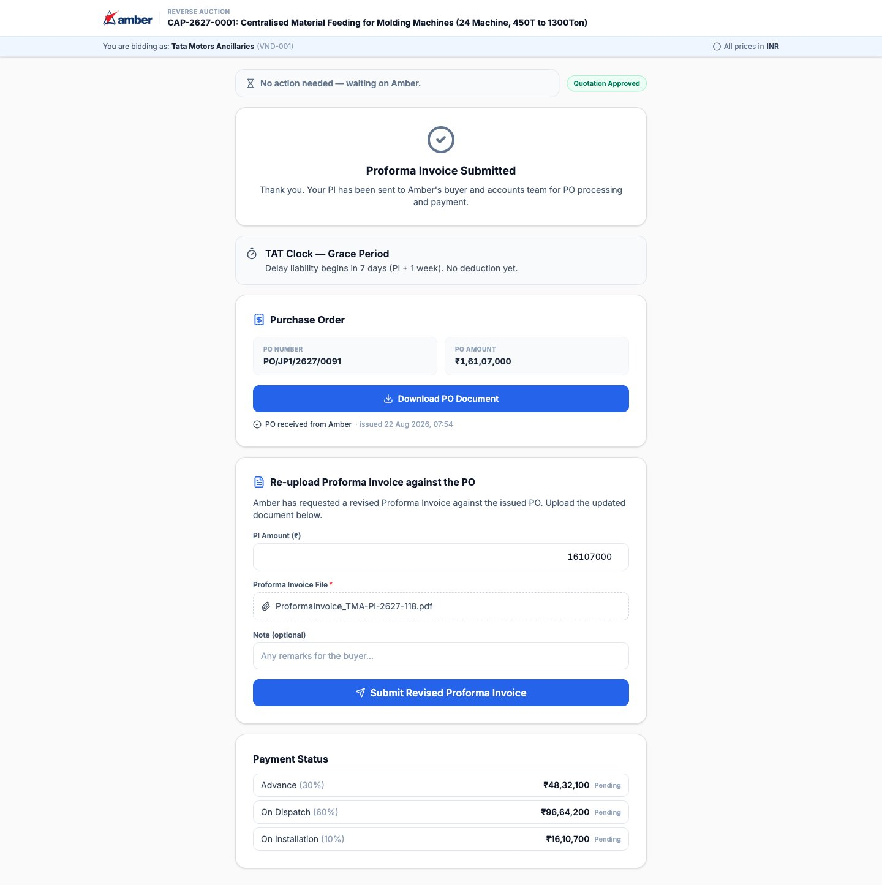

A purchase-order card with number, amount, a download button and the issue timestamp — plus a
**re-upload the proforma invoice against this PO** card, because an invoice raised before the PO
often has to be reissued against it, and the payment status showing what is due and when.

That re-upload window **closes the moment the first payment is made**. Once money has moved against
the invoice on file, revising it would change what was already paid.

## Slide 9.8 · Payment milestones — and the one that is locked

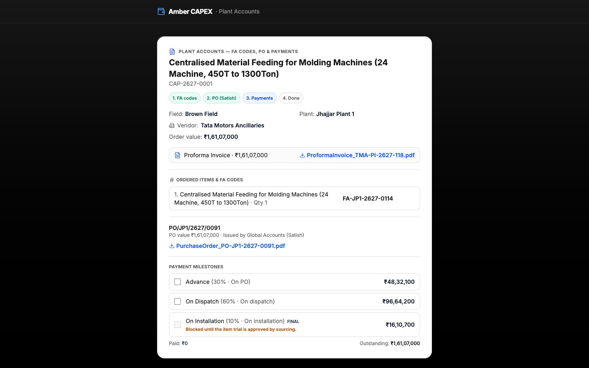

The milestones come from the vendor's payment terms, not from a number somebody typed:

| Milestone | Share | Amount | Trigger |
|---|---|---|---|
| Advance | 30% | ₹48,32,100 | On PO |
| On Dispatch | 60% | ₹96,64,200 | On dispatch |
| **On Installation** `FINAL` | 10% | ₹16,10,700 | On installation |

The last one is visibly locked: *"Blocked until the item trial is approved by sourcing."* It is not
merely greyed out in the interface — the underlying action refuses it.

Ticking the advance also starts the expected final-payment date, calculated from the vendor's own
delivery lead time, and opens the trial.

## Slide 9.9 · The trial

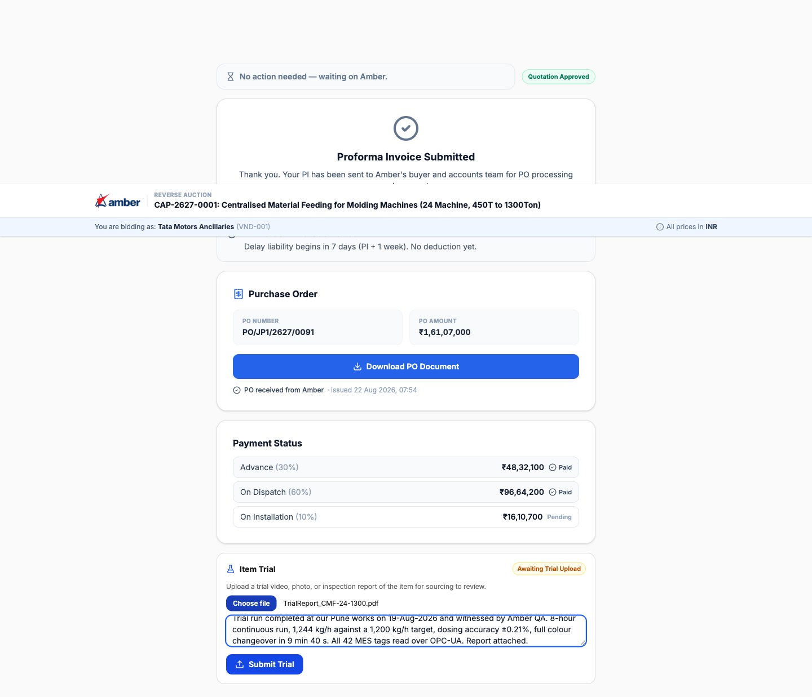

*"Upload a trial video, photo, or inspection report of the item for sourcing to review."* The vendor
attaches the evidence and a note:

> *"Trial run completed at our Pune works on 19-Aug-2026 and witnessed by Amber QA. 8-hour continuous
> run, 1,244 kg/h against a 1,200 kg/h target, dosing accuracy ±0.21%, full colour changeover in
> 9 min 40 s. All 42 MES tags read over OPC-UA. Report attached."*

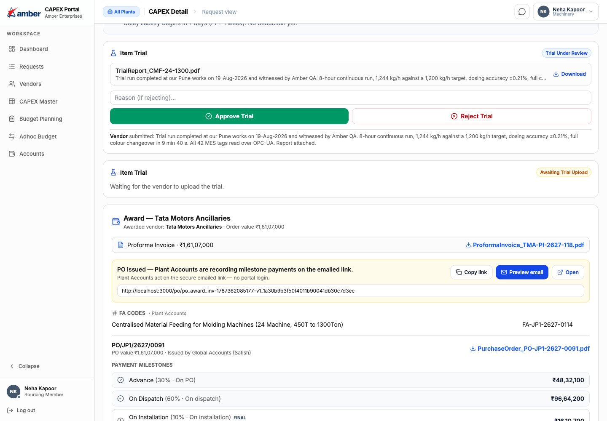

Sourcing reviews it on the request page: download the file, read the note, then **Approve Trial** or
**Reject Trial** with a reason — a rejection sends the vendor back to re-upload.

## Slide 9.10 · Settled

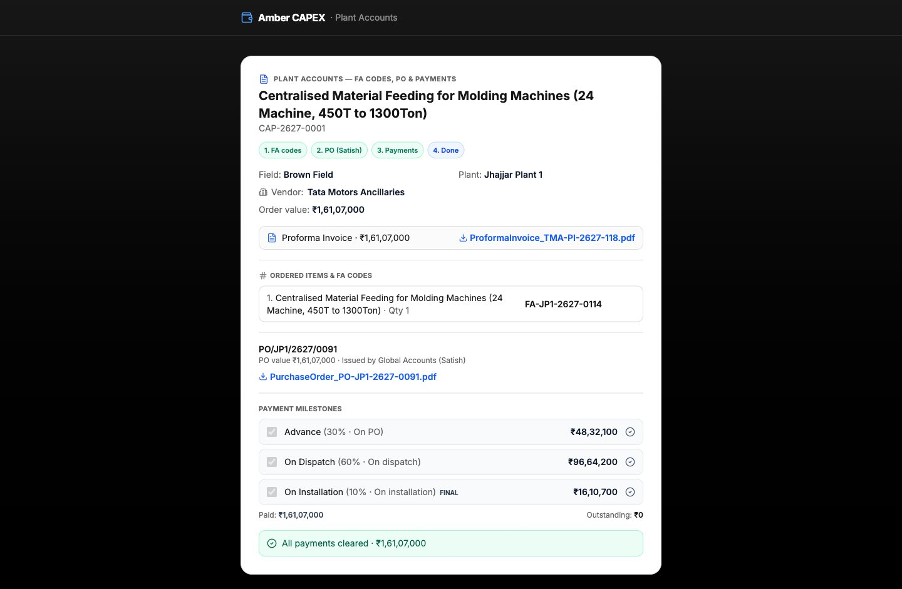

With the trial approved, the final milestone unlocks. All three ticked: **Paid ₹1,61,07,000 ·
Outstanding ₹0 · All payments cleared**, the rail on **4. Done**, and the delay clock stopped.

The vendor's own view of the same moment, on a phone: **TAT Closed — Final Payment Made · Delivered
within TAT — no delay deduction**, the purchase order still downloadable, all three milestones paid
and the trial marked approved. Every screen a vendor ever sees works at this size.

Once the L&T award finished the same way, `CAP-2627-0001` moved to **Completed**.

---

# Part 10 — Foreign vendors, Incoterms and currency

> Run on the second request, `CAP-2627-0002` — a *Shrink less Vertical M/C* for the Copper Shop,
> allocated ₹2.10 Cr — which was quoted by an Indian vendor and a German one.

## Slide 10.1 · Adding a foreign vendor mid-enquiry

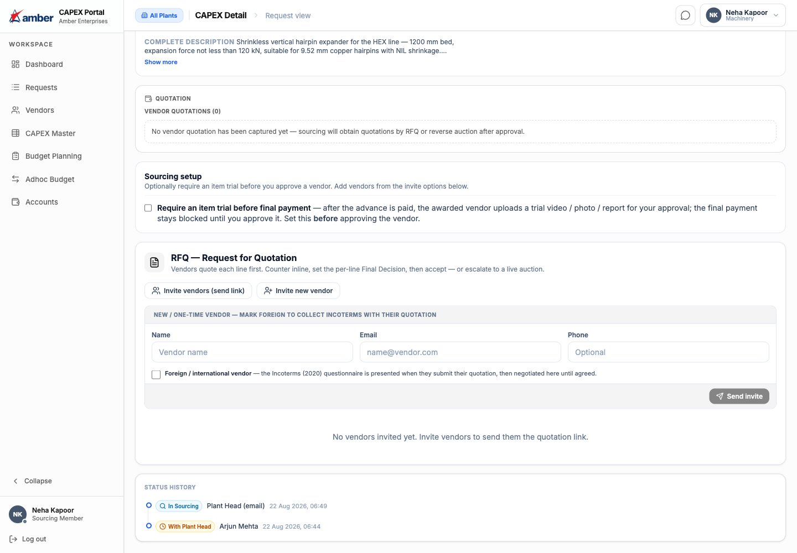

Sourcing can add a vendor who is not on the master by name, email and phone — and tick **foreign /
international vendor**. The caption states what that does: *"the Incoterms (2020) questionnaire is
presented when they submit their quotation, then negotiated here until agreed."*

## Slide 10.2 · Incoterms are collected with the quotation, not after it

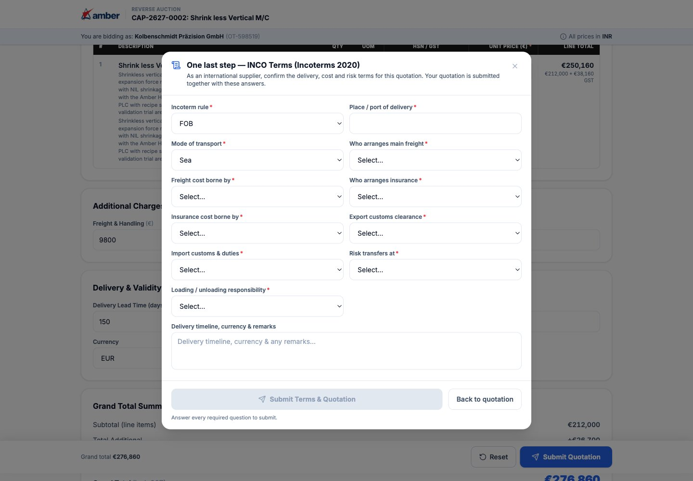

Kolbenschmidt Präzision GmbH prices the machine at **€212,000**, and on clicking submit gets one more
step: the **Incoterms 2020 agreement** — twelve questions covering the rule, the place of delivery,
the mode of transport, who arranges and who pays for the main freight and the insurance, who clears
export and who pays import duty, where risk transfers, and who loads and unloads.

They answer CIP Mundra, sea freight, seller-arranged and seller-paid freight and insurance, seller
export clearance, buyer import duty, risk at carrier handoff — and the quotation and the terms are
submitted **together**. Close the questionnaire without answering and the quotation is not sent at
all.

This is the difference between knowing the landed cost and finding out about it at the port.

## Slide 10.3 · Sourcing negotiates the terms like a price

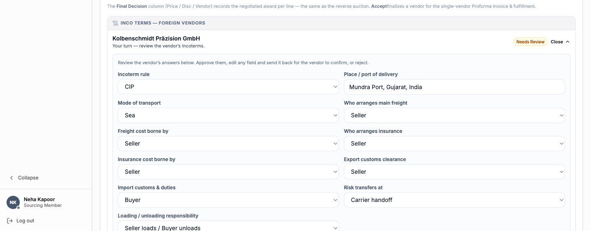

The answers land in an **INCO Terms** tracker beside the quotation. Sourcing can approve them, edit
any field and send them back with a note for the vendor to confirm, or reject them. The loop runs
until both sides agree — and until they do, **the vendor cannot be awarded**. The grid says so, on
the vendor's own column: *"INCO Terms open — settle before award."*

## Slide 10.4 · Everything that compares vendors converts to rupees first

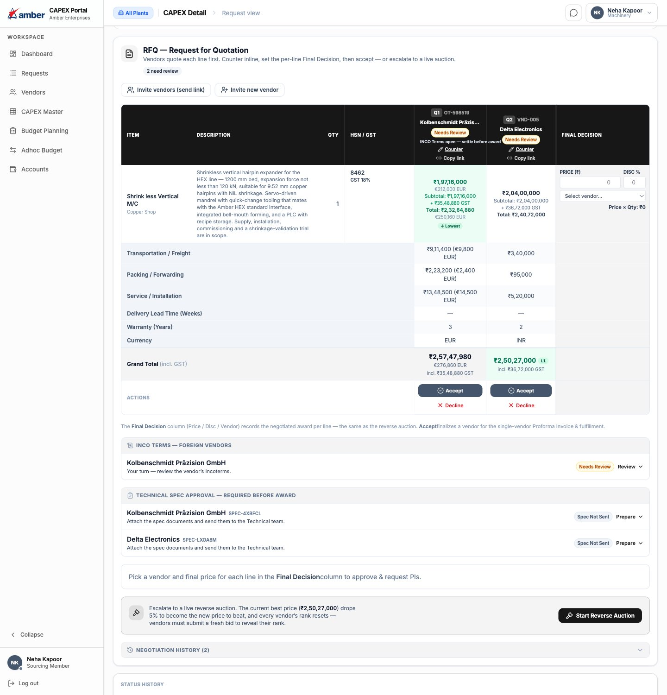

The German quotation is in euros and the Indian one in rupees, so the grid shows **rupees first with
the vendor's own currency underneath**:

| | Kolbenschmidt Präzision GmbH | Delta Electronics |
|---|---|---|
| Machine | ₹1,97,16,000 (€212,000) | ₹2,04,00,000 |
| Freight | ₹9,11,400 (€9,800) | ₹3,40,000 |
| Packing | ₹2,23,200 (€2,400) | ₹95,000 |
| Service / installation | ₹13,48,500 (€14,500) | ₹5,20,000 |
| Warranty | 3 years | 2 years |
| **Whole quotation, incl. GST** | ₹2,57,47,980 (€276,860) | **₹2,50,27,000** `L1` |

Read the two rows together and the point becomes obvious: the German machine is **cheaper on the
machine itself** and marked *↓ Lowest* on that line, but once freight, packing and installation are
in, the Indian vendor is cheaper on the **whole quotation** and takes L1. Both facts are true, both
are shown, and each figure states which basis it is on.

What the vendor contractually offered is always displayed in the currency they offered it in.
Anything that **compares** vendors, or that Accounts will act on, converts to rupees first.

---

# Part 11 — The reverse auction

## Slide 11.1 · Auctions are escalated, never started cold

At the bottom of the quotation grid sits the escalation offer, with the consequence spelled out
before the click:

> *"Escalate to a live reverse auction. The current best price (₹2,50,27,000) drops 5% to become the
> new price to beat, and every vendor's rank resets — vendors must submit a fresh bid to reveal their
> rank."*

An auction needs at least two real quotations to escalate from. Without competing prices there is
nothing to beat.

## Slide 11.2 · Configuring the auction

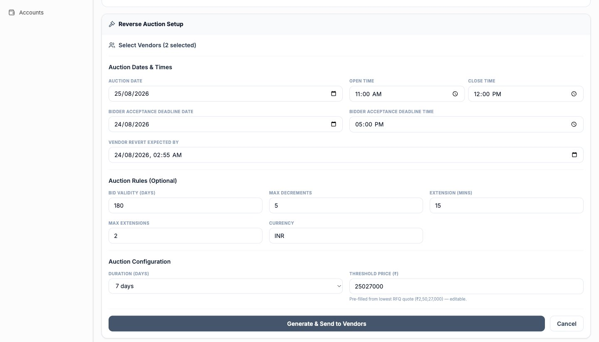

One form, in four blocks:

- **Auction dates and times** — auction date, opening time, closing time, the deadline by which
  bidders must accept, and when vendors are expected to revert.
- **Auction rules** — bid validity (180 days), maximum decrements in one go (5), time extension
  (15 minutes, maximum 2 per bidder), currency.
- **Auction configuration** — duration, and the **threshold price**, pre-filled from the lowest
  quotation received and editable.
- **Generate & send to vendors.**

## Slide 11.3 · The Business Rules document

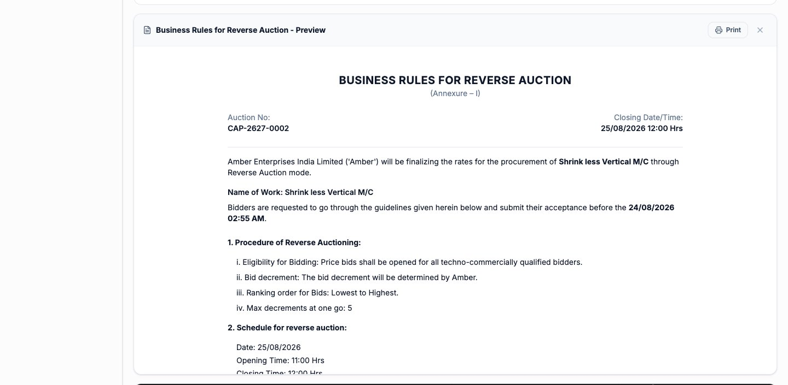

The portal generates a printable **"Business Rules for Reverse Auction (Annexure – I)"** — auction
number, closing date and time, the name of work, the acceptance deadline, the bidding procedure, and
the embedded Commercial Terms, Performance Bank Guarantee and Delay Liability Clause. This is the
document vendors legally accept in order to be allowed to bid.

## Slide 11.4 · Nobody bids until they have accepted

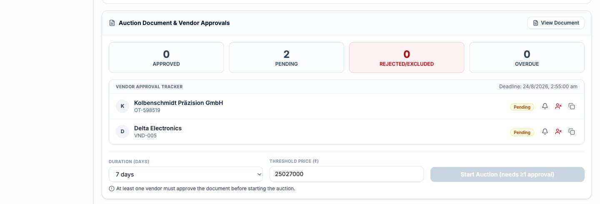

The **vendor approval tracker** counts approved, pending, rejected/excluded and overdue, shows the
revert deadline, and per vendor offers a reminder, an exclusion and a copy-link. **Start Auction is
disabled** — *"At least one vendor must approve the document before starting the auction."*

## Slide 11.5 · The vendor's acceptance screen

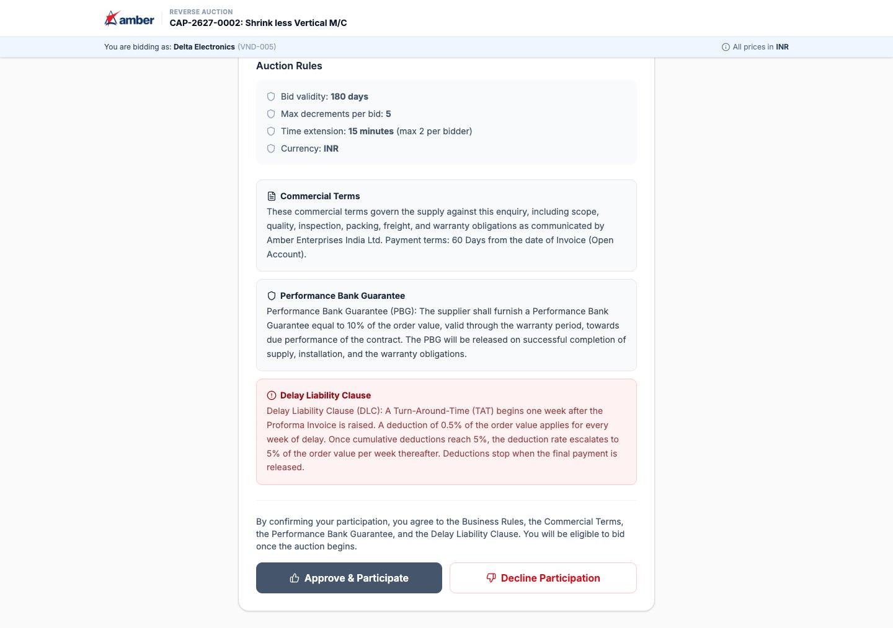

Response deadline, auction summary, the four rules, then the commercial terms, the bank guarantee and
the delay clause in full, and the binding sentence:

> *"By confirming your participation, you agree to the Business Rules, the Commercial Terms, the
> Performance Bank Guarantee, and the Delay Liability Clause. You will be eligible to bid once the
> auction begins."*

**Approve & Participate** or **Decline Participation**.

## Slide 11.6 · Live

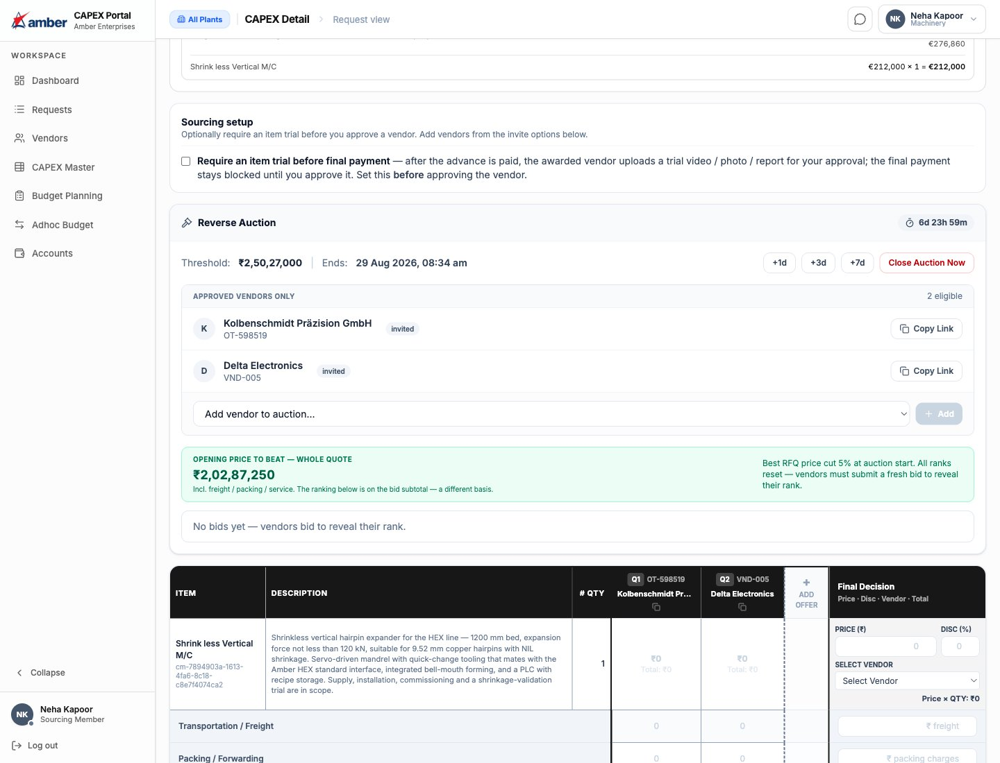

With both vendors accepted, the auction starts. Sourcing gets a countdown, the threshold, the
eligible-vendor list with copy links, quick **+1d / +3d / +7d** extensions, and **Close Auction Now**
— an auction can end on the clock or on demand.

The green panel states the opening price and how it was derived: **₹2,02,87,250 — best quotation cut
5% at auction start. All ranks reset — vendors must submit a fresh bid to reveal their rank.** It also
names its own basis: *"Incl. freight / packing / service. The ranking below is on the bid subtotal — a
different basis."*

## Slide 11.7 · The bid screen

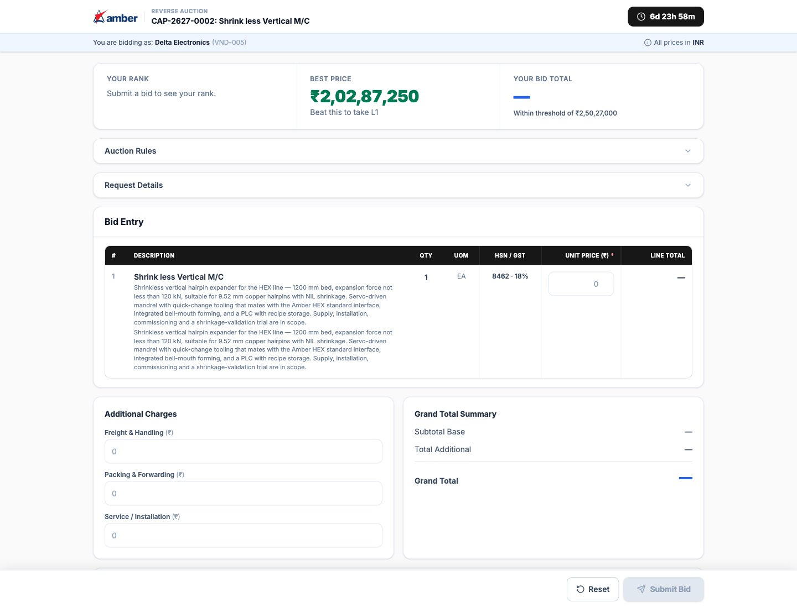

The vendor's screen is built around three numbers:

| | |
|---|---|
| **Your Rank** | *"Submit a bid to see your rank"* — rank comes only from a live bid; escalation reset everybody |
| **Best Price** | **₹2,02,87,250** — *"Beat this to take L1"* |
| **Your Bid Total** | live as they type, with *"Within threshold of ₹2,50,27,000"* |

There is deliberately **one** price to beat, for the whole quotation — no per-line best price to
reverse-engineer a competitor's costing from. It opens at the best quotation minus 5% and then moves
**only when somebody actually beats it**.

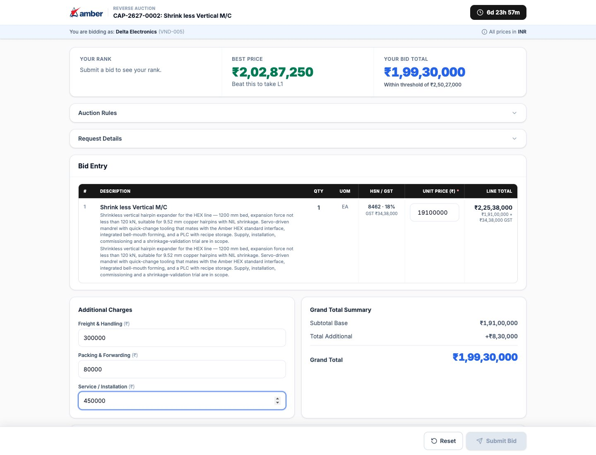

Delta bids ₹1,91,00,000 on the machine, for a bid total of ₹1,99,30,000 — under the price to beat.

## Slide 11.8 · Ranks, on a common basis

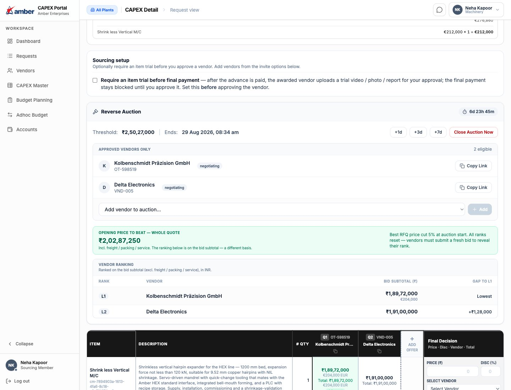

Both vendors rebid, and the ranking is stated with its basis in the heading — *ranked on the bid
subtotal, in INR*:

| Rank | Vendor | Bid subtotal | Gap to L1 |
|---|---|---|---|
| **L1** | Kolbenschmidt Präzision GmbH | ₹1,89,72,000 (€204,000) | Lowest |
| L2 | Delta Electronics | ₹1,91,00,000 | +₹1,28,000 |

The German vendor came back at €204,000 and took first place by ₹1,28,000 — a gap of well under one
percent, on a machine where the opening quotations were ₹7 lakh apart. That is what the auction is
for.

From here the auction path and the quotation path converge completely: the same per-line Final
Decision, the same split-award bar, the same technical-specification gate, the same fulfilment chain
described in Part 9.

---

# Part 12 — The dashboards

> Four dashboards, one per role. Nobody gets a generic "management view" — each person opens the
> portal onto the work that is actually theirs.

## Slide 12.1 · The idea behind all four

Every dashboard in the product is built in the same three bands, in the same order:

1. **My turn** — what is waiting on *you*, right now.
2. **Waiting on** — what you have handed to somebody else, and how long they have had it.
3. **Outcomes** — what the work has actually delivered.

That order is deliberate. A dashboard that opens on a portfolio total tells you how the year is
going; a dashboard that opens on *"four things are on your desk and the oldest has been there
sixty-six days"* tells you what to do next.

Three rules run through all of them, and they are what make the numbers trustworthy:

- **Every figure states the basis it is on.** A number whose provenance is invisible is worse than no
  number. Where a figure is an estimate, it says so.
- **A tile and the list it links to always agree.** Click a tile reading 2 and you land on exactly
  those 2 rows, with the reason marked on each — not on a list of 11 that happens to contain them.
- **Where something cannot be measured, it says so rather than printing zero.** A plant with no
  budget recorded reads *unmeasurable*, because printing 0% would claim it spent nothing of its
  budget when the truth is that it has none.

## Slide 12.2 · The buyer's dashboard

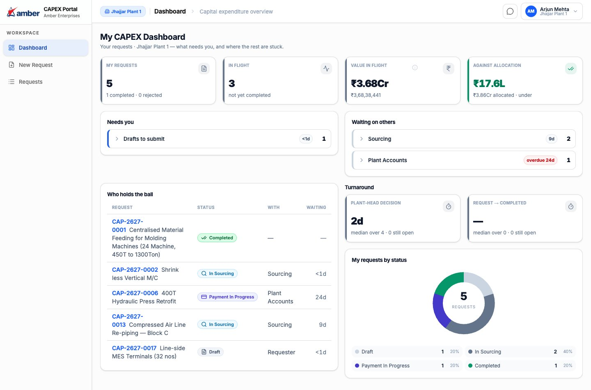

Arjun Mehta's view. It answers one question — *where are my requests, and what is holding them up?*

| Tile | What it counts | How to read it |
|---|---|---|
| **My requests** | Every request this buyer raised, in any state | 5, of which 1 completed and 0 rejected |
| **In flight** | Raised but not yet completed | 3 still moving |
| **Value in flight** | The money represented by those live requests | ₹3.68 Cr — the exact figure is shown underneath, because a rounded crore figure is a poor basis for a conversation |
| **Against allocation** | Live value compared with the budget allocated to those same lines | ₹17.6 L **under** ₹3.86 Cr allocated — green because under is good |

Below the tiles:

- **Needs you** — the queue that is genuinely his: 1 draft to submit.
- **Waiting on others** — Sourcing has 2 of his requests (9 days); Plant Accounts have 1, marked
  **overdue 24d** in red.
- **Who holds the ball** — every live request, its status, who is holding it, and for how long. This
  is the table a buyer screenshots and sends to somebody.
- **Turnaround** — how long the plant head typically takes (2 days, measured over 4 decisions), and
  how long a request takes end to end. Each states how many it measured and how many are still open,
  because a median measured only over finished work reads fastest exactly when the most work is
  stuck.
- **My requests by status** — the mix at a glance.

## Slide 12.3 · The sourcing cockpit — Desk

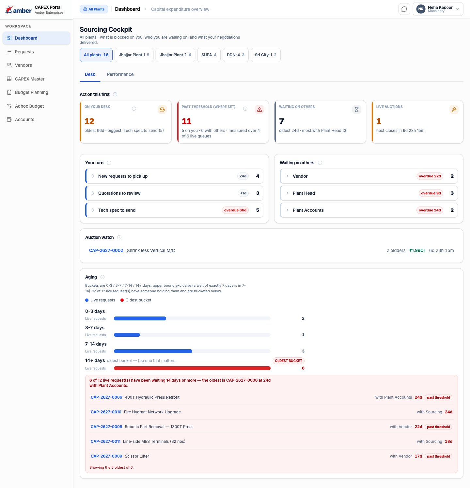

Neha Kapoor runs sourcing across all plants, so her dashboard starts with a plant filter — *All
plants 18*, then a chip per plant — and two tabs. **Desk** is the working tab.

| Tile | What it counts | Reading it here |
|---|---|---|
| **On your desk** | Everything currently waiting on sourcing | 12 · oldest 66 days · biggest single queue is *Tech spec to send* with 5 |
| **Past threshold** | Items older than the agreed service level, split by who is holding them | 11 · 5 on sourcing, 6 with others, measured over 4 of 6 live queues |
| **Waiting on others** | Handed out and not yet returned | 7 · oldest 24 days · most sitting with plant heads |
| **Live auctions** | Auctions currently running | 1 · next closes in 6d 23h |

- **Your turn** — new requests to pick up (4), quotations to review (3), technical specs to send (5,
  flagged *overdue 66d*).
- **Waiting on others** — vendor (2, overdue 22d), plant head (3, overdue 9d), plant accounts (2,
  overdue 24d).
- **Auction watch** — every live auction with its bidder count, current best price and time left.
- **Aging** — live requests bucketed 0–3 / 3–7 / 7–14 / 14+ days, with the oldest bucket highlighted
  and its contents listed by name: *"6 of 12 live requests have been waiting 14 days or more — the
  oldest is CAP-2627-0006 at 24d with Plant Accounts."*

That last line is the whole design in miniature: not a chart to interpret, a sentence to act on.

## Slide 12.4 · The sourcing cockpit — Performance

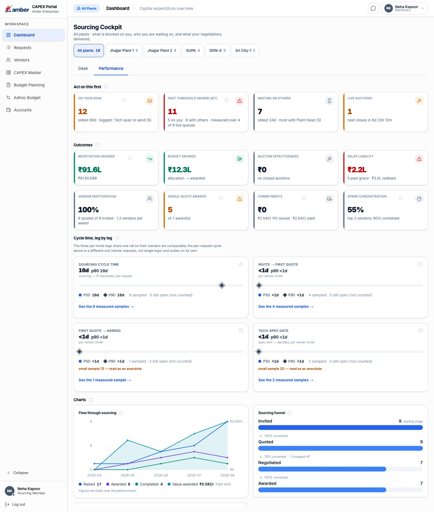

The same person, asking a different question: *did the negotiating actually deliver anything?*

| Tile | What it measures | Here |
|---|---|---|
| **Negotiation savings** | First quotation → final awarded price, like for like | **₹91.6 L** |
| **Budget savings** | Allocated budget → awarded price | ₹12.3 L |
| **Auction effectiveness** | Value taken out by reverse auctions | ₹0 — no auction has closed yet, and it says so rather than showing a flattering blank |
| **Delay liability** | Penalty accruing on late vendors | ₹2.2 L · 5 past grace · ₹3.0 L already realised |
| **Vendor participation** | How many invited vendors actually quoted | 100% — 9 of 9 · 1.3 vendors per award |
| **Single-quote awards** | Awards made against only one quotation | 5 of 7 — amber, because a single-quote award is a governance flag, not an achievement |
| **Commitments** | PO issued against paid | ₹2.04 Cr issued · ₹2.04 Cr paid |
| **Spend concentration** | Share of spend with the largest vendor, and the top three | 55% · top 3 combined 90% |

**Cycle time, leg by leg** measures four separate legs — sourcing cycle, invite → first quote, first
quote → agreed, and the technical-spec gate — each showing the median and the 90th percentile, how
many were measured, **how many are still open and therefore not counted**, and a plain warning when
the sample is too small to mean anything (*"small sample (1) — read as an anecdote"*).

Then two charts: **flow through sourcing** month by month, and the **sourcing funnel** — invited 9 →
quoted 9 → negotiated 7 → awarded 7, with the conversion and drop-off between each stage.

## Slide 12.5 · Administration — My Desk

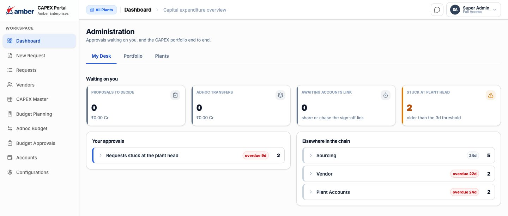

The administrator's dashboard opens, like everyone else's, on their own queue rather than on the
portfolio.

| Tile | What it counts |
|---|---|
| **Proposals to decide** | Budget proposals sitting at the admin gate, with their value |
| **Adhoc transfers** | Budget transfer requests awaiting approval |
| **Awaiting accounts link** | Approved budgets whose Global Accounts sign-off link still needs sending or chasing |
| **Stuck at plant head** | Requests waiting on a plant head **past the threshold** — 2 here, older than 3 days |

**Elsewhere in the chain** shows where everything else in the company is sitting: 5 with sourcing, 2
with vendors, 2 with plant accounts, each with the oldest wait.

## Slide 12.6 · Administration — Portfolio

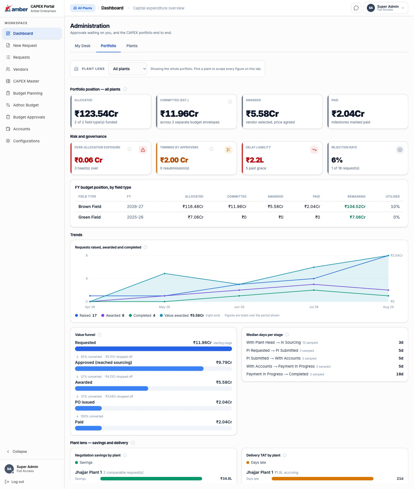

The money view, for all plants or for one — the **plant lens** at the top scopes every figure on the
tab, and travels with you into the lists you click through to.

**Portfolio position**

| Tile | Meaning |
|---|---|
| **Allocated ₹123.54 Cr** | Approved budget across every funded kind of capital expenditure |
| **Committed (est.) ₹11.96 Cr** | What live requests represent — the awarded price where awarded, else the agreed or best quotation, else the estimate. An estimate basis, and labelled as one |
| **Awarded ₹5.58 Cr** | Vendor selected, price agreed |
| **Paid ₹2.04 Cr** | Milestones actually marked paid |

**Risk and governance**

| Tile | Meaning |
|---|---|
| **Over-allocation exposure ₹0.06 Cr** | Committed against effective head allocation, wherever a head is over — 3 heads here, measured per plant on that plant's own live year. Part 13 clears one of them |
| **Trimmed by approvers ₹2.00 Cr** | Money taken out by approvers editing budgets while sending them forward — the plant head's ₹2.00 Cr trim from Part 2, surfaced as a number |
| **Delay liability ₹2.2 L** | Penalty accruing across every live order |
| **Rejection rate 6%** | 1 request rejected of 18 raised |

Then the **FY budget position by field type** — allocated, committed, awarded, paid, remaining and
utilised, **per kind of capital expenditure and never blended**, because Brown Field and Green Field
are separate envelopes and a ratio across them would be meaningless.

Below that, the **trend** of requests raised, awarded and completed with the value awarded on a
second axis; the **value funnel** — requested ₹11.96 Cr → approved ₹9.79 Cr → awarded ₹5.58 Cr → PO
issued ₹2.04 Cr → paid ₹2.04 Cr, with the conversion and the drop-off at each step; and the **median
days per stage**, measured from the record rather than assumed.

## Slide 12.7 · Administration — Plants

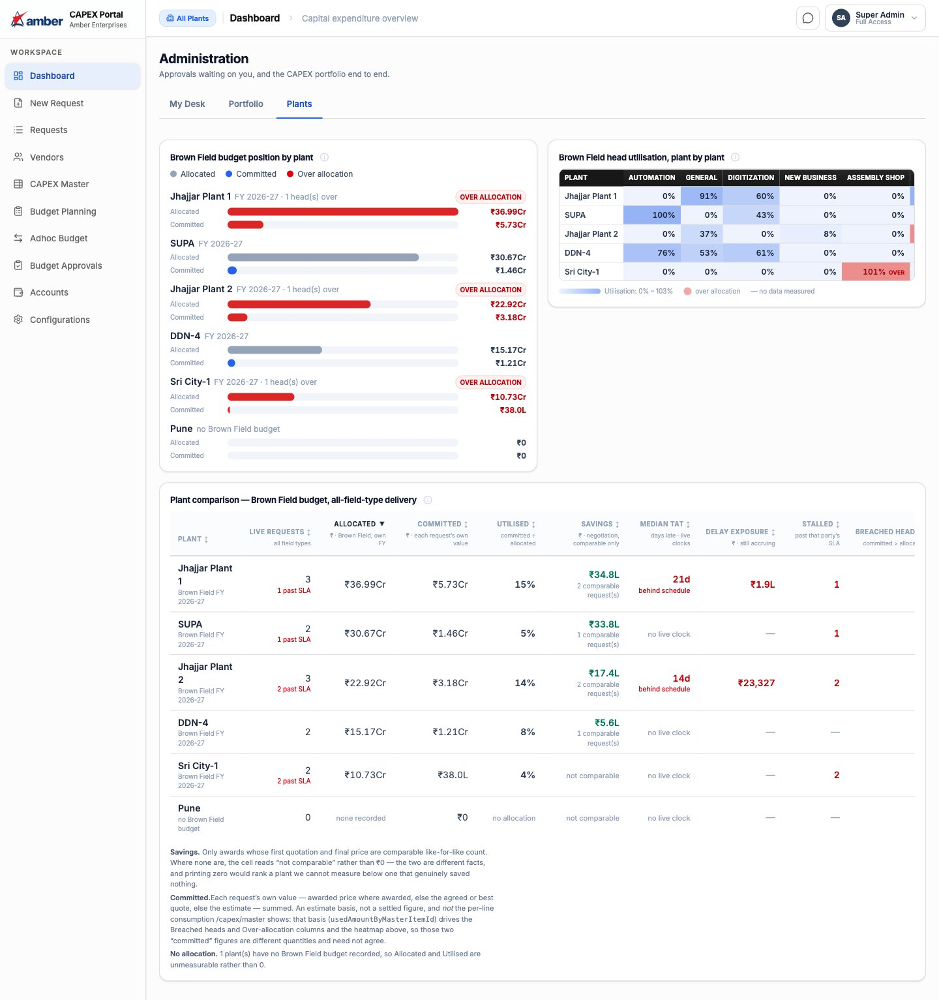

Plant against plant, which is where a capital budget is actually managed.

- **Budget position by plant** — allocated against committed, with an **over allocation** flag where
  a head has been overspent.
- **Head utilisation, plant by plant** — a heatmap of every head in every plant, so a 101% cell
  stands out at a glance.
- **Plant comparison** — a sortable table with live requests and how many are past service level,
  allocated, committed, utilisation, negotiation savings, median delivery delay, delay exposure,
  stalled requests and breached heads.

Read the footnotes under that table; they are the product being careful in public:

> *"Savings. Only awards whose first quotation and final price are comparable like-for-like count.
> Where none are, the cell reads 'not comparable' rather than ₹0 — the two are different facts, and
> printing zero would rank a plant we cannot measure below one that genuinely saved nothing."*

> *"No allocation. 1 plant has no Brown Field budget recorded, so Allocated and Utilised are
> unmeasurable rather than 0."*

## Slide 12.8 · The budget author's dashboard

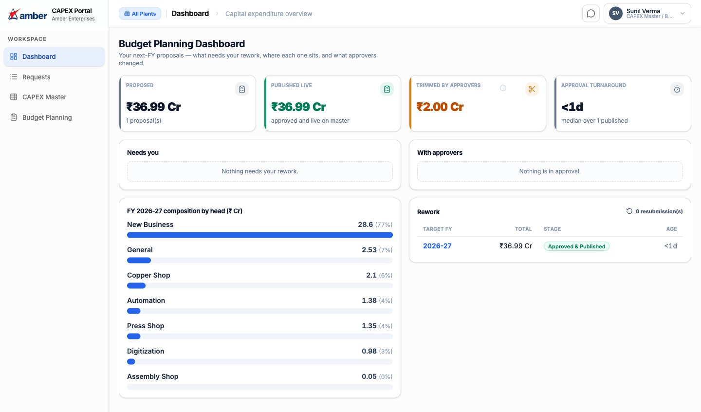

Sunil Verma's view is about proposals, not requests.

| Tile | Meaning |
|---|---|
| **Proposed ₹36.99 Cr** | What he has put up, across 1 proposal |
| **Published live ₹36.99 Cr** | What cleared all three gates and is now spendable |
| **Trimmed by approvers ₹2.00 Cr** | What approvers took out on the way through, and how many resubmissions it cost |
| **Approval turnaround <1d** | How long the three gates took, measured over what has actually published |

Then **needs you** (nothing to rework), **with approvers** (nothing in flight), the **composition of
the year by head** — New Business 77%, General 7%, Copper Shop 6%, Automation 4%, Press Shop 4%,
Digitization 3%, Assembly Shop 0% — and a rework table showing where each target year stands.

## Slide 12.9 · Every number can show its own definition

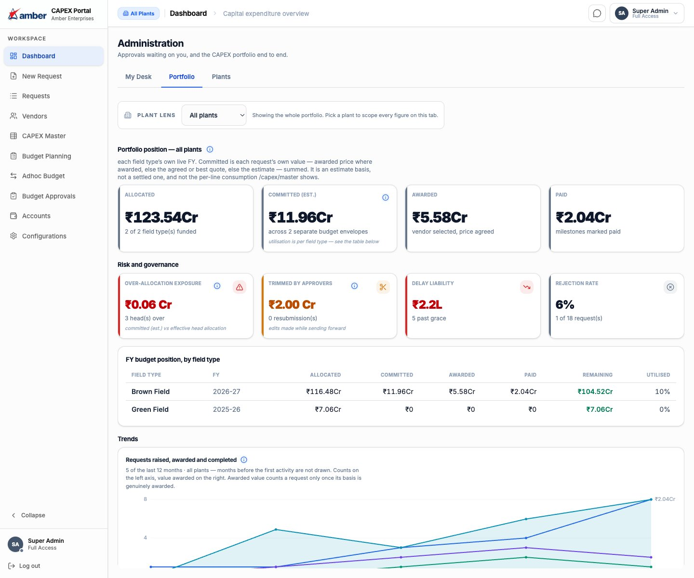

Next to most figures is a small ⓘ. Open it and the figure explains itself in place — which year it is
on, what it includes, what it deliberately excludes, and what it cannot measure. For example:

> *"Committed is each request's own value — awarded price where awarded, else the agreed or best
> quote, else the estimate — summed. It is an estimate basis, not a settled one."*

> *"Median days late on LIVE delivery clocks — a settled track is history, not current pace. 4 plants
> have no clock running and are not shown."*

> *"Both charts compare ALL plants regardless of the lens, because a comparison of one plant is not a
> comparison; the selected plant is marked instead."*

Folded away, the dashboards stay readable. Opened, every number can be defended in a meeting. That is
the difference between a report somebody trusts and one they quietly stop using.

## Slide 12.10 · A tile and its list always agree

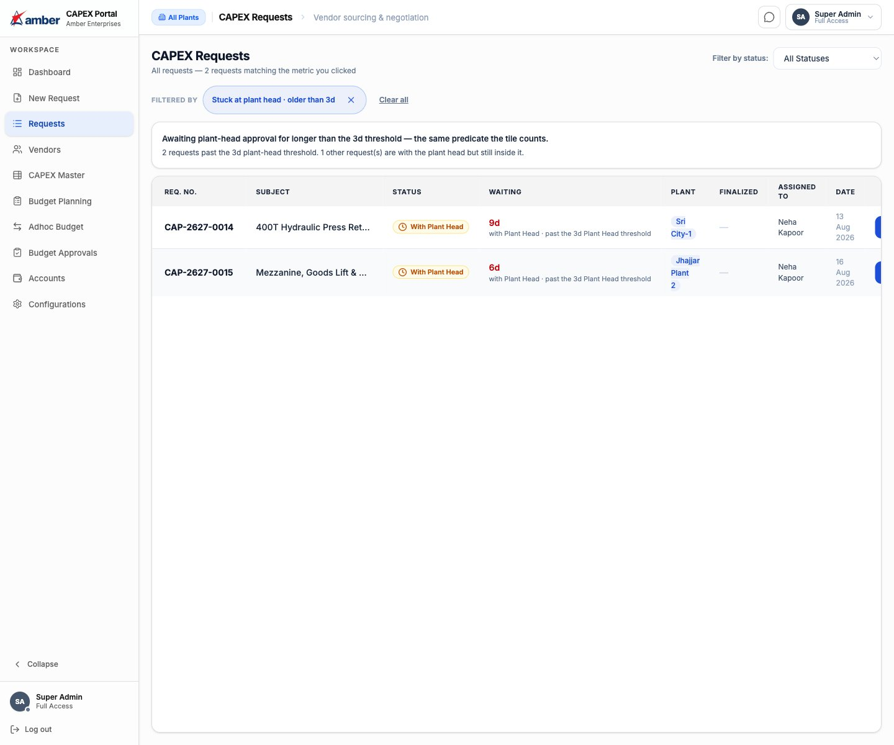

Click the administrator's **Stuck at plant head — 2** tile and this is where you land: two requests,
not eleven.

The chip states the filter that was applied — *Stuck at plant head · older than 3d* — the banner
restates the rule in words, an extra column marks **why each row qualifies** (9 days and 6 days, both
*past the 3d Plant Head threshold*), and the disclosure underneath names what is **not** shown:
*"1 other request is with the plant head but still inside it."*

The tile and the destination are driven by the same rule, so they cannot drift apart. If a link ever
carries a filter the portal cannot apply, it says so in an amber banner and tells you exactly what
you are looking at instead — it never silently shows you a different list.

## Slide 12.11 · The full request list

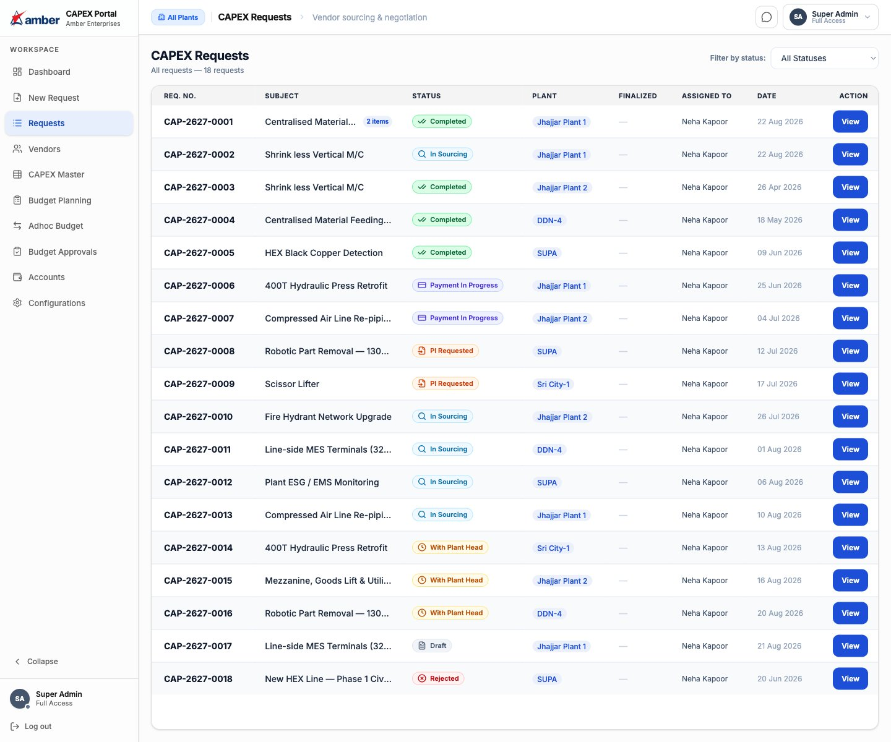

The unfiltered list behind all of it: 18 requests across five plants and every state in the pipeline
— completed, payment in progress, PI requested, in sourcing, with plant head, draft and rejected —
each with its number, subject, plant, owner and date. Filter by status from the corner, or arrive
here from any dashboard tile with the filter already applied.

---

# Part 13 — Trackers, transfers and configuration

## Slide 13.1 · The accounts queue

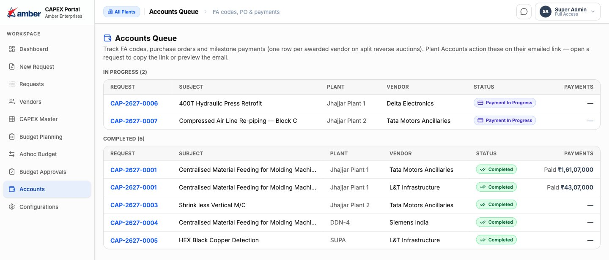

A read-only tracker of every order in the accounts stage, split into *in progress* and *completed*,
with the paid figure where there is one.

**One row per awarded vendor**, which is why `CAP-2627-0001` appears twice — Tata's award and L&T's
award are separate orders with separate purchase orders and separate payments. It answers *"where is
every rupee?"* without giving anybody the ability to move one.

## Slide 13.2 · Ad-hoc budget reallocation — the only mid-year change

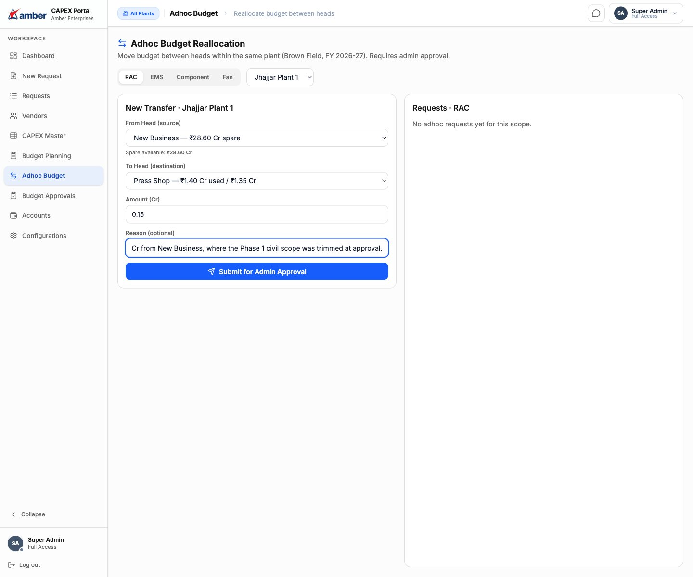

A live budget year is read-only. The one exception is a transfer **between heads within the same
plant and the same year**, and it needs the administrator's approval.

Here the Press Shop head has gone ₹0.05 Cr over after the 400T press retrofit came in above estimate.
Sourcing raises a transfer of ₹0.15 Cr from New Business — where the plant head trimmed the civil
scope back in Part 2 — and states the reason.

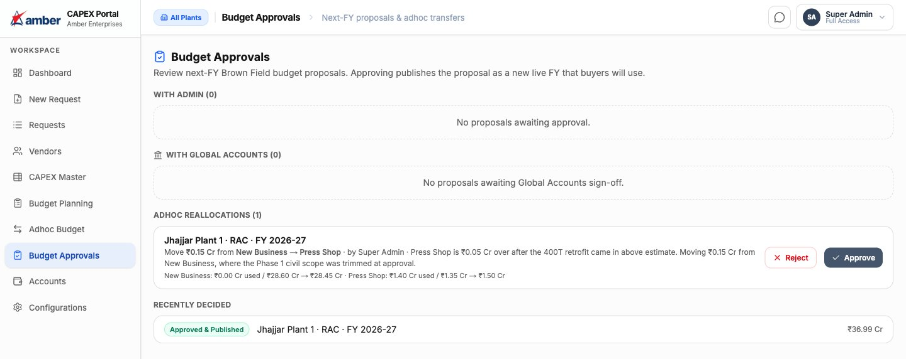

The administrator sees the transfer with **both heads' positions before and after** spelled out —
*New Business ₹28.60 Cr → ₹28.45 Cr · Press Shop ₹1.35 Cr → ₹1.50 Cr* — and approves or rejects.
Approving rewrites the head's effective allocation, and the over-allocation flag on the dashboard
clears on the next refresh.

Note what did **not** happen: nobody edited an approved budget line. The original numbers stand, the
transfer is a separate, attributable, approved act on top of them.

## Slide 13.3 · Configuration

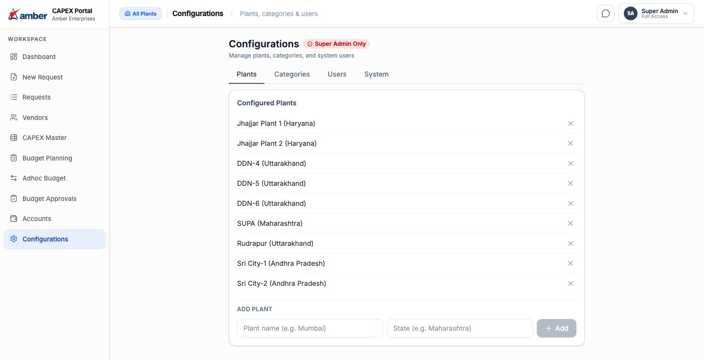

Administrator only. Four tabs — **Plants**, **Categories**, **Users** and **System** — holding the
reference data the rest of the portal depends on. The nine Amber plants shown here are what every
plant picker in the product offers.

## Slide 13.4 · The other three kinds of capital expenditure

Everything so far followed a Brown Field request, because that is the longest route. The other three
work the same way with different structure.

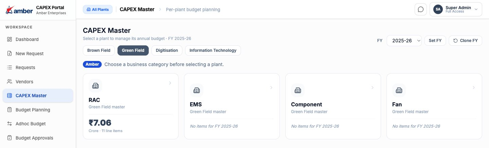

**Green Field** — a brand-new plant — is budgeted in a hierarchy rather than a flat list: plant →
section → head → line item, with a budget assigned at each level and each level deducting from the
one above it.

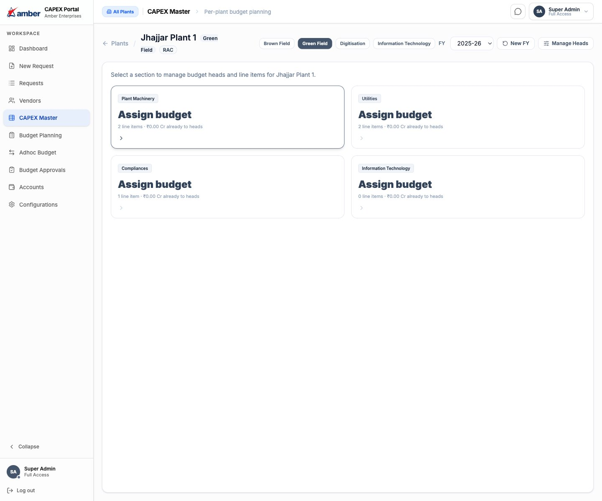

The four sections are **Plant Machinery**, **Utilities**, **Compliances** and **Information
Technology**; opening one for the first time prompts for its share of the plant's envelope, and
opening a head inside it prompts for its share of the section's. Green Field requests skip the
plant-head gate, because the plant does not have a head yet.

**Digitisation** and **Information Technology** each have their own master and their own heads, and
route like Brown Field.

---

# Part 14 — Every email in one place

The portal composes and previews the mail; a person still sends it. Each message carries a
single-purpose link that does exactly one job for exactly one person.

| # | Sent when | To | What the link lets them do |
|---|---|---|---|
| 1 | A budget proposal is submitted | Plant head | Approve, edit-and-send-forward, or reject the plant's budget |
| 2 | The admin approves the budget | Global Accounts | Final sign-off, which publishes the year |
| 3 | A request is submitted | Sourcing engineer | Notification of new work |
| 4 | A Brown Field / Digitisation / IT request is submitted | Plant head | Approve the request for sourcing |
| 5 | Vendors are invited | Each vendor | Accept the terms, then quote, negotiate, bid |
| 6 | A specification is sent | Technical team | Approve, send back, or reject the machine spec — vendor anonymous |
| 7 | A vendor uploads the proforma invoice | Plant Accounts | Assign the FA codes, then record payments |
| 8 | The FA codes are submitted | Global Accounts | Issue the purchase order to the vendor |

The links are unguessable. The decision links — the budget sign-off and the technical specification —
are **consumed on use** and **replaced when a package is re-sent**, so a forwarded email cannot
re-decide something. The accounts links are not consumed, because those two people come back to the
same page over several days.

---

# Part 15 — On any device

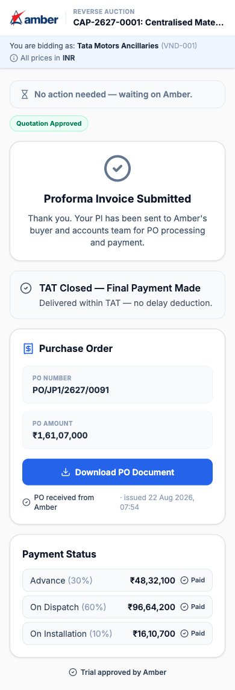

Every screen an outsider touches — the plant head's approval page, the technical team's sign-off, both
accounts pages and every vendor screen — is built to work on a phone as well as a desktop. That is
not decoration: a plant head approving a budget from a plant floor and a vendor checking a payment
from a factory in Pune are the normal cases, not the exceptions.

On a phone the pricing tables become card stacks rather than shrinking to unreadable columns, and the
maths behind them is the same code, so the desktop and mobile figures cannot disagree.

---

## Closing · The story in one paragraph

A maintenance engineer writes next year's budget from a blank sheet, uploads it as a spreadsheet, and
it clears three independent gates — plant head, administrator, Global Accounts — before a single
rupee is spendable, with each approver able to trim a number and send it forward, and the next
approver shown exactly what changed and why. A plant buyer then raises a request that can only point
at money already approved, and the plant head waves it through from an email. Sourcing invites two
vendors, who accept Amber's commercial terms, bank guarantee and delay penalty *before* they are
allowed to see a price field, quote line by line with their own HSN codes, and get countered inline.
Amber's technical team signs off each machine on its own link, without being told which supplier it
came from. Sourcing splits the award across both vendors, and each award runs its own track: the
vendor raises an invoice, Plant Accounts code the asset, Global Accounts issue the purchase order,
the vendor proves the machine with a trial, and the final 10% is released only once sourcing accepts
it. A second machine goes to a live reverse auction and closes ₹1.28 lakh apart on a common rupee
basis. And at every point, four dashboards say who is holding what, for how long, and what the
negotiating actually delivered — with every figure willing to explain where it came from.

**One tracked pipeline. Named gates. Nobody outside the buying team ever needs a login. And every
rupee traceable from the budget line it came out of to the milestone it was paid against.**

---

## Appendix · The route a request takes

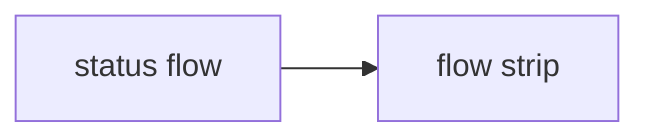
```mermaid
flowchart LR
  A[status flow] --> B[flow strip]
```
