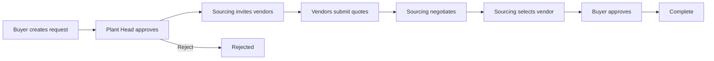
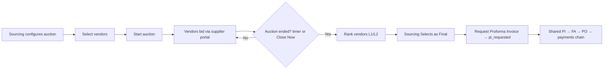
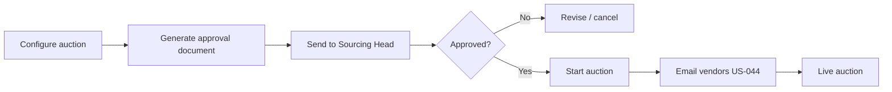

# Capex Amber — Product Scope Document

**Last updated:** 2026-06-19  
**Status:** Living document — reflects implemented features and planned roadmap  
**Related:** [USER_STORY.md](./USER_STORY.md) · [CLAUDE.md](../CLAUDE.md)

---

## 1. Executive Summary

**Capex Amber** is a procurement workflow portal for Amber Enterprises' capital expenditure (CAPEX) process. It covers the full lifecycle from buyer request creation through plant-head approval, vendor sourcing, reverse auction, negotiation, and final buyer sign-off.

The current build is a **Next.js 16 client-side demo**: all data lives in browser `localStorage` with no backend, database, or real email integration. The app is designed to demonstrate end-to-end workflows across multiple internal roles and an external supplier portal.

---

## 2. System Overview

### 2.1 Application surfaces

| Surface | Route | Audience | Auth |
|---------|-------|----------|------|
| Login | `/login` | Internal users | Role picker (mock) |
| Internal portal | `/capex/*`, `/sourcing/*`, `/settings` | Buyers, plant heads, sourcing, admin | `localStorage("capex_role")` |
| Supplier portal | `/supplier/[token]` | External vendors | Tokenised invite link (no account) |

### 2.2 Technology stack

- **Framework:** Next.js 16 (App Router), TypeScript, Tailwind CSS v4
- **UI:** shadcn/ui (base-nova), Lucide icons, Sonner toasts
- **State:** React Context (`CapexProvider`) persisted to `localStorage` key `capex_data_v2`; large base64 file blobs (PI / attachments) are offloaded to **IndexedDB** (`src/lib/fileStore.ts`) so the localStorage payload stays within quota and always persists
- **Export:** ExcelJS (dynamic import) for vendor comparison spreadsheets
- **Backend:** None — fully client-side prototype

### 2.3 Plants

Seeded plants: Jhajjar P1, Jhajjar P2, Pune, and others. Super admins can add custom plants via Settings. Plant-scoped roles see only their plant's data.

---

## 3. User Roles & Permissions

| Role | Scope | Key capabilities |
|------|-------|------------------|
| **Buyer** (`buyer`, `buyer_jhajjar_*`) | Own requests; plant-scoped variants filter by plant | Create requests, view own submissions, approve sourcing recommendation |
| **Plant Head** (`plant_head`, `plant_head_jhajjar_*`) | Plant-scoped | Approve/reject pending requests, view CAPEX master budget |
| **Sourcing Member** (`sourcing_member`) | Assigned requests | Invite vendors, compare quotes, run reverse auction, negotiate, submit sourcing decision |
| **Sourcing Head** (`sourcing_head`) | All requests | Oversight of sourcing workflow; approve final vendor selection |
| **Maintenance** (`maintenance`) | Global (Brown Field) | Author next-FY budget proposals (incl. bulk upload); raise adhoc transfers |
| **Plant Accounts** *(no portal role — emailed link)* | Per request/award | On `/po/[token]`: assign FA codes, email Satish the PO link, then tick the payment milestones |
| **Global Accounts — "Satish"** *(no portal role — emailed links)* | Per request/award + per budget proposal | On `/po-issue/[token]`: issue the PO (number + documents). On `/approve/[token]`: final sign-off on a next-FY budget (approving publishes it live) |
| **Super Admin** (`super_admin`) | Full access | Settings, data reset, all pages; sole approver of budget proposals & adhoc transfers |

Role switching is available from the top navigation without re-login (demo convenience).

---

## 4. Implemented Features

### 4.1 Authentication & navigation

- **Role-picker login** — select a persona on `/login`; role stored in `localStorage`
- **Login gate** — internal routes redirect to login if no role is set
- **Role switcher** — change persona from top nav; fires `capex_rolechange` event for live UI updates
- **Collapsible sidebar** — role-filtered navigation links
- **Internal chat** — role-to-role messaging in top nav (buyer ↔ sourcing ↔ plant head)

### 4.2 Dashboard (`/capex/dashboard`)

- Summary KPI cards: total requests, total budget, active sourcing count
- **Requests by status** — donut chart with status breakdown
- **Requests by plant** — horizontal bar chart
- **Money saved** — savings vs. budget for completed sourcing decisions
- **Recent requests** table with status badges
- Plant filter dropdown

### 4.3 CAPEX request lifecycle

#### Status flow

```
draft → submitted → pending_head_approval → sourcing → pi_requested → …
                  ↘ rejected (from pending_head_approval onward)

Brown Field fulfillment (RFQ & auction converge identically from sourcing):
  sourcing ─(RFQ: vendor approves price + docs)──────────┐
  sourcing ─(auction: ends → split award per vendor → each: terms → req PI)─┤
            (each award fulfils independently; request completes when all awards do)
  … → pi_requested → pi_submitted → accounts_processing → payment_in_progress → completed

(legacy only: sourcing_approved / buyer_approved — new auctions skip these)
```

Brown Field submissions start at `pending_head_approval`; Green Field / Digitisation / IT start at `sourcing`. After `sourcing`, Brown Field runs **RFQ by default** and can escalate to a **Reverse Auction**; **both paths converge identically** into the PI → accounts/PO → payments fulfillment chain (see §4.8) — the auction, once it ends and a winner is finalized, requests the PI directly (**no separate buyer-approval step and no post-award terms step** — vendors approved the pre-bid Business Rules before bidding; Request PI restricted to `sourcing_head`/`super_admin`). `sourcing_approved` / `buyer_approved` remain only for legacy/in-flight requests. Transitions are enforced by an explicit allowed-transitions map in `CapexProvider`.

#### Request list (`/capex/requests`)

- Role-filtered view (buyers see own requests; sourcing sees assigned; plant heads see plant)
- Status filter (plant heads default to "Pending Head Approval")
- Columns: request no., subject, plant, budget, status, priority, dates
- Deep link to request detail

#### New request (`/capex/new`)

Three-step flow: **form → review → sent**

**Field type selection (US-040)**

- **Green Field** — new plant build capex
- **Brown Field** — existing plant capex

**Green Field structure (US-043, US-046)**

1. Division card picker: Land & Building · Machinery · Utilities · Legal
2. Legal division: empty by design (no predefined heads); shows guidance to select another division or use custom heads
3. Land & Building only: **Land Documents folder** for unlimited land-related file uploads (deeds, surveys, permits)
4. Machinery only: budget head card picker (Moulding Shop, Press Shop, etc.) — head locked for entire request
5. Multi-row spreadsheet-style line-item grid

**Line-item grid fields**

- Head / Sub Particular (cascading dropdowns from CAPEX master)
- Machine Capacity (free text, Machinery division only)
- Description, category, quantity, UOM, specs, budget, remarks
- Vendor recommendation, last price / last vendor (reference)
- Per-row attachment (base64)
- **Land Documents folder** (Land & Building only) — unlimited files, no size cap

**Request-level fields**

- Priority, justification, technical specs, ROI/benefits, remarks
- Request attachment

**Derived on submit**

- `requestNo`: `CAP-{FY}-{seq}` (e.g. `CAP-2526-0001`)
- `subject`, `budget`, `category`, `quantity` aggregated from line items
- Sourcing engineer auto-assigned (round-robin ready; currently single engineer)
- `statusHistory` entry appended on every transition

#### Request detail (`/capex/[id]`)

- **Request info card** — metadata, line items, attachments, tech specs, justification
- **Status banner** — contextual message per status with icon and colour
- **Status history timeline** — who moved the request and when (US-015)
- **Plant head actions** — approve → sourcing, or reject with reason
- **Buyer actions** — approve or reject sourcing recommendation at `sourcing_approved`
- **Sourcing decision banner** — final vendor, prices, freight/packing/service, delivery, warranty
- **Request comments** — threaded comments by buyer / sourcing / sourcing head

### 4.4 Vendor sourcing & comparison

#### Vendor master (`/sourcing/vendors`)

- Searchable vendor directory (code, name, category, GSTIN, contact)
- Expandable row detail (address, payment terms, bank details)
- **Onboard new vendor** modal

#### Vendor comparison grid (`VendorGrid` on request detail)

- Multi-vendor quote comparison matrix (line items × vendors)
- Invite vendors to request (creates tokenised `VendorInvite`)
- Copy supplier portal link to clipboard
- **Mock email thread UI** — visual preview of RFQ sent / quote received (no real email sent)
- Per-vendor negotiation drawer with message thread and counter-offer
- Offer columns for multi-round comparison
- Per-line-item final vendor selection
- Final decision row: freight, packing, service, delivery, warranty
- Sourcing head approval of selected vendor
- **Excel export** of comparison grid

#### Negotiation (`NegotiationDrawer`)

- Quote history with expandable previous bids
- Sourcing sends messages with optional counter-price
- Attachment display on quotes

### 4.5 Reverse auction (US-042)

**Internal (sourcing on request detail)**

- Configure duration (1–30 days) and price threshold
- Select vendors and **Start Auction** — auto-invites vendors with supplier links
- Live countdown timer
- Extend auction (+1 / +3 / +7 days)
- **Close Auction Now** — end the auction early instead of waiting for the countdown; this (or natural expiry) unlocks winner finalization
- Add vendors mid-auction
- Vendor ranking table: L1/L2 labels, gap-to-L1, grand total
- Copy per-vendor supplier links
- **Split award → per-vendor fulfillment (US-070):** once the auction has **ended**, `sourcing_head`/`super_admin` awards line items in the per-line **Final Decision** column (a winning vendor + final price per line — different lines may go to different vendors) and clicks **Approve Final Decision & Award**. Each winning vendor becomes its own **award** (`finalizeSplitAward`) that runs the full chain independently: **Request PI** per award (no post-award terms step — terms were approved pre-bid) → that vendor uploads its own PI → Plant Accounts run that award's FA codes + payments and Satish issues its PO, each on their own emailed link. The **request** completes only when **every** award completes (status stays coarse `pi_requested` in between; a "n/m awards complete" chip shows). RFQ / single-vendor auctions keep the single request-level PI → PO → payments chain unchanged

**Supplier portal (`/supplier/[token]`)**

- Token-resolved invite (no login)
- Sticky header: request no., countdown, vendor identity, currency
- Rank badge and grand-total summary card
- Collapsible request details and bid history
- Bid-entry table: unit price, total per line item; anonymous market prices inline
- Additional charges panel (freight, packing, service)
- Delivery, validity, supporting info section
- Threshold warning (non-blocking, red indicator) — whole-quote, surfaced once (header chip + rank summary)
- Re-bid overwrites existing quote in place
- Quote attachment (max 500 KB, base64 inline)
- Sticky bottom submit bar with rank hint, reset, submit
- Cross-tab sync via `storage` event when supplier submits in another tab
- **Two responsive UIs (US-068):** every state renders on desktop and mobile (~390px). Pricing screens (RFQ quote entry, quote review, auction bid) show a **desktop table mirroring the internal sourcing grid** (`SupplierQuoteTable`, near-black header, line items as rows) and a **mobile card stack** (`SupplierQuoteCards`) — shared `read`/`entry`/`bid` variants, GST/totals via `rfqUtils` (no desktop/mobile drift). Non-pricing states use the shared `SUPPLIER_CARD` with mobile-stacking action rows.

### 4.x UI / UX system (US-068)

- **Compact density** applied portal-wide and centralized in `src/lib/uiTokens.ts` (page `p-5`, section `space-y-4`, cards `rounded-xl p-4` on semantic `bg-card`/`border-border`, **data rows `py-2`**, page titles `text-xl`); editable input grids intentionally roomier (`py-3`/`py-0.5`).
- **Dense space utilization:** key-value metadata renders as inline `label: value` strips (not stacked cells); long text fields clamp to 2 lines with a measured "Show more/less" (`ClampText`); status stepper + dashboard KPIs tightened — request-detail line items sit near the top without scrolling.
- **Black-and-white chrome + blue accent:** white surfaces, near-black (`#171717`) text/headers, **blue (`#2563EB`)** as the chrome accent, red for danger; grayscale + blue throughout the page chrome, tables, buttons and nav; subtle charcoal→black gradients (login hero, table headers). Driven by `globals.css` CSS-variable tokens; `uiTokens.ts`/`auctionTheme.ts` carry the literal palette.
- **Coloured status badges (the one exception):** status/priority/invite badges carry **semantic colour + a Lucide icon** for at-a-glance workflow visibility — `STATUS_COLORS` gives a distinct colour per request status; `BADGE_TONE` is the shared 5-phase palette (slate/amber/blue/emerald/red) for invite + secondary maps. Rendered via the shared `StatusBadge` component (`STATUS_ICONS`/`INVITE_STATUS_ICONS`). The dashboard donut uses a distinct grayscale ramp (blue = submitted, red = rejected).
- Login responsive (hero hidden below `lg`, card `w-full max-w-md`).
- Touch targets kept ≥44px on interactive controls.

### 4.6 CAPEX master budget (`/capex/master`)

#### Brown Field (US-040, US-047)

- Four divisions: **Machinery**, **Utilities**, **Legal**, **Other Brown Field**
- Machinery and Utilities reuse Green Field sub-head taxonomy; Legal starts empty; Other Brown Field holds legacy heads (Automation, General, Digitization, etc.)
- Division tabs on plant detail view; per-plant, per-FY budget grid
- Legacy flat `Machinery`/`Utilities` master rows migrated to division + sub-head on load
- New requests: division card picker (Machinery / Utilities / Legal) with same Machinery head-lock flow as Green Field

#### Green Field (US-040, US-043)

- Four divisions: **Land & Building**, **Machinery**, **Utilities**, **Legal**
- Division tabs with canonical sub-heads per `GF_DIVISION_HEADS`
- 114+ seed template rows per plant (Jhajjar P1/P2, Pune)
- Backfill migration for existing localStorage data

#### Budget management

- Add / edit / delete master line items
- Clone master data to a new fiscal year
- Custom budget heads (add, rename, remove)
- Link requests to master items via `masterItemId`

#### Overrun indicators (US-041)

- Red row + "↑ ₹X L over" when linked request budgets exceed `totalCost`
- Red head chip + "Over by ₹X Cr" at aggregate head level
- Plant card overrun warning on master grid overview

### 4.7 Administration (`/settings`)

Super admin only:

- **Plants** — add custom plants with label, state, assigned user
- **Categories** — add/remove request categories
- **Users** — read-only role reference (mock personas)
- **System** — reset all localStorage data and return to seed state

### 4.8 Brown Field procurement expansion (US-057 – US-063)

End-to-end Brown-Field lifecycle (frontend-only). Scoped to `fieldType === 'brown_field'`; other field types unchanged. Document-approval enhancements also apply to reverse auctions.

- **New request line grid** — one row per line item: Head → **Sub Particular** (required — it *is* the item name; the free-text Subject field was removed) → Qty → Description, with the master allocation shown read-only per row. The request subject is derived from the first line's sub particular.
- **Budget proposals → admin approval → new FY** — the live Brown Field master FY is read-only; maintenance authors a next-FY proposal — **always starting blank** (the previous FY is never carried over), with **bulk Excel/CSV upload** on **Budget Planning** (`/capex/budget-proposals`); super admin reviews the full head → sub-particular breakdown and **publishes** it as the new live FY on **Budget Approvals** (`/capex/budget-approvals`).
- **Leaner Brown Field request** — buyers enter specs + a preferred vendor only; no quotations.
- **RFQ-only → optional auction (vendor-quotes-first, per line item)** — Brown Field is **RFQ by default** (no chooser); a reverse auction can only be **escalated from RFQ** and needs **≥2 vendor quotes**. RFQ: invite vendors (sends the link **+ the contract doc-package**) → **the vendor first accepts the documents** (Commercial Terms / PBG / Delay Liability Clause / payment terms — gated before quoting) → **the vendor prices each line item** on a responsive, auction-styled portal table → sourcing reviews in the **auction-style comparison grid** (line items as rows, vendors as columns, per-line lowest highlight, footer charges, Grand Total/L1, and a per-line **Final Decision** column identical to the auction's — Price / Disc / Vendor / Price×Qty) and **counters inline** or **accepts** a vendor → request Proforma Invoice. The supplier link is copyable for every vendor at every stage. Sourcing can instead **Start a Reverse Auction**, which **carries each vendor's RFQ prices into the auction as opening bids** (lowest = L1, others rebid lower) and pre-fills the threshold to the lowest collected quote, then runs the existing auction approval flow. Both paths converge into the same fulfillment chain.
- **Document approval package** — Performance Bank Guarantee + Delay Liability Clause (+ payment terms for one-time/non-onboarded vendors). In RFQ the package is **decoupled from the price** and **auto-sends once the price is agreed**; the vendor approves it on a separate screen; PI is gated on price **and** documents approved; declines are re-sendable. In auctions the same terms are embedded in the approval document.
- **Accounts & payments (off-portal, two links)** — the finalized vendor uploads a PI; sourcing/admin then share the **public Plant-Accounts link** from the request detail (copy link + email preview). Plant Accounts assign the **FA codes** there and, on submit, an email to **Satish (Global Accounts)** opens automatically carrying **his own link** to raise the PO. Satish assigns the **PO number + uploads the PO document** and issues it (the vendor is notified and downloads it from the supplier portal); the vendor **re-uploads the PI** against it; Plant Accounts return to their link to tick the **payment milestones** (advance/dispatch/installation) from the vendor's split — with the **item trial** running after the advance and gating the final payment when it's required. Internally the same data is a **read-only tracker** on the request detail and in the **Accounts Queue** at `/accounts/queue`.
- **Budget display removed (US-071)** — the requested-budget "Budget" column was removed from the requests list, dashboard, and request-detail line-items tables (and the detail meta), and the "Est. Budget (Total, ₹)" input from `/capex/new`; the underlying `budget` data is retained (KPIs, savings, fallbacks), with Brown Field line budget defaulting to the master allocation.
- **GST via HSN (item-wise)** — the HSN code is set per **line item** (one value per item, not per vendor). **Only the vendor enters it** (editable per-line dropdown on their bid form); **sourcing sees it read-only** in the RFQ comparison grid and cannot set or override it. A built-in HSN→GST table derives each item's rate and GST = unit × qty × rate is computed per line and folded into the (GST-inclusive) total; freight/packing/service are not taxed.
- **Technical specification approval** — before sourcing can finalise a vendor and request the PI, the machine's tech spec (with the spec document the vendor provided) is sent to Amber's Technical team, who approve / send back / reject from a public emailed link. Per vendor; the award is blocked until approved.
- **INCO Terms (Incoterms 2020)** — sourcing can quick-add any vendor by name/email/phone; a **foreign** vendor answers a 12-question Incoterms agreement in a **popup when they submit their quotation** (quote + terms are saved together, or not at all), after which the two sides edit/send-back/accept/reject until agreed. An unsettled agreement blocks the **award**, not the quoting.
- **TAT & delay liability** — clock starts PI + 1 week; 0.5%/week up to a cumulative 5%, then 5%/week; stops on final payment.
- **Adhoc budget reallocation** (`/capex/adhoc-budget`) — move budget head→head within a plant/FY (admin-approved) to cover overruns.

---

## 5. Data Model (summary)

| Entity | Key fields |
|--------|------------|
| `CapexRequest` | id, requestNo, fieldType, lineItems[], status, budget, plant, assignedTo, sourcingDecision, auctionConfig, statusHistory |
| `CapexLineItem` | description, masterItemId, division, machineCapacity, budget, specs, attachment |
| `CapexMasterItem` | plant, fy, fieldType, division, head, department, subParticulars, totalCost |
| `Vendor` | vendorCode, vendorName, category, GSTIN, contact, payment terms |
| `VendorInvite` | token, requestId, vendorId, quotes[], negotiationThread[], status |
| `Quote` | prices, freight, delivery, validity, attachment |
| `AuctionConfig` | startedAt, durationDays, endsAt, threshold |
| `SourcingDecision` | selectedVendorId, finalPrices, offerCols, finalVendorPerItem |

---

## 6. Planned / Future Features

The following capabilities are **not yet implemented** but are on the product roadmap.

### 6.1 Automated email functionality (US-044)

**Current state:** The vendor grid shows a mock "Email Thread" panel (RFQ preview and quote-received card). Links are copied manually; no emails are sent.

**Planned scope:**

| Trigger | Recipients | Content |
|---------|------------|---------|
| Vendor invited to RFQ | Vendor contact email | RFQ summary, line items, supplier portal link |
| Vendor invited to auction | Vendor contact email | Auction start notice, duration, threshold, portal link |
| Quote received | Assigned sourcing engineer | Notification with vendor name and quote total |
| Auction ending soon (e.g. 24 h) | Invited vendors + sourcing | Reminder with countdown and current rank hint |
| Plant head approval needed | Plant head for request plant | Request summary, budget, approve/reject deep link |
| Sourcing decision ready | Buyer (request creator) | Selected vendor, final price, approve/reject link |
| Request rejected | Buyer | Rejection reason and request reference |
| Auction extended | Invited vendors | New end date and portal link |

**Technical requirements (future):**

- Email service integration (e.g. SendGrid, AWS SES, or corporate SMTP)
- Backend API for send, retry, and delivery status
- HTML email templates aligned with Amber branding
- Audit log of sent emails per request / invite
- Unsubscribe / bounce handling for vendor contacts

### 6.2 Auto-generated vendor approval document before auction (US-045)

**Current state:** Auction can be started immediately after vendor selection with no formal pre-auction approval step or document.

**Planned scope:**

Before a reverse auction starts, the system will:

1. **Generate a structured approval document** (PDF or Word) containing:
   - Request reference, plant, field type (Green/Brown), division
   - Line items with descriptions, quantities, specs, machine capacity (if applicable)
   - Estimated budget and auction threshold
   - Shortlisted vendor list with contact details
   - Proposed auction duration and rules (re-bid overwrites, ranking method)
   - Sourcing engineer recommendation and justification

2. **Route for approval** — document sent to designated approver(s):
   - Sourcing head (minimum)
   - Optional: plant head for high-value auctions

3. **Approval gate** — auction **Start** button disabled until approval is recorded:
   - Approver signs off in-app (status + timestamp + actor)
   - Or uploads signed document copy

4. **Audit trail** — document version, generator, approver, and approval timestamp stored on `CapexRequest`

**Technical implementation (completed 2026-06-11):**

- Document template rendered as HTML/printable view (client-side, no PDF library)
- New types: `AuctionApprovalDocument`, `AuctionApprovalStatus` (`not_sent` | `pending` | `approved` | `rejected` | `excluded` | `overdue`)
- New `VendorInvite` fields: `auctionApprovalStatus`, `approvalDocumentSentAt`, `approvalRespondedAt`, `approvalReminderSentAt`, `approvalExcludedAt`, `approvalExclusionReason`
- Mutations: `saveAuctionApprovalDocument`, `sendAuctionApprovalToVendors`, `respondToAuctionApproval`, `sendAuctionApprovalReminder`, `excludeVendorFromAuction`
- Internal UI: auction document setup form, printable preview, vendor approval tracker, gated Start Auction button
- Supplier portal: approval/rejection flow, waiting states, eligibility check before bidding
- **Note:** Email delivery is mocked (in-app toasts only) — real email service requires backend integration (see §6.1)

### 6.3 Other likely future enhancements

| Area | Description |
|------|-------------|
| **Real authentication** | SSO / LDAP instead of role picker |
| **Backend & database** | Replace localStorage with persistent API + DB |
| **Multi-engineer round-robin** | Expand `SOURCING_ENGINEERS` with true assignment rotation |
| **Notifications centre** | In-app notification feed (complements email) |
| **Reporting & analytics** | Exportable spend reports, cycle-time metrics, vendor scorecards |
| **Document management** | Centralised attachment store (S3) instead of base64 inline |
| **Approval workflows** | Configurable multi-level approval chains by budget band |
| **ERP integration** | Push approved PO data to SAP / Oracle |
| **Audit & compliance** | Immutable audit log, role-based action logging |

---

## 7. Key Workflows

### 7.1 Standard CAPEX request



### 7.2 Reverse auction path



### 7.3 Future: auction with pre-approval document



---

## 8. Current Limitations

| Limitation | Impact |
|------------|--------|
| No backend | Data is per-browser; no multi-user sync except supplier tab `storage` event |
| Mock auth | Any user can switch to any role |
| No real email | RFQ and notifications require manual link copy; auction approval document delivery is mocked (in-app only) |
| Base64 attachments | Size caps (500 KB supplier quotes); not suitable for production |
| Single sourcing engineer | No true round-robin assignment yet |
| No automated tests | Manual QA only |

---

## 9. User Story Cross-Reference

| ID | Feature | Status |
|----|---------|--------|
| US-001 – US-003 | Auth & roles | Done |
| US-010 – US-015 | Request lifecycle | Done |
| US-020 – US-022 | Budget & master | Done |
| US-030 – US-031 | Administration | Done |
| US-040 | Green / Brown field | Done |
| US-041 | Budget overrun indicators | Done |
| US-042 | Reverse auction | Done |
| US-043 | Green Field divisions & machine capacity | Done |
| US-044 | Automated email | **Backlog** |
| US-045 | Pre-auction vendor approval document | **Backlog** |

See [USER_STORY.md](./USER_STORY.md) for full acceptance criteria.

---

## 10. Document Maintenance

Update this scope document when:

- A major feature ships (move from Planned → Implemented)
- Architecture or route structure changes
- New epics are added to the roadmap
- User roles, status flow, or integrations change

Keep [USER_STORY.md](./USER_STORY.md) and [CLAUDE.md](../CLAUDE.md) in sync per project conventions.
